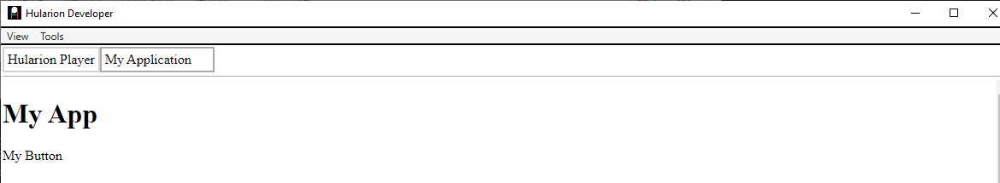
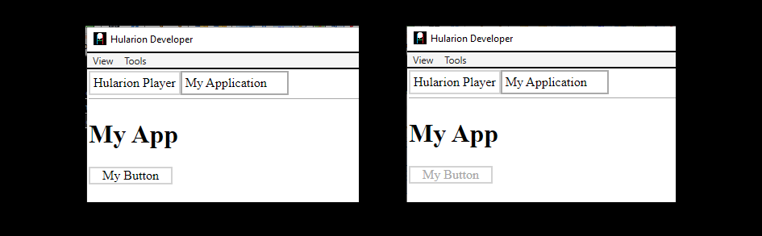

# Hularion - *Software with a Strategy*

##### Hularion TM &nbsp;&nbsp;&nbsp;&nbsp;&nbsp;&nbsp;&nbsp; Software with a Strategy TM

&nbsp;

## Hularion Experience - Creating a Button

In this example, we will create a button. A button requires many of the basic features included with HX, including handles, presenter references, proxy methods, event handlers, and some CSS basics. If you are unfamiliar with Hularion Experience, please take a look at the Getting Started documentation first. We will be building on that starting project.

To get started, find the project we created in the 1-Getting Started sample. It would be helpful to open the project in Hularion Developer. Hularion Developer allows us to refresh an application tab. When this happens, it will also rebuild the project. This enables us to quickly view our changes.


### Adding the button

1. Go to the MyAppPresenters folder. Then, create a new file called Button.html. 

2. Add the following text to create the button presenter.
```
<label>Button</label>

<script>

    function Button() {
    }

    Button.prototype = {

        start: function (parameters) {
            console.log("Button.start - ", this, window);
        }
    }

</script>
```

3. Next, we will add a button instance to the MyAppEntryPoint presenter. Open that presenter and add the following code.

```
<hx h-presenter="Button" h-handle="buttons.myButton" />
```
So we get
```
<h1>My App</h1>

<hx h-presenter="Button" h-handle="buttons.myButton" />

<script>

    function MyAppEntryPoint() {
    }

    MyAppEntryPoint.prototype = {

        start: function (parameters) {
            var t = this;
            
            console.log("MyAppEntryPoint.start - ", t, window);
        }
    }

</script>
```
The h-presenter attribute lets HX know to start up an instance of the presenter, Button in this case. It will also add it to the DOM in the same position as the tag declaring it.

If you refresh the application tab, by right-clicking on the tab, you shoud see the following. 


4. Take a look in the Dev Tools window and find the line starting with "MyAppEntryPoint.start". It should be the last line in the window. If you take a look at the first object, that is the instance of the MyAppEntryPoint presenter. That instance will have a "hularion" member, which is reserved. Since we gave the button a handle of "buttons.myHandle" the presenter is assigned an object for myButton on the specified path. Inside that object there is a proxy object, which contains public methods and accessors, a publisher object which is for event handling, a dome object which is the DOM element instance, and the view object which is the same as the dome unless a wrapper (e.g. jQuery) is specified in the project.

5. Let's make it so we can change the button text. In the Button presenter, let's add a handle to the label and a public method to the button.

```
<hx h-proxy="setText" />

<label h-handle="title">Button</label>


<script>

    function Button() {
    }

    Button.prototype = {

        start: function (parameters) {            
		
            console.log("Button.start - ", this, window);

        },
		
		setText: function(text){
            console.log("Button.setText - ", this, text);
			this.title.innerHTML = text;
		}
    }

</script>
```
The hx tag with the h-proxy="setText" is what makes setText a public method. As you can see, the same method is added to the prototype for Button, and the text of title is being set there, using the handle "title" which points to the label. Note that the handle to an element is simply the DOM element unless it is wrapped, in which case it will be the wrapped element. 

6. Go to the MyAppEntryPoint presenter and use the buttons.myButton reference in the start method to set the button name to "My Button".
```
<h1>My App</h1>

<hx h-presenter="Button" h-handle="buttons.myButton" />

<script>

    function MyAppEntryPoint() {
    }

    MyAppEntryPoint.prototype = {

        start: function (parameters) {
            var t = this;            
            console.log("MyAppEntryPoint.start - ", t, window);

			t.buttons.myButton.proxy.setText("My Button");
        }
    }

</script>
```
Refresh the app. The name now displays "My Button".


7. Let's add a little styling to setup the boundary for the button. Create a style tag and add the following text to the end of the Button presenter.
```
<style>
	
	.this{
		width: 100px;
		border:solid 2px lightgrey;
		text-align:center;
		cursor: pointer;
		user-select: none;
	}
	
	.this *{
		cursor: pointer;
		user-select: none;
	}

	.buttonTitle:hover{
		color:darkgrey;
	}

</style>
```

Note the .this class. .this will be removed on build and replaced with a runtime class name. Using .this prevents the developer from needing to know that class name. Furthermore, all blocks are scoped to the .this class, such as the .buttonTitle block.
If you refresh the app, you should be able to see a well-defined button with a hover effect.


8. Let's setup the clicking. Go to the Button presenter and add the following to the top. The position does not really matter, but the convention is to put proxies, accessors, and publish/subscribe tags at the top.
```
<hx h-publisher="Click" />
```
Then, add the following code to the start method.
```
var t = this;
t.hularion.principal.addEventListener("click", ()=>{
    console.log("Button - button clicked");
    
    t.hularion.publisher.Click.publish();
});
```
Notice the "var t = this;" line. Setting "this" to a local variable allows us to use this in the context of the callback function.

The publisher and subscriber handles are kept on "this.hularion.publisher" and the event name (e.g. Click) is added as an object with a publish or subscribe method (or both) as specified in the presenter. 

9. Finally, we need to subscribe to Button's events. In the MyAppEntryPoint presenter, add the following to the start method.
```
t.buttons.myButton.publisher.Click.subscribe((object, event)=>{
    console.log("MyAppEntryPoint.start - ", t, object, event);				
});
```
In this case, the publisher is assigned to the presenter object with any defined publisher such as Click attached to it. The callback function takes the sender object and then zero or more additional event objects, but usually just one.

10. Refresh the app in HUlarion Developer. If you look at the Dev Tools while clicking the button, you should see the console.log entries, one from Button and the other from MyAppEntryPoint.

### So, there is a sample Button Hularion Experience. Here is the final code.

## MyAppEntryPoint
```
<h1>My App</h1>

<hx h-presenter="Button" h-handle="buttons.myButton" />

<script>

    function MyAppEntryPoint() {
    }

    MyAppEntryPoint.prototype = {

        start: function (parameters) {
            var t = this;
            
            console.log("MyAppEntryPoint.start - ", t, window);

			t.buttons.myButton.proxy.setText("My Button");

			t.buttons.myButton.publisher.Click.subscribe((object, event)=>{
				console.log("MyAppEntryPoint.start - ", t, object, event);				
			});
        }
    }

</script>
```

## Button
```
<hx h-publisher="Click" />
<hx h-proxy="setText" />

<label h-handle="title" class="buttonTitle">Button</label>


<script>

    function Button() {
    }

    Button.prototype = {

        start: function (parameters) {            
		
            console.log("Button.start - ", this, window);

			var t = this;
			t.hularion.principal.addEventListener("click", ()=>{
				console.log("Button - button clicked");
				
				t.hularion.publisher.Click.publish();
			});
        },
		
		setText: function(text){
            console.log("Button.setText - ", this, text);
			this.title.innerHTML = text;
		}
    }

</script>

<style>
	
	.this{
		width: 100px;
		border:solid 2px lightgrey;
		text-align:center;
		cursor: pointer;
		user-select: none;
	}
	
	.this *{
		cursor: pointer;
		user-select: none;
	}
	
	.buttonTitle:hover{
		color:darkgrey;
	}

</style>

```

### The End