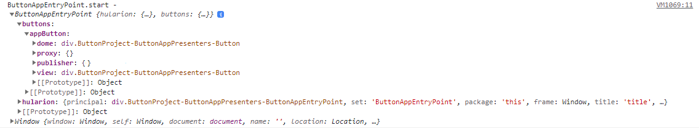

<a id="top"></a> 


#### Hularion - *Software with a Strategy*
#### Hularion Experience (HX) - A modular client application framework for web and desktop using HTML, CSS, and JS.

&nbsp;

# Hularion Experience - Basics - Create a Button

&nbsp;

## Prerequisites

If you are unfamiliar with Hularion Experience, please review the following article(s) before continuing. 

#### Article 1 - Getting Started

https://github.com/JohnathanADrews/HularionExperience/tree/main/docs/1%20-%20GettingStarted/readme.md

&nbsp;
<a id="Requirements"></a>
## Requirements

#### Hularion Developer - https://github.com/JohnathanADrews/HularionDeveloper

Please use the latest release. Alternatively, you can run it from your IDE by setting the HularionDeveloper project as the startup project.

&nbsp;

## Contents 

1. [Introduction](#Introduction)
1. [Setup](#Setup)
1. [Adding a Button](#AddingAButton)
1. [Creating a Button Instance](#CreatingAButtonInstance)
1. [Adding a Proxy Method](#AddingProxyMethod)
1. [Adding Style](#AddingStyle)
1. [Publishing the Click](#PublishingClick)
1. [Final Code](#FinalCode)


&nbsp;
<a id="Introduction"></a>
## Introduction

###### goto &rarr; [(next)](#Setup) - [(top)](#top)

In this article, we will discuss many of the basic features of Hularion Experience, including handles, presenter references, proxy methods, event handlers, and some CSS basics. We will create a Button to exercise these concepts.


&nbsp;
<a id="Setup"></a>
## Setup

###### goto &rarr; [(prev)](#Introduction) - [(next)](#AddingAButton) - [(top)](#top)

1. Open the Hularion Developer application as set out in the [(Requirements)](#Requirements).
2. Copy the content of the [Setup](Setup) folder into a local folder. Alternatively, you can create the folder structure and files as follows.

#### Directory Structure and Files


#### ButtonProject.hxproject
```
<hx h-hxpackage="true"
    h-package-name="Button Project"
    h-version="1.0.0"
    h-package-key="ButtonProject">

</hx>
```

#### ButtonApp.html
```
<hx h-application="true"
    h-application-key="ButtonApp"
    h-application-name="Button Application"
    h-presenter-set="ButtonAppPresenters"
    h-application-presenter="ButtonAppEntryPoint"
    h-application-is-default="true">
</hx>
```

#### ButtonAppEntryPoint.html
```
<h1>Button App</h1>

<script>

    function ButtonAppEntryPoint() {
    }

    ButtonAppEntryPoint.prototype = {

        start: function (parameters) {
            var t = this;
            
            console.log("ButtonAppEntryPoint.start - ", t, window);

        }
    }

</script>
```

#### Load the ButtonApp Applcation

In Hularion Developer, select Package->ViewSources. Then, click Add Source.


Enter a Name and a Location, which is the directory in which ButtonProject.hxproject was placed. Then, click Create. The Create button will then be replaced by an Update button and a Delete button.


Go to Package->View Packages. You will see the Button Project package. It has a green tip, which means that it is sourced from a project, as opposed to a compiled package. Click the Add button to add the project. The Add button will be replaced by a Remove button.


Next, go to Apps->My Apps. You should see a line for Button Application. Click Run, which will cause the application to load in another tab.


The running application:


&nbsp;
<a id="AddingAButton"></a>
## Adding a Button

###### goto &rarr; [(prev)](#Setup) - [(next)](#CreatingAButtonInstance) - [(top)](#top)

Like the ButtonAppEntryPoint presenter, the Button is another presenter, with its own function. To create the button we need to create the presenter file and add the code.


First, go to the ButtonAppPresenters folder. Then, create a new file called Button.html. 

Next, add the following text to create the button presenter.
```
<label>Button</label>

<script>

    function Button() {
    }

    Button.prototype = {

        start: function (parameters) {
            console.log("Button.start - ", this, window);
        }
    }

</script>
```


&nbsp;
<a id="CreatingAButtonInstance"></a>
## Creating a Button Instance

###### goto &rarr; [(prev)](#AddingAButton) - [(next)](#AddingProxyMethod) - [(top)](#top)

Let's add a button instance to the ButtonAppEntryPoint presenter. Open that presenter and add the following code.

```
<hx h-presenter="Button" h-handle="buttons.appButton" />
```
So we get
```
<h1>Button App</h1>

<hx h-presenter="Button" h-handle="buttons.appButton" />

<script>

    function ButtonAppEntryPoint() {
    }

    ButtonAppEntryPoint.prototype = {

        start: function (parameters) {
            var t = this;
            
            console.log("ButtonAppEntryPoint.start - ", t, window);
        }
    }

</script>
```
The h-presenter attribute lets HX know to start up an instance of the presenter, Button in this case. It will also add it to the DOM in the same position as the tag declaring it.

If you refresh the application tab, by right-clicking on the tab, you should see the following. 


Take a look in the Dev Tools window and find the line starting with "ButtonAppEntryPoint.start". It should be the last line in the window.



The first object is the instance of the ButtonAppEntryPoint presenter. That instance will have a "hularion" member, which is reserved. Since we gave the button a handle of "buttons.appButton" the presenter is assigned an object for appButton on the specified path. Inside that object there is a proxy object, which contains public methods and accessors, a publisher object which is for event handling, a dome object which is the DOM element instance, and the view object which is the same as the dome unless a wrapper (e.g. jQuery) is specified in the project.


&nbsp;
<a id="AddingProxyMethod"></a>
## Adding a Proxy Method

###### goto &rarr; [(prev)](#CreatingAButtonInstance) - [(next)](#AddingStyle) - [(top)](#top)

The text of the button in the running application is just "Button". Now, let's add a couple of items that will enable us to change the text from the ButtonAppEntryPoint presenter. Open the Button.html file in a text editor.

First, let's add a h-handle attribute to the label. Just like the Button presenter handle in ButtonAppEntryPoint, this handle will give us access to the label without needing to query the DOM.
```
<label h-handle="title" class="buttonTitle">Button</label>
```

Second, let's add a proxy method declaration, which is like adding a public method. This is done with a single tag having the h-proxy attribute.
```
<hx h-proxy="setText" />
```

Third, let's add the setText method to the Button prototype. When setText is called by ButtonAppEntryPoint on the Button proxy, HX will in turn call this method with the parameters and return the result.
```
setText: function(text){
    console.log("Button.setText - ", this, text);
    this.title.innerHTML = text;
}
```

All together, we have the following:
```
<hx h-proxy="setText" />

<label h-handle="title">Button</label>


<script>

    function Button() {
    }

    Button.prototype = {

        start: function (parameters) {            
		
            console.log("Button.start - ", this, window);

        },
		
		setText: function(text){
            console.log("Button.setText - ", this, text);
			this.title.innerHTML = text;
		}
    }

</script>
```

Finally, let's call setText from ButtonAppEntryPoint using the proxy object. We will add the following code.
```
t.buttons.appButton.proxy.setText("App Button");
```
Here is the full ButtonAppEntryPoint.html code:
```
<h1>Button App</h1>

<hx h-presenter="Button" h-handle="buttons.appButton" />

<script>

    function ButtonAppEntryPoint() {
    }

    ButtonAppEntryPoint.prototype = {

        start: function (parameters) {
            var t = this;
            
            console.log("ButtonAppEntryPoint.start - ", t, window);

			t.buttons.appButton.proxy.setText("App Button");
        }
    }

</script>
```

Let's reload the application by right-clicking on the application tab and selecting Reload.


As you can see, we have updated the label text of the button from the caller.


&nbsp;
<a id="AddingStyle"></a>
## Adding Style

###### goto &rarr; [(prev)](#AddingProxyMethod) - [(next)](#PublishingClick) - [(top)](#top)

Now that we have some basic functionality, let's add a bit of style to Button so we can clearly see the boundaries. In Button.html, add the following style tag at the bottom.

```
<style>
	
	.this{
		width: 100px;
		border:solid 2px lightgrey;
		text-align:center;
		cursor: pointer;
		user-select: none;
	}
	
	.this *{
		cursor: pointer;
		user-select: none;
	}

	.buttonTitle:hover{
		color:darkgrey;
	}

</style>
```

Note the .this class. ".this" will be removed on build and replaced with a runtime class name. Using .this prevents the developer from needing to know that class name. Furthermore, all blocks are scoped to the .this class, such as the .buttonTitle block.
If you refresh the app, you should be able to see a well-defined button with a hover effect.


Full Button.html code:
```
<hx h-proxy="setText" />

<label h-handle="title">Button</label>

<script>

    function Button() {
    }

    Button.prototype = {

        start: function (parameters) {            
		
            console.log("Button.start - ", this, window);

        },
		
		setText: function(text){
            console.log("Button.setText - ", this, text);
			this.title.innerHTML = text;
		}
    }

</script>

<style>
	
	.this{
		width: 100px;
		border:solid 2px lightgrey;
		text-align:center;
		cursor: pointer;
		user-select: none;
	}
	
	.this *{
		cursor: pointer;
		user-select: none;
	}

	.buttonTitle:hover{
		color:darkgrey;
	}

</style>
```


&nbsp;
<a id="PublishingClick"></a>
## Publishing the Click

###### goto &rarr; [(prev)](#AddingStyle) - [(next)](#FinalCode) - [(top)](#top)

The last functionality we will add to button is publishing the Click event. In HX, a presenter can declare a tag having an h-publisher attribute. This indicates that the presenter will publish events to the registered subscribers. In this section, we will add a Click publisher to the Button presenter and subscribe to Click publisher from the ButtonAppEntryPoint presenter.

First, let's add the Click publisher declaration to Button
```
<hx h-publisher="Click" />
```

Second, let's send messages to the click publisher when Button is clicked.
```
var t = this;
t.hularion.principal.addEventListener("click", ()=>{
    console.log("Button - button clicked");
    
    t.hularion.publisher.Click.publish();
});
```
In this code block, we are adding an event listener on "principal", which is the DOM element of the Button instance. When that event happens, we are first logging the event to the console. Then, we are using the publisher to publish to Click. The Click object is automatically assigned by HX due to the declaration at the top. 


Here its the complete Button.html code.
```
<hx h-publisher="Click" />
<hx h-proxy="setText" />

<label h-handle="title" class="buttonTitle">Button</label>


<script>

    function Button() {
    }

    Button.prototype = {

        start: function (parameters) {            
		
            console.log("Button.start - ", this, window);

			var t = this;
			console.log("Button.start principal - ", t.hularion.principal);
			t.hularion.principal.addEventListener("click", ()=>{
				console.log("Button - button clicked");
				
				t.hularion.publisher.Click.publish();
			});
        },
		
		setText: function(text){
            console.log("Button.setText - ", this, text);
			this.title.innerHTML = text;
		}
    }

</script>

<style>
	
	.this{
		width: 100px;
		border:solid 2px lightgrey;
		text-align:center;
		cursor: pointer;
		user-select: none;
	}
	
	.this *{
		cursor: pointer;
		user-select: none;
	}

	.buttonTitle:hover{
		color:darkgrey;
	}

</style>
```

Finally, let's subscribe to the event in the ButtonAppEntryPoint. Add the following code block.
```
t.buttons.appButton.publisher.Click.subscribe((object, event)=>{
    console.log("ButtonAppEntryPoint.start - ", t, object, event);				
});
```
As you can see, the Button presenter object has a Click object on the publisher, which matches the declaration in Button. The Click.subscribe method expects a function with the first parameter being the sending object, the Button instance in this case. The second parameter is the event object, which contains the information the sender wants to send.

Full ButtonAppEntryPoint.html code:
```
<h1>Button App</h1>

<hx h-presenter="Button" h-handle="buttons.appButton" />

<script>

    function ButtonAppEntryPoint() {
    }

    ButtonAppEntryPoint.prototype = {

        start: function (parameters) {
            var t = this;
            
            console.log("ButtonAppEntryPoint.start - ", t, window);

			t.buttons.appButton.proxy.setText("App Button");

			t.buttons.appButton.publisher.Click.subscribe((object, event)=>{
				console.log("ButtonAppEntryPoint.start - ", t, object, event);				
			});
        }
    }

</script>
```

If we reload the application and click the button a few times, we can see the result in the console.


&nbsp;
<a id="FinalCode"></a>
## Final Code

###### goto &rarr; [(prev)](#PublishingClick) - [(next)](#End) - [(top)](#top)

#### File Structure


#### ButtonProject.hxproject
```
<hx h-hxpackage="true"
    h-package-name="Button Project"
    h-version="1.0.0"
    h-package-key="ButtonProject">

</hx>
```

#### ButtonApp.html
```
<hx h-application="true"
    h-application-key="ButtonApp"
    h-application-name="Button Application"
    h-presenter-set="ButtonAppPresenters"
    h-application-presenter="ButtonAppEntryPoint"
    h-application-is-default="true">
</hx>
```

#### ButtonAppEntryPoint.html
```
<h1>Button App</h1>

<hx h-presenter="Button" h-handle="buttons.appButton" />

<script>

    function ButtonAppEntryPoint() {
    }

    ButtonAppEntryPoint.prototype = {

        start: function (parameters) {
            var t = this;
            
            console.log("ButtonAppEntryPoint.start - ", t, window);

			t.buttons.appButton.proxy.setText("App Button");
			
			t.buttons.appButton.publisher.Click.subscribe((object, event)=>{
				console.log("ButtonAppEntryPoint.start - Button Clicked - ", object, event);				
			});
        }
    }

</script>
```

Button.html
```
<hx h-publisher="Click" />
<hx h-proxy="setText" />

<label h-handle="title" class="buttonTitle">Button</label>


<script>

    function Button() {
    }

    Button.prototype = {

        start: function (parameters) {            
		
            console.log("Button.start - ", this, window);

			var t = this;
			console.log("Button.start principal - ", t.hularion.principal);
			t.hularion.principal.addEventListener("click", ()=>{
				console.log("Button - button clicked");
				
				t.hularion.publisher.Click.publish();
			});
        },
		
		setText: function(text){
            console.log("Button.setText - ", this, text);
			this.title.innerHTML = text;
		}
    }

</script>

<style>
	
	.this{
		width: 100px;
		border:solid 2px lightgrey;
		text-align:center;
		cursor: pointer;
		user-select: none;
	}
	
	.this *{
		cursor: pointer;
		user-select: none;
	}

	.buttonTitle:hover{
		color:darkgrey;
	}

</style>
```

&nbsp;
<a id="End"></a>
### The End 
Please take a look a this [Completed](Completed) folder for the final project.
###### goto &rarr; [(prev)](#FinalCode) - [(top)](#top)