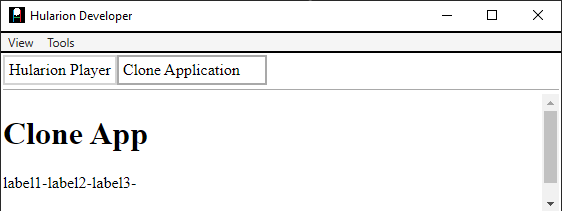

<a id="top"></a> 


#### Hularion - *Software with a Strategy*
#### Hularion Experience (HX) - A modular client application framework for web and desktop using HTML, CSS, and JS.

&nbsp;

# Hularion Experience - Clones

&nbsp;

## Prerequisites

If you are unfamiliar with Hularion Experience, please review the following article(s) before continuing. 

#### Article 1 - Getting Started

https://github.com/JohnathanADrews/HularionExperience/tree/main/docs/1%20-%20GettingStarted/readme.md


#### Article 2 - Basics - Create a Button

https://github.com/JohnathanADrews/HularionExperience/blob/main/docs/2%20-%20Create%20a%20Button/readme.md

&nbsp;
<a id="Requirements"></a>
## Requirements

#### Hularion Developer - https://github.com/JohnathanADrews/HularionDeveloper

Please use the latest release. Alternatively, you can run it from your IDE by setting the HularionDeveloper project as the startup project.

&nbsp;

## Contents 

1. [Introduction](#Introduction)
1. [Setup](#Setup)
1. [Adding a Label Clone](#AddingLabelClone)
1. [Adding a Div Clone](#AddingDivClone)
1. [Clone Instances](#CloneInstances)
1. [Final Code](#FinalCode)


&nbsp;
<a id="Introduction"></a>
## Introduction

###### goto &rarr; [(next)](#Setup) - [(top)](#top)

In Hularion Experience, there are two types of templating mechanisms, clones and templates. Clones are lightweight copies of HTML fragments. Templates, on the other hand, can copy presenter references, clone instances, and even other template instances. In this document, we will discuss clones.


&nbsp;
<a id="Setup"></a>
## Setup

###### goto &rarr; [(prev)](#Introduction) - [(next)](#AddingLabelClone) - [(top)](#top)

1. Open the Hularion Developer application as set out in the [(Requirements)](#Requirements).
2. Copy the content of the [Setup](Setup) folder into a local folder. Alternatively, you can create the folder structure and files as follows.

#### Directory Structure and Files


#### CloneProject.hxproject
```
<hx h-hxpackage="true"
    h-package-name="Clone Project"
    h-version="1.0.0"
    h-package-key="CloneProject">

</hx>
```

#### CloneApp.html
```
<hx h-application="true"
    h-application-key="CloneApp"
    h-application-name="Clone Application"
    h-presenter-set="CloneAppPresenters"
    h-application-presenter="CloneAppEntryPoint"
    h-application-is-default="true">
</hx>
```

#### CloneAppEntryPoint.html
```
<h1>Clone App</h1>


<script>

    function CloneAppEntryPoint() {
    }

    CloneAppEntryPoint.prototype = {

        start: function (parameters) {
            var t = this;
            
            console.log("CloneAppEntryPoint.start - ", t, window);

        }
    }

</script>
```

#### Load the CloneApp Applcation

In Hularion Developer, select Package->ViewSources.


Enter a Name and a Location, which is the directory in which CloneProject.hxproject was placed. Then, click Create. The Create button will then be replaced by an Update button and a Delete button.


Go to Package->View Packages. You will see the Clone Project package. It has a green tip, which means that it is sourced from a project, as opposed to a compiled package. Click the Add button to add the project. The Add button will be replaced by a Remove button.


Next, go to Apps->My Apps. You should see a line for Clone Application. Click Run, which will cause the application to load in another tab.


The running application:


&nbsp;
<a id="AddingLabelClone"></a>
## Adding a Label Clone

###### goto &rarr; [(prev)](#Setup) - [(next)](#AddingDivClone) - [(top)](#top)

In CloneAppEntryPoint, add the following tag after the h1 tag.
```
<label h-clone="labelClone" h-handle="label"></label>
```
This tag adds a clone to the presenter which can then be used to create copies using the name "labelClone". 

We can now add the clone logic in the javascript and create a few clones, change their names, and add them to the presenter. 
```
<h1>Clone App</h1>

<label h-clone="labelClone"></label>

<script>

    function CloneAppEntryPoint() {
    }

    CloneAppEntryPoint.prototype = {

        start: function (parameters) {
            var t = this;
            
            console.log("CloneAppEntryPoint.start - ", t, window);
			
			var clone1 = t.hularion.createClone("labelClone");			
            console.log("CloneAppEntryPoint.start clone1 - ", clone1);
			clone1.dome.innerHTML = "label1-";
			t.hularion.principal.append(clone1.dome);
			
			var clone2 = t.hularion.createClone("labelClone");			
            console.log("CloneAppEntryPoint.start clone2 - ", clone2);
			clone2.dome.innerHTML = "label2-";
			t.hularion.principal.append(clone2.dome);
			
			var clone3 = t.hularion.createClone("labelClone");			
            console.log("CloneAppEntryPoint.start clone3 - ", clone3);
			clone3.dome.innerHTML = "label3-";
			t.hularion.principal.append(clone3.dome);
			
        }
    }

</script>
```
Notice that the t.hularion.createClone method is used to create the clone by passing the name of the clone. this.hularion.presenter is a reference to the DOM element of the presenter instance, which is where the clones are being added.




&nbsp;
<a id="AddingDivClone"></a>
## Adding a Div Clone

###### goto &rarr; [(prev)](#AddingLabelClone) - [(next)](#CloneInstances) - [(top)](#top)

This time we will add a div clone, and we will add some elements to that clone. Add the following HTML.
```
<div h-clone="divClone" class="divClone">
	<div class="outerDiv">
		<div class="innerDiv">
			<h1 h-handle="h1"></h1>
		</div>
		<p h-handle="p"></p>
	</div>
</div>
```
We will also add a condainer div for our div clones.
```
<div h-handle="divCloneContainer" class="divCloneContainer"></div>
```
Then, some styling to better observe the divs.
```
<style>

	.divCloneContainer{
		display: inline-block;
	}

	.divClone{
		width:200px;
		height:200px;
		margin:20px;
		background-color: black;
		float:left;
	}
	
	.outerDiv{
		width:80%;
		height:80%;
		background-color: lightblue;
	}
	
	.innerDiv{
		width:80%;
		height:80%;
		background-color: lightgreen;
	}

</style>
```

Finally, let's add some javascript to create a couple of clones and add them to the presenter.
```
var divClone1 = t.hularion.createClone("divClone");			
console.log("CloneAppEntryPoint.start divClone1 - ", divClone1);
divClone1.handles.h1.innerHTML = "h1-1";
divClone1.handles.p.innerHTML = "p-1";
t.divCloneContainer.append(divClone1.dome);

var divClone2 = t.hularion.createClone("divClone");			
console.log("CloneAppEntryPoint.start divClone2 - ", divClone2);
divClone2.handles.h1.innerHTML = "h1-2";
divClone2.handles.p.innerHTML = "p-2";
t.divCloneContainer.append(divClone2.dome);
```

As you can see, we are using the "handles" oject attached to each clone. This provides access to those elements without needing to use any DOM queries.

Full code:
```
<h1>Clone App</h1>

<div h-handle="divCloneContainer" class="divCloneContainer"></div>

<!-- Although not necessary, clones should be after the presenter view but before the script. -->

<label h-clone="labelClone"></label>

<div h-clone="divClone" class="divClone">
	<div class="outerDiv">
		<div class="innerDiv">
			<h1 h-handle="h1"></h1>
		</div>
		<p h-handle="p"></p>
	</div>
</div>


<script>

    function CloneAppEntryPoint() {
    }

    CloneAppEntryPoint.prototype = {

        start: function (parameters) {
            var t = this;
            
            console.log("CloneAppEntryPoint.start - ", t, window);
			
			var clone1 = t.hularion.createClone("labelClone");			
            console.log("CloneAppEntryPoint.start clone1 - ", clone1);
			clone1.dome.innerHTML = "label1-";
			t.hularion.principal.append(clone1.dome);
			
			var clone2 = t.hularion.createClone("labelClone");			
            console.log("CloneAppEntryPoint.start clone2 - ", clone2);
			clone2.dome.innerHTML = "label2-";
			t.hularion.principal.append(clone2.dome);
			
			var clone3 = t.hularion.createClone("labelClone");			
            console.log("CloneAppEntryPoint.start clone3 - ", clone3);
			clone3.dome.innerHTML = "label3-";
			t.hularion.principal.append(clone3.dome);
						
			var divClone1 = t.hularion.createClone("divClone");			
            console.log("CloneAppEntryPoint.start divClone1 - ", divClone1);
			divClone1.handles.h1.innerHTML = "h1-1";
			divClone1.handles.p.innerHTML = "p-1";
			t.divCloneContainer.append(divClone1.dome);
			
			var divClone2 = t.hularion.createClone("divClone");			
            console.log("CloneAppEntryPoint.start divClone2 - ", divClone2);
			divClone2.handles.h1.innerHTML = "h1-2";
			divClone2.handles.p.innerHTML = "p-2";
			t.divCloneContainer.append(divClone2.dome);
			
        }
    }

</script>

<style>

	.divCloneContainer{
		display: inline-block;
	}

	.divClone{
		width:200px;
		height:200px;
		margin:20px;
		background-color: black;
		float:left;
	}
	
	.outerDiv{
		width:80%;
		height:80%;
		background-color: lightblue;
	}
	
	.innerDiv{
		width:80%;
		height:80%;
		background-color: lightgreen;
	}

</style>
```


&nbsp;
<a id="CloneInstances"></a>
## Clone Instances

###### goto &rarr; [(prev)](#AddingDivClone) - [(next)](#FinalCode) - [(top)](#top)

In HX, you can create instances of clones and insert them as tags onto the presenter. In this example, we will create a couple of labelClone instances and add them just under the Clone App h1 tag. Use the following code.
```
<hx h-clone-instance="labelClone" h-handle="labelInstace1" />
<br>
<hx h-clone-instance="labelClone" h-handle="labelInstace2" />
<br>
```
Then in the javascript, we will give them some new HTML text using the assigned handles.
```
t.labelInstace1.dome.innerHTML = "labelInstace1";
t.labelInstace2.dome.innerHTML = "labelInstace2";
```


Full Code
```
<h1>Clone App</h1>

<hx h-clone-instance="labelClone" h-handle="labelInstace1" />
<br>
<hx h-clone-instance="labelClone" h-handle="labelInstace2" />
<br>
<div h-handle="divCloneContainer" class="divCloneContainer"></div>


<!-- Although not necessary, clones should be after the presenter view but before the script. -->

<label h-clone="labelClone"></label>

<div h-clone="divClone" class="divClone">
	<div class="outerDiv">
		<div class="innerDiv">
			<h1 h-handle="h1"></h1>
		</div>
		<p h-handle="p"></p>
	</div>
</div>


<script>

    function CloneAppEntryPoint() {
    }

    CloneAppEntryPoint.prototype = {

        start: function (parameters) {
            var t = this;
            
            console.log("CloneAppEntryPoint.start - ", t, window);
			
			var clone1 = t.hularion.createClone("labelClone");			
            console.log("CloneAppEntryPoint.start clone1 - ", clone1);
			clone1.dome.innerHTML = "label1-";
			t.hularion.principal.append(clone1.dome);
			
			var clone2 = t.hularion.createClone("labelClone");			
            console.log("CloneAppEntryPoint.start clone2 - ", clone2);
			clone2.dome.innerHTML = "label2-";
			t.hularion.principal.append(clone2.dome);
			
			var clone3 = t.hularion.createClone("labelClone");			
            console.log("CloneAppEntryPoint.start clone3 - ", clone3);
			clone3.dome.innerHTML = "label3-";
			t.hularion.principal.append(clone3.dome);
						
			var divClone1 = t.hularion.createClone("divClone");			
            console.log("CloneAppEntryPoint.start divClone1 - ", divClone1);
			divClone1.handles.h1.innerHTML = "h1-1";
			divClone1.handles.p.innerHTML = "p-1";
			t.divCloneContainer.append(divClone1.dome);
			
			var divClone2 = t.hularion.createClone("divClone");			
            console.log("CloneAppEntryPoint.start divClone2 - ", divClone2);
			divClone2.handles.h1.innerHTML = "h1-2";
			divClone2.handles.p.innerHTML = "p-2";
			t.divCloneContainer.append(divClone2.dome);
			
			t.labelInstace1.dome.innerHTML = "labelInstace1";
			t.labelInstace2.dome.innerHTML = "labelInstace2";
        }
    }

</script>

<style>

	.divCloneContainer{
		display: inline-block;
	}

	.divClone{
		width:200px;
		height:200px;
		margin:20px;
		background-color: black;
		float:left;
	}
	
	.outerDiv{
		width:80%;
		height:80%;
		background-color: lightblue;
	}
	
	.innerDiv{
		width:80%;
		height:80%;
		background-color: lightgreen;
	}

</style>
```

Similarly, instances of divClone could be placed onto the presenter and could then be managed by the javascript when given a handle.


&nbsp;
<a id="FinalCode"></a>
## Final Code

###### goto &rarr; [(prev)](#CloneInstances) - [(next)](#End) - [(top)](#top)

#### File Structure


#### CloneProject.hxproject
```
<hx h-hxpackage="true"
    h-package-name="Clone Project"
    h-version="1.0.0"
    h-package-key="CloneProject">

</hx>
```

#### CloneApp.html
```
<hx h-application="true"
    h-application-key="CloneApp"
    h-application-name="Clone Application"
    h-presenter-set="CloneAppPresenters"
    h-application-presenter="CloneAppEntryPoint"
    h-application-is-default="true">
</hx>
```

#### CloneAppEntryPoint.html
```
<h1>Clone App</h1>

<hx h-clone-instance="labelClone" h-handle="labelInstace1" />
<br>
<hx h-clone-instance="labelClone" h-handle="labelInstace2" />
<br>
<div h-handle="divCloneContainer" class="divCloneContainer"></div>


<!-- Although not necessary, clones should be after the presenter view but before the script. -->

<label h-clone="labelClone"></label>

<div h-clone="divClone" class="divClone">
	<div class="outerDiv">
		<div class="innerDiv">
			<h1 h-handle="h1"></h1>
		</div>
		<p h-handle="p"></p>
	</div>
</div>


<script>

    function CloneAppEntryPoint() {
    }

    CloneAppEntryPoint.prototype = {

        start: function (parameters) {
            var t = this;
            
            console.log("CloneAppEntryPoint.start - ", t, window);
			
			var clone1 = t.hularion.createClone("labelClone");			
            console.log("CloneAppEntryPoint.start clone1 - ", clone1);
			clone1.dome.innerHTML = "label1-";
			t.hularion.principal.append(clone1.dome);
			
			var clone2 = t.hularion.createClone("labelClone");			
            console.log("CloneAppEntryPoint.start clone2 - ", clone2);
			clone2.dome.innerHTML = "label2-";
			t.hularion.principal.append(clone2.dome);
			
			var clone3 = t.hularion.createClone("labelClone");			
            console.log("CloneAppEntryPoint.start clone3 - ", clone3);
			clone3.dome.innerHTML = "label3-";
			t.hularion.principal.append(clone3.dome);
						
			var divClone1 = t.hularion.createClone("divClone");			
            console.log("CloneAppEntryPoint.start divClone1 - ", divClone1);
			divClone1.handles.h1.innerHTML = "h1-1";
			divClone1.handles.p.innerHTML = "p-1";
			t.divCloneContainer.append(divClone1.dome);
			
			var divClone2 = t.hularion.createClone("divClone");			
            console.log("CloneAppEntryPoint.start divClone2 - ", divClone2);
			divClone2.handles.h1.innerHTML = "h1-2";
			divClone2.handles.p.innerHTML = "p-2";
			t.divCloneContainer.append(divClone2.dome);
			
			t.labelInstace1.dome.innerHTML = "labelInstace1";
			t.labelInstace2.dome.innerHTML = "labelInstace2";
        }
    }

</script>

<style>

	.divCloneContainer{
		display: inline-block;
	}

	.divClone{
		width:200px;
		height:200px;
		margin:20px;
		background-color: black;
		float:left;
	}
	
	.outerDiv{
		width:80%;
		height:80%;
		background-color: lightblue;
	}
	
	.innerDiv{
		width:80%;
		height:80%;
		background-color: lightgreen;
	}

</style>
```


&nbsp;
<a id="End"></a>
### The End 
Please take a look a this [Completed](Completed) folder for the final project.
###### goto &rarr; [(prev)](#FinalCode) - [(top)](#top)


### The End