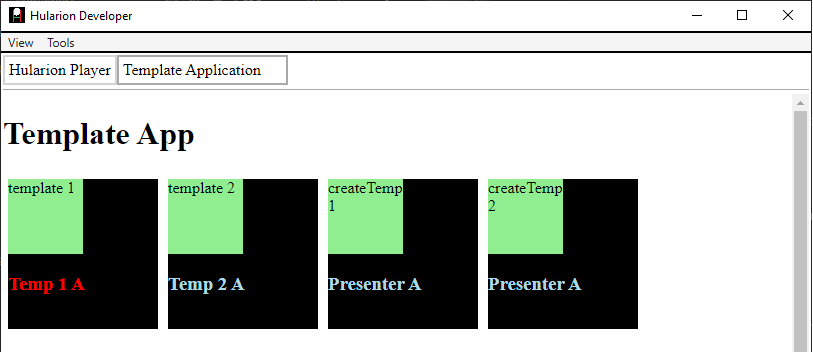

<a id="top"></a> 


#### Hularion - *Software with a Strategy*
#### Hularion Experience (HX) - A modular client application framework for web and desktop using HTML, CSS, and JS.

&nbsp;

# Hularion Experience - Templates

&nbsp;

## Prerequisites

If you are unfamiliar with Hularion Experience, please review the following article(s) before continuing. 

#### Article 1 - Getting Started

https://github.com/JohnathanADrews/HularionExperience/tree/main/docs/1%20-%20GettingStarted/readme.md


#### Article 2 - Basics - Create a Button

https://github.com/JohnathanADrews/HularionExperience/blob/main/docs/2%20-%20Create%20a%20Button/readme.md

&nbsp;
<a id="Requirements"></a>
## Requirements

#### Hularion Developer - https://github.com/JohnathanADrews/HularionDeveloper

Please use the latest release. Alternatively, you can run it from your IDE by setting the HularionDeveloper project as the startup project.

&nbsp;

## Contents 

1. [Introduction](#Introduction)
1. [Setup](#Setup)
1. [Creating a Template](#CreatingATemplate)
1. [Templates Containing Presenters](#TemplatesContainingPresenters)
1. [Templates Chaining Presenters](#TemplatesChainingPresenters)
1. [Clone Instances and Template Instances](#TemplatesWithInstances)
1. [Final Code](#FinalCode)


&nbsp;
<a id="Introduction"></a>
## Introduction

###### goto &rarr; [(next)](#Setup) - [(top)](#top)

In Hularion Experience, there are two types of templating mechanisms, clones and templates. Clones are lightweight copies of HTML fragments. Templates, on the other hand, can copy presenter references, clone instances, and even other template instances. In this document, we will discuss templates. 

While clones are fairly lightweight and, depending on the size, hundreds can be created in a short amount of time, templates are a bit slower. If a template copies a presenter that has many of its own references, there could be a gigantic tree of presenters to resolve per copy. So, they should be used with caution. Furthermore, if a template is getting big, that is a good indication that the Single Responsibility principle is being broken. You may find yourself creating templates and later converting them to presenters, which could be a reasonable approach.


&nbsp;
<a id="Setup"></a>
## Setup

###### goto &rarr; [(prev)](#Introduction) - [(next)](#CreatingATemplate) - [(top)](#top)

1. Open the Hularion Developer application as set out in the [(Requirements)](#Requirements).
2. Copy the content of the [Setup](Setup) folder into a local folder. Alternatively, you can create the folder structure and files as follows.

#### Directory Structure and Files


#### TemplateProject.hxproject
```
<hx h-hxpackage="true"
    h-package-name="Template Project"
    h-version="1.0.0"
    h-package-key="TemplateProject">

</hx>
```

#### TemplateApp.html
```
<hx h-application="true"
    h-application-key="TemplateApp"
    h-application-name="Template Application"
    h-presenter-set="TemplateAppPresenters"
    h-application-presenter="TemplateAppEntryPoint"
    h-application-is-default="true">
</hx>
```

#### TemplateAppEntryPoint.html
```
<h1>Template App</h1>

<script>

    function TemplateAppEntryPoint() {
    }

    TemplateAppEntryPoint.prototype = {

        start: function (parameters) {
            var t = this;
            
            console.log("TemplateAppEntryPoint.start - ", t, window);
			
        }
    }

</script>
```

#### Load the TemplateApp Application

In Hularion Developer, select Package->ViewSources. Then, click Add Source.


Enter a Name and a Location, which is the directory in which TemplateProject.hxproject was placed. Then, click Create. The Create button will then be replaced by an Update button and a Delete button.


Go to Package->View Packages. You will see the Template Project package. It has a green tip, which means that it is sourced from a project, as opposed to a compiled package. Click the Add button to add the project. The Add button will be replaced by a Remove button.


Next, go to Apps->My Apps. You should see a line for Template Application. Click Run, which will cause the application to load in another tab.


The running application:


&nbsp;
<a id="CreatingATemplate"></a>
## Creating a Template

###### goto &rarr; [(prev)](#Setup) - [(next)](#TemplatesContainingPresenters) - [(top)](#top)

A template is an tag with zero or more tags inside of it. The container tag and all interior tags will be copied when a template instance is create. To start, let's create a div template tag with some other tags withing it.

```
<div h-template="firstTemplate" class="firstTemplate">
	<div h-handle="innerDiv" class="innerDiv">
		<label h-handle="label"></label>
	</div>
</div>
```
We will also add a container div for our template instances.
```
<div h-handle="container" class="container"></div>
```

Then, add some styling to better observe the divs.
```
<style>

	.container{
		width:100%;
		display:inline-block;
	}
	.container > *{
		float:left;
		margin:5px;
	}
	
	.firstTemplate{
		width: 150px;
		height: 150px;
		background-color:black;
	}
	.innerDiv{
		width:50%;
		height:50%;
		background-color:lightgreen;
	}

</style>
```

Finally, let's add the javascript to create and attach the templates.
```

	var template1 = t.hularion.createTemplate("firstTemplate");
	template1.handles.label = "template 1";
	t.container.append(template1.dome);
	
	var template2 = t.hularion.createTemplate("firstTemplate");
	template2.handles.label = "template 2";
	t.container.append(template2.dome);
```
Full code
```
<h1>Template App</h1>

<div h-handle="container" class="container">
</div>

<div h-template="firstTemplate" class="firstTemplate">
	<div h-handle="innerDiv" class="innerDiv">
		<label h-handle="label"></label>
	</div>
</div>

<script>

    function TemplateAppEntryPoint() {
    }

    TemplateAppEntryPoint.prototype = {

        start: function (parameters) {
            var t = this;
            
            console.log("TemplateAppEntryPoint.start - ", t, window);
			
			var jsTemplate1 = t.hularion.createTemplate("firstTemplate");
            console.log("TemplateAppEntryPoint.start - jsTemplate1 -  ", jsTemplate1);
			jsTemplate1.handles.label.innerHTML = "createTemplate 1";
			t.container.append(jsTemplate1.dome);
			
			var jsTemplate2 = t.hularion.createTemplate("firstTemplate");
			jsTemplate2.handles.label.innerHTML = "createTemplate 2";
			t.container.append(jsTemplate2.dome);
            console.log("TemplateAppEntryPoint.start - jsTemplate1 -  ", jsTemplate1);
			
			
        }
    }

</script>
<style>

	.container{
		width:100%;
		display:inline-block;
	}
	.container > *{
		float:left;
		margin:5px;
	}
	
	.firstTemplate{
		width: 150px;
		height: 150px;
		background-color:black;
	}
	.innerDiv{
		width:50%;
		height:50%;
		background-color:lightgreen;
	}

</style>
```


Now, let's add a couple of template instances to the container div.
```
<div h-handle="container" class="container">
	<hx h-template-instance="firstTemplate" h-handle="templates.template1" />
	<hx h-template-instance="firstTemplate" h-handle="templates.template2" />
</div>
```
Let's also set the label innerHTML of those templates.
```
t.templates.template1.handles.label.innerHTML = "temp Instance 1";
t.templates.template2.handles.label.innerHTML = "temp Instance 2";
```

In total, we have
```
<h1>Template App</h1>

<div h-handle="container" class="container">
	<hx h-template-instance="firstTemplate" h-handle="templates.template1" />
	<hx h-template-instance="firstTemplate" h-handle="templates.template2" />
</div>

<div h-template="firstTemplate" class="firstTemplate">
	<div h-handle="innerDiv" class="innerDiv">
		<label h-handle="label"></label>
	</div>
</div>

<script>

    function TemplateAppEntryPoint() {
    }

    TemplateAppEntryPoint.prototype = {

        start: function (parameters) {
            var t = this;
            
            console.log("TemplateAppEntryPoint.start - ", t, window);
			
			var jsTemplate1 = t.hularion.createTemplate("firstTemplate");
            console.log("TemplateAppEntryPoint.start - jsTemplate1 -  ", jsTemplate1);
			jsTemplate1.handles.label.innerHTML = "createTemplate 1";
			t.container.append(jsTemplate1.dome);
			
			var jsTemplate2 = t.hularion.createTemplate("firstTemplate");
			jsTemplate2.handles.label.innerHTML = "createTemplate 2";
			t.container.append(jsTemplate2.dome);
            console.log("TemplateAppEntryPoint.start - jsTemplate1 -  ", jsTemplate1);
			
			
			t.templates.template1.handles.label.innerHTML = "temp Instance 1";
			t.templates.template2.handles.label.innerHTML = "temp Instance 2";
        }
    }

</script>
<style>

	.container{
		width:100%;
		display:inline-block;
	}
	.container > *{
		float:left;
		margin:5px;
	}
	
	.firstTemplate{
		width: 150px;
		height: 150px;
		background-color:black;
	}
	.innerDiv{
		width:50%;
		height:50%;
		background-color:lightgreen;
	}

</style>
```


So, we have two instances that are created using the hularion.createTemplate function, and two which were created using h-template-instance. Notice that the h-template-instance instances appear first. This is because HX will resolve all dependencies before calling "start" on the presenter.


&nbsp;
<a id="TemplatesContainingPresenters"></a>
## Templates Containing Presenters

###### goto &rarr; [(prev)](#CreatingATemplate) - [(next)](#TemplatesChainingPresenters) - [(top)](#top)

So far, we have used templates just like we would use clones. Now, let's add another presenter into this. In the same folder as TemplateAppEntryPoint, create the file PresenterA.html and add the following code.

```
<h3>Presenter A</h3>

<script>

    function PresenterA() {
    }

    PresenterA.prototype = {

        start: function (parameters) {     
			var t = this;       		
            console.log("PresenterA.start - ", t, window);

        }
	}
</script>

<style>

	.this{
		color:lightblue;
	}
	
</style>
```

Now, let's go back to TemplateAppEntryPoint and add PresenterA instances to to the template.
```
<div h-template="firstTemplate" class="firstTemplate">
	<div h-handle="innerDiv" class="innerDiv">
		<label h-handle="label"></label>
	</div>
	<hx h-presenter="PresenterA" h-handle="presenterA" />
</div>
```


Looking at the console log, we can see the presenter object within the context of the template object template1.


So, let's add a few things to PresenterA to see them reflected in the object. We will add a couple of of public methods using h-proxy to change the name and color. We will also publish an event when the mouse enters or leaves.

```
<hx h-publisher="MouseEnter" />
<hx h-publisher="MouseLeave" />

<hx h-proxy="setName" />
<hx h-proxy="setColor" />


<h3 h-handle="name">Presenter A</h3>

<script>

    function PresenterA() {
    }

    PresenterA.prototype = {

        start: function (parameters) {     
			var t = this;       		
            console.log("PresenterA.start - ", t, window);

			t.hularion.principal.addEventListener("mouseenter", ()=>{
				t.hularion.publisher.MouseEnter.publish({ event: "enter"});
			});
			t.hularion.principal.addEventListener("mouseleave", ()=>{
				t.hularion.publisher.MouseLeave.publish({ event: "leave"});
			});
        },
		
		setName: function(name){
			this.name.innerHTML = name;
		},
		
		setColor:  function(color){
			this.hularion.principal.style.color = color;
		}
	}

</script>

<style>

	.this{
		color:lightblue;
	}
	
</style>
```

For the TemplateAppEntryPoint, we will set the names of the presenters in the templates and also subscribe to the mouse events.

```
<h1>Template App</h1>

<div h-handle="container" class="container">
	<hx h-template-instance="firstTemplate" h-handle="templates.template1" />
	<hx h-template-instance="firstTemplate" h-handle="templates.template2" />
</div>

<div h-template="firstTemplate" class="firstTemplate">
	<div h-handle="innerDiv" class="innerDiv">
		<label h-handle="label"></label>
	</div>
	<hx h-presenter="PresenterA" h-handle="presenterA" />
</div>

<script>

    function TemplateAppEntryPoint() {
    }

    TemplateAppEntryPoint.prototype = {

        start: function (parameters) {
            var t = this;
            
            console.log("TemplateAppEntryPoint.start - ", t, window);
			
			var jsTemplate1 = t.hularion.createTemplate("firstTemplate");
            console.log("TemplateAppEntryPoint.start - jsTemplate1 -  ", jsTemplate1);
			jsTemplate1.handles.label.innerHTML = "createTemplate 1";
			t.container.append(jsTemplate1.dome);
			
			var jsTemplate2 = t.hularion.createTemplate("firstTemplate");
			jsTemplate2.handles.label.innerHTML = "createTemplate 2";
			t.container.append(jsTemplate2.dome);
            console.log("TemplateAppEntryPoint.start - jsTemplate1 -  ", jsTemplate1);
			
			t.templates.template1.handles.label.innerHTML = "template 1";
			t.templates.template2.handles.label.innerHTML = "template 2";
			
			t.templates.template1.handles.presenterA.proxy.setName("Temp 1 A");
			t.templates.template2.handles.presenterA.proxy.setName("Temp 2 A");
			
			t.templates.template1.handles.presenterA.publisher.MouseEnter.subscribe((o,e)=>{
				t.templates.template1.handles.presenterA.proxy.setColor("red");
			});
			t.templates.template1.handles.presenterA.publisher.MouseLeave.subscribe((o,e)=>{
				t.templates.template1.handles.presenterA.proxy.setColor("lightblue");
			});
			
			t.templates.template2.handles.presenterA.publisher.MouseEnter.subscribe((o,e)=>{
				t.templates.template2.handles.presenterA.proxy.setColor("green");
			});
			t.templates.template2.handles.presenterA.publisher.MouseLeave.subscribe((o,e)=>{
				t.templates.template2.handles.presenterA.proxy.setColor("lightblue");
			});
        }
    }

</script>

<style>

	.container{
		width:100%;
		display:inline-block;
	}
	.container > *{
		float:left;
		margin:5px;
	}
	
	.firstTemplate{
		width: 150px;
		height: 150px;
		background-color:black;
	}
	.innerDiv{
		width:50%;
		height:50%;
		background-color:lightgreen;
	}

</style>
```
As you can see, the names changed when referenced by the template instances. If you refresh the app, you can see the names change color when hovered over.



&nbsp;
<a id="TemplatesChainingPresenters"></a>
## Templates Chaining Presenters

###### goto &rarr; [(prev)](#TemplatesContainingPresenters) - [(next)](#TemplatesWithInstances) - [(top)](#top)

Next, we will esablish that the presenter creation chain takes place with templates. For this, we will create PresenterB and PresenterC. PresenterA will be given a reference to PresenterB, and PresenterB will be given a refernce to PresenterC.

PresenterB.html
```
<h4>Presenter B</h4>

<hx h-presenter="PresenterC" />

<script>

    function PresenterB() {
    }

    PresenterB.prototype = {

        start: function (parameters) {     
			var t = this;       		
            console.log("PresenterB.start - ", t, window);

        }
	}

</script>

<style>

	.this{
		color:yellow;
	}
	
</style>
```

PresenterC.html
```
<h4>Presenter C</h4>

<script>

    function PresenterC() {
    }

    PresenterC.prototype = {

        start: function (parameters) {     
			var t = this;       		
            console.log("PresenterC.start - ", t, window);

        }
	}

</script>

<style>

	.this{
		color:orange;
	}
	
</style>
```

Revised PresenterA.html
```
<hx h-publisher="MouseEnter" />
<hx h-publisher="MouseLeave" />

<hx h-proxy="setName" />
<hx h-proxy="setColor" />


<h3 h-handle="name">Presenter A</h3>

<hx h-presenter="PresenterB" />

<script>

    function PresenterA() {
    }

    PresenterA.prototype = {

        start: function (parameters) {     
			var t = this;       		
            console.log("PresenterA.start - ", t, window);

			t.hularion.principal.addEventListener("mouseenter", ()=>{
				t.hularion.publisher.MouseEnter.publish({ event: "enter"});
			});
			t.hularion.principal.addEventListener("mouseleave", ()=>{
				t.hularion.publisher.MouseLeave.publish({ event: "leave"});
			});
        },
		
		setName: function(name){
			this.name.innerHTML = name;
		},
		
		setColor:  function(color){
			this.hularion.principal.style.color = color;
		}
	}

</script>

<style>

	.this{
		color:lightblue;
		background-color:black;
	}
	
</style>
```


Notice the creation order. The framework creates C before B, B before A, A before the template, and both templates before TemplateAppEntryPoint.start. The h-template-instance instances are created first, then "start" is called, then the instances in "start" are created, but the creation order for presenters A, B, and C are the same.


&nbsp;
<a id="TemplatesWithInstances"></a>
## Clone Instances and Template Instances

###### goto &rarr; [(prev)](#TemplatesChainingPresenters) - [(next)](#FinalCode) - [(top)](#top)

In this section we will create a clone and another template. We will then add instances of each to our current template to see that they are copied. Please keep in mind that all clone instances and template instances require a h-handle attribute in the current version of the framework.

Here is the new template and clone.
```
<div h-template="secondTemplate" class="secondTemplate">
	<hx h-clone-instance="clone1" h-handle="label" />
	<hx h-template-instance="firstTemplate" h-handle="templates.template1" />
</div>

<label h-clone="clone1">Clone label</label>
```

Let's add another template instance to the container, but for the second template.

```
<hx h-template-instance="secondTemplate" h-handle="templates.template3"/>
```

Additionally, we will add a style for the new template for a red top border.
```
.secondTemplate{
	border-top: solid 10px red;
}
```

Full Code
```
<h1>Template App</h1>

<div h-handle="container" class="container">
	<hx h-template-instance="firstTemplate" h-handle="templates.template1" />
	<hx h-template-instance="firstTemplate" h-handle="templates.template2" />
	<hx h-template-instance="secondTemplate" h-handle="templates.template3" />
</div>

<div h-template="firstTemplate" class="firstTemplate">
	<div h-handle="innerDiv" class="innerDiv">
		<label h-handle="label"></label>
	</div>
	<hx h-presenter="PresenterA" h-handle="presenterA" />
</div>

<div h-template="secondTemplate">
	<hx h-clone-instance="clone1" h-handle="label" />
	<hx h-template-instance="firstTemplate" h-handle="templates.template1" />
</div>

<label h-clone="clone1">Clone label</label>

<script>

    function TemplateAppEntryPoint() {
    }

    TemplateAppEntryPoint.prototype = {

        start: function (parameters) {
            var t = this;
            
            console.log("TemplateAppEntryPoint.start - ", t, window);
			
			var jsTemplate1 = t.hularion.createTemplate("firstTemplate");
            console.log("TemplateAppEntryPoint.start - jsTemplate1 -  ", jsTemplate1);
			jsTemplate1.handles.label.innerHTML = "createTemplate 1";
			t.container.append(jsTemplate1.dome);
			
			var jsTemplate2 = t.hularion.createTemplate("firstTemplate");
			jsTemplate2.handles.label.innerHTML = "createTemplate 2";
			t.container.append(jsTemplate2.dome);
            console.log("TemplateAppEntryPoint.start - jsTemplate1 -  ", jsTemplate1);
			
			t.templates.template1.handles.label.innerHTML = "template 1";
			t.templates.template2.handles.label.innerHTML = "template 2";
			
			t.templates.template1.handles.presenterA.proxy.setName("Temp 1 A");
			t.templates.template2.handles.presenterA.proxy.setName("Temp 2 A");
			
			t.templates.template1.handles.presenterA.publisher.MouseEnter.subscribe((o,e)=>{
				t.templates.template1.handles.presenterA.proxy.setColor("red");
			});
			t.templates.template1.handles.presenterA.publisher.MouseLeave.subscribe((o,e)=>{
				t.templates.template1.handles.presenterA.proxy.setColor("lightblue");
			});
			
			t.templates.template2.handles.presenterA.publisher.MouseEnter.subscribe((o,e)=>{
				t.templates.template2.handles.presenterA.proxy.setColor("green");
			});
			t.templates.template2.handles.presenterA.publisher.MouseLeave.subscribe((o,e)=>{
				t.templates.template2.handles.presenterA.proxy.setColor("lightblue");
			});
        }
    }

</script>

<style>

	.container{
		width:100%;
		display:inline-block;
	}
	.container > *{
		float:left;
		margin:5px;
	}
	
	.firstTemplate{
		width: 150px;
		height: 150px;
		background-color:black;
	}
	.innerDiv{
		width:50%;
		height:50%;
		background-color:lightgreen;
	}
	
	.secondTemplate{
		border-top: solid 10px red;
	}

</style>
```

And the result is


&nbsp;
<a id="FinalCode"></a>
## Final Code

###### goto &rarr; [(prev)](#TemplatesWithInstances) - [(next)](#End) - [(top)](#top)


#### File Structure


#### TemplateProject.hxproject
```
<hx h-hxpackage="true"
    h-package-name="Template Project"
    h-version="1.0.0"
    h-package-key="TemplateProject">

</hx>
```

#### TemplateApp.html
```
<hx h-application="true"
    h-application-key="TemplateApp"
    h-application-name="Template Application"
    h-presenter-set="TemplateAppPresenters"
    h-application-presenter="TemplateAppEntryPoint"
    h-application-is-default="true">
</hx>
```

#### TemplateAppEntryPoint.html
```
<h1>Template App</h1>

<div h-handle="container" class="container">
	<hx h-template-instance="firstTemplate" h-handle="templates.template1" />
	<hx h-template-instance="firstTemplate" h-handle="templates.template2" />
	<hx h-template-instance="secondTemplate" h-handle="templates.template3" />
</div>

<div h-template="firstTemplate" class="firstTemplate">
	<div h-handle="innerDiv" class="innerDiv">
		<label h-handle="label"></label>
	</div>
	<hx h-presenter="PresenterA" h-handle="presenterA" />
</div>

<div h-template="secondTemplate" class="secondTemplate">
	<hx h-clone-instance="clone1" h-handle="label" />
	<hx h-template-instance="firstTemplate" h-handle="templates.template1" />
</div>

<label h-clone="clone1">Clone label</label>

<script>

    function TemplateAppEntryPoint() {
    }

    TemplateAppEntryPoint.prototype = {

        start: function (parameters) {
            var t = this;
            
            console.log("TemplateAppEntryPoint.start - ", t, window);
			
			var jsTemplate1 = t.hularion.createTemplate("firstTemplate");
            console.log("TemplateAppEntryPoint.start - jsTemplate1 -  ", jsTemplate1);
			jsTemplate1.handles.label.innerHTML = "createTemplate 1";
			t.container.append(jsTemplate1.dome);
			
			var jsTemplate2 = t.hularion.createTemplate("firstTemplate");
			jsTemplate2.handles.label.innerHTML = "createTemplate 2";
			t.container.append(jsTemplate2.dome);
            console.log("TemplateAppEntryPoint.start - jsTemplate1 -  ", jsTemplate1);
			
			t.templates.template1.handles.label.innerHTML = "template 1";
			t.templates.template2.handles.label.innerHTML = "template 2";
			
			t.templates.template1.handles.presenterA.proxy.setName("Temp 1 A");
			t.templates.template2.handles.presenterA.proxy.setName("Temp 2 A");
			
			t.templates.template1.handles.presenterA.publisher.MouseEnter.subscribe((o,e)=>{
				t.templates.template1.handles.presenterA.proxy.setColor("red");
			});
			t.templates.template1.handles.presenterA.publisher.MouseLeave.subscribe((o,e)=>{
				t.templates.template1.handles.presenterA.proxy.setColor("lightblue");
			});
			
			t.templates.template2.handles.presenterA.publisher.MouseEnter.subscribe((o,e)=>{
				t.templates.template2.handles.presenterA.proxy.setColor("green");
			});
			t.templates.template2.handles.presenterA.publisher.MouseLeave.subscribe((o,e)=>{
				t.templates.template2.handles.presenterA.proxy.setColor("lightblue");
			});
        }
    }

</script>

<style>

	.container{
		width:100%;
		display:inline-block;
	}
	.container > *{
		float:left;
		margin:5px;
	}
	
	.firstTemplate{
		width: 150px;
		height: 150px;
		background-color:black;
	}
	.innerDiv{
		width:50%;
		height:50%;
		background-color:lightgreen;
	}
	
	.secondTemplate{
		border-top: solid 10px red;
	}

</style>
```

#### PresenterA.html
```
<hx h-publisher="MouseEnter" />
<hx h-publisher="MouseLeave" />

<hx h-proxy="setName" />
<hx h-proxy="setColor" />


<h3 h-handle="name">Presenter A</h3>

<hx h-presenter="PresenterB" />

<script>

    function PresenterA() {
    }

    PresenterA.prototype = {

        start: function (parameters) {     
			var t = this;       		
            console.log("PresenterA.start - ", t, window);

			t.hularion.principal.addEventListener("mouseenter", ()=>{
				t.hularion.publisher.MouseEnter.publish({ event: "enter"});
			});
			t.hularion.principal.addEventListener("mouseleave", ()=>{
				t.hularion.publisher.MouseLeave.publish({ event: "leave"});
			});
        },
		
		setName: function(name){
			this.name.innerHTML = name;
		},
		
		setColor:  function(color){
			this.hularion.principal.style.color = color;
		}
	}

</script>

<style>

	.this{
		color:lightblue;
		background-color:black;
	}
	
</style>
```

#### PresenterB.html
```
<h4>Presenter B</h4>

<hx h-presenter="PresenterC" />

<script>

    function PresenterB() {
    }

    PresenterB.prototype = {

        start: function (parameters) {     
			var t = this;       		
            console.log("PresenterB.start - ", t, window);

        }
	}

</script>

<style>

	.this{
		color:yellow;
	}
	
</style>
```

#### PresenterC.html
```
<h4>Presenter C</h4>

<script>

    function PresenterC() {
    }

    PresenterC.prototype = {

        start: function (parameters) {     
			var t = this;       		
            console.log("PresenterC.start - ", t, window);

        }
	}

</script>

<style>

	.this{
		color:orange;
	}
	
</style>
```


&nbsp;
<a id="End"></a>
### The End 
Please take a look a this [Completed](Completed) folder for the final project.
###### goto &rarr; [(prev)](#FinalCode) - [(top)](#top)


### The End