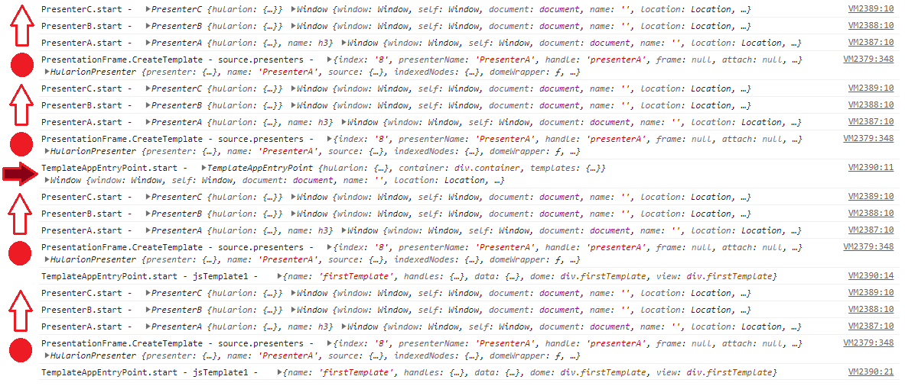

# Hularion - *Software with a Strategy*

##### Hularion TM &nbsp;&nbsp;&nbsp;&nbsp;&nbsp;&nbsp;&nbsp; Software with a Strategy TM

&nbsp;

If you are unfamiliar with Hularion Experience, please take a look at the first two documents, Getting Started and Button. The concepts in those two are necessary for this one. They are available using the following links.

https://github.com/JohnathanADrews/HularionExperience/tree/main/docs/1%20-%20GettingStarted/readme.md

https://github.com/JohnathanADrews/HularionExperience/blob/main/docs/2%20-%20Create%20a%20Button/readme.md

## Hularion Experience - Templates


In Hularion Experience, there are two types of templating mechanisms, clones and templates. Clones are lightweight copies of HTML fragments. Templates, on the other hand, can copy presenter references, clone instances, and even other template instances. In this document, we will discuss templates. 

While clones are fairly lightweight and, depending on the size, hundreds can be created in a short amount of time, templates are a bit slower. If a template copies a presenter that has many of its own references, there could be a gigantic tree of presenters to resolve per copy. So, they should be used with caution. Furthermore, if a template is getting big, that is a good indication that the Single Responsibility principle is being broken. You may find yourself creating templates and later converting them to presenters, which is fine. Having said that, let's get on with it.

We will use a clean version the MyAppEntryPoint presenter from the first document. So, it will have the following code. 

```
<h1>My App</h1>

<script>

    function MyAppEntryPoint() {
    }

    MyAppEntryPoint.prototype = {

        start: function (parameters) {
            var t = this;
            
            console.log("MyAppEntryPoint.start - ", t, window);

        }
    }

</script>
```

1. Let's add a div and add the template attribute.
```
<div h-template="firstTemplate" class="firstTemplate">
	<div h-handle="innerDiv" class="innerDiv">
	</div>
</div>
```
In the complete code following are a couple of template instances, styling, and assigned some label values. 

```

<h1>My App</h1>

<div h-handle="container1" class="container1">
	<hx h-template-instance="firstTemplate" h-handle="templates.template1" />
	<hx h-template-instance="firstTemplate" h-handle="templates.template2" />
</div>

<div h-template="firstTemplate" class="firstTemplate">
	<div h-handle="innerDiv" class="innerDiv">
		<label h-handle="label"></label>
	</div>
</div>

<script>

    function MyAppEntryPoint() {
    }

    MyAppEntryPoint.prototype = {

        start: function (parameters) {
            var t = this;
            
            console.log("MyAppEntryPoint.start - ", t, window);
			
			t.templates.template1.handles.label.innerHTML = "template 1";
			t.templates.template2.handles.label.innerHTML = "template 2";
			
        }
    }

</script>


<style>

	.container1{
		width:100%;
		display:inlinw-block;
	}
	.container1 > *{
		float:left;
		margin-right:10px;
	}
	
	.firstTemplate{
		width: 130px;
		height: 130px;
		background-color:black;
	}
	.innerDiv{
		width:50%;
		height:50%;
		background-color:lightgreen;
	}
	

</style>
```


##

2. So far, this is just like the Clones example, but with templates. Now, let's add another presenter into this. In the same folder as MyAppEntryPoint, create the file PresenterA.html and add the following code.

```
<h3>Presenter A</h3>

<script>

    function PresenterA() {
    }

    PresenterA.prototype = {

        start: function (parameters) {     
			var t = this;       		
            console.log("PresenterA.start - ", t, window);

        }

</script>

<style>

	.this{
		color:lightblue;
	}
	
</style>
```

Now, let's go back to MyAppEntryPoint and add PresenterA instances to to the template.
```
<div h-template="firstTemplate" class="firstTemplate">
	<div h-handle="innerDiv" class="innerDiv">
		<label h-handle="label"></label>
	</div>
	<hx h-presenter="PresenterA" h-handle="presenterA" />
</div>
```


Looking at the console log, we can see the presenter object within the context of the template object template1.


So, let's add a few things to PresenterA to see them reflected in the object. We will add a couple of of public methods using h-proxy to change the name and color. We will also publish an event when the mouse enters or leaves.

```

<hx h-publisher="MouseEnter" />
<hx h-publisher="MouseLeave" />

<hx h-proxy="setName" />
<hx h-proxy="setColor" />


<h3 h-handle="name">Presenter A</h3>

<script>

    function PresenterA() {
    }

    PresenterA.prototype = {

        start: function (parameters) {     
			var t = this;       		
            console.log("PresenterA.start - ", t, window);

			t.hularion.principal.addEventListener("mouseenter", ()=>{
				t.hularion.publisher.MouseEnter.publish({ event: "enter"});
			});
			t.hularion.principal.addEventListener("mouseleave", ()=>{
				t.hularion.publisher.MouseLeave.publish({ event: "leave"});
			});
        },
		
		setName: function(name){
			this.name.innerHTML = name;
		},
		
		setColor:  function(color){
			this.hularion.principal.style.color = color;
		}
	}

</script>

<style>

	.this{
		color:lightblue;
	}
	
</style>

```

For the MyAppEntryPoint, we will set the names of the presenters in the templates and also subscribe to the mouse events.

```
<h1>My App</h1>

<div h-handle="container1" class="container1">
	<hx h-template-instance="firstTemplate" h-handle="templates.template1" />
	<hx h-template-instance="firstTemplate" h-handle="templates.template2" />
</div>

<div h-template="firstTemplate" class="firstTemplate">
	<div h-handle="innerDiv" class="innerDiv">
		<label h-handle="label"></label>
	</div>
	<hx h-presenter="PresenterA" h-handle="presenterA" />
</div>

<script>

    function MyAppEntryPoint() {
    }

    MyAppEntryPoint.prototype = {

        start: function (parameters) {
            var t = this;
            
            console.log("MyAppEntryPoint.start - ", t, window);
			
			t.templates.template1.handles.label.innerHTML = "template 1";
			t.templates.template2.handles.label.innerHTML = "template 2";
			
			t.templates.template1.handles.presenterA.proxy.setName("Temp 1 A");
			t.templates.template2.handles.presenterA.proxy.setName("Temp 2 A");
			
			t.templates.template1.handles.presenterA.publisher.MouseEnter.subscribe((o,e)=>{
				t.templates.template1.handles.presenterA.proxy.setColor("red");
			});
			t.templates.template1.handles.presenterA.publisher.MouseLeave.subscribe((o,e)=>{
				t.templates.template1.handles.presenterA.proxy.setColor("lightblue");
			});
			
			t.templates.template2.handles.presenterA.publisher.MouseEnter.subscribe((o,e)=>{
				t.templates.template2.handles.presenterA.proxy.setColor("green");
			});
			t.templates.template2.handles.presenterA.publisher.MouseLeave.subscribe((o,e)=>{
				t.templates.template2.handles.presenterA.proxy.setColor("lightblue");
			});
        }
    }

</script>

<style>

	.container1{
		width:100%;
		display:inlinw-block;
	}
	.container1 > *{
		float:left;
		margin-right:10px;
	}
	
	.firstTemplate{
		width: 130px;
		height: 130px;
		background-color:black;
	}
	.innerDiv{
		width:50%;
		height:50%;
		background-color:lightgreen;
	}
	

</style>
```
As you can see, the names changed when referenced by the template instances. If you refresh the app, you can see the names change color when hovered over.


##

Next, we will esablish that the presenter creation chain takes place with templates. For this, we will create PresenterB and PresenterC. PresenterA will be given a reference to PresenterB, and PresenterB will be given a refernce to PresenterC.

PresenterB
```
<h4>Presenter B</h4>

<hx h-presenter="PresenterC" />

<script>

    function PresenterB() {
    }

    PresenterB.prototype = {

        start: function (parameters) {     
			var t = this;       		
            console.log("PresenterB.start - ", t, window);

        }
	}

</script>

<style>

	.this{
		color:yellow;
	}
	
</style>
```

PresenterC
```
<h4>Presenter C</h4>

<script>

    function PresenterC() {
    }

    PresenterC.prototype = {

        start: function (parameters) {     
			var t = this;       		
            console.log("PresenterC.start - ", t, window);

        }
	}

</script>

<style>

	.this{
		color:orange;
	}
	
</style>
```

Revised PresenterA
```
<hx h-publisher="MouseEnter" />
<hx h-publisher="MouseLeave" />

<hx h-proxy="setName" />
<hx h-proxy="setColor" />


<h3 h-handle="name">Presenter A</h3>

<hx h-presenter="PresenterB" />

<script>

    function PresenterA() {
    }

    PresenterA.prototype = {

        start: function (parameters) {     
			var t = this;       		
            console.log("PresenterA.start - ", t, window);

			t.hularion.principal.addEventListener("mouseenter", ()=>{
				t.hularion.publisher.MouseEnter.publish({ event: "enter"});
			});
			t.hularion.principal.addEventListener("mouseleave", ()=>{
				t.hularion.publisher.MouseLeave.publish({ event: "leave"});
			});
        },
		
		setName: function(name){
			this.name.innerHTML = name;
		},
		
		setColor:  function(color){
			this.hularion.principal.style.color = color;
		}
	}

</script>

<style>

	.this{
		color:lightblue;
		background-color:black;
	}
	
</style>
```


Notice the creation order. The framework creates C before B, B before A, A before the template, and both templates before MyAppEntryPoint.start.


If we create a new template in the MyAppEntryPoint.start method, that template of course gets created after the MyAppEntryPoint presenter has been created.
```
t.hularion.createTemplate("firstTemplate");
```


## 

Now, we will add a Clone and another template to demonstrate that clone instances and template instances will be copied in the template. In MyAppEntryPoint, add the following.
```

<div h-template="secondTemplate">
	<hx h-clone-instance="clone1" h-handle="label" />
	<hx h-template-instance="firstTemplate" h-handle="templates.template1" />
</div>

<label h-clone="clone1">Clone label</label>
```
Then, add another template instance to the container, but for the second template.
```
<hx h-template-instance="secondTemplate" h-handle="templates.template3"/>
```

All together, we have
```
<h1>My App</h1>

<div h-handle="container1" class="container1">
	<hx h-template-instance="firstTemplate" h-handle="templates.template1" />
	<hx h-template-instance="firstTemplate" h-handle="templates.template2" />
	<hx h-template-instance="secondTemplate" h-handle="templates.template3"/>
</div>


<div h-template="firstTemplate" class="firstTemplate">
	<div h-handle="innerDiv" class="innerDiv">
		<label h-handle="label"></label>
	</div>
	<hx h-presenter="PresenterA" h-handle="presenterA" />
</div>

<div h-template="secondTemplate">
	<hx h-clone-instance="clone1" h-handle="label" />
	<hx h-template-instance="firstTemplate" h-handle="templates.template1" />
</div>

<label h-clone="clone1">Clone label</label>

<script>

    function MyAppEntryPoint() {
    }

    MyAppEntryPoint.prototype = {

        start: function (parameters) {
            var t = this;
            
            console.log("MyAppEntryPoint.start - ", t, window);
			
			t.templates.template1.handles.label.innerHTML = "template 1";
			t.templates.template2.handles.label.innerHTML = "template 2";
			
			t.templates.template1.handles.presenterA.proxy.setName("Temp 1 A");
			t.templates.template2.handles.presenterA.proxy.setName("Temp 2 A");
			
			t.templates.template1.handles.presenterA.publisher.MouseEnter.subscribe((o,e)=>{
				t.templates.template1.handles.presenterA.proxy.setColor("red");
			});
			t.templates.template1.handles.presenterA.publisher.MouseLeave.subscribe((o,e)=>{
				t.templates.template1.handles.presenterA.proxy.setColor("lightblue");
			});
			
			t.templates.template2.handles.presenterA.publisher.MouseEnter.subscribe((o,e)=>{
				t.templates.template2.handles.presenterA.proxy.setColor("green");
			});
			t.templates.template2.handles.presenterA.publisher.MouseLeave.subscribe((o,e)=>{
				t.templates.template2.handles.presenterA.proxy.setColor("lightblue");
			});
			
			t.hularion.createTemplate("firstTemplate");
        }
    }

</script>


<style>

	.container1{
		width:100%;
		display:inlinw-block;
	}
	.container1 > *{
		float:left;
		margin-right:10px;
	}
	
	.firstTemplate{
		width: 130px;
		height: 130px;
		background-color:black;
	}
	.innerDiv{
		width:50%;
		height:50%;
		background-color:lightgreen;
	}
	

</style>
```

And the result is


##
#### Please note that at the time of this writing, clone and template instances must have a handle.
##

### The End