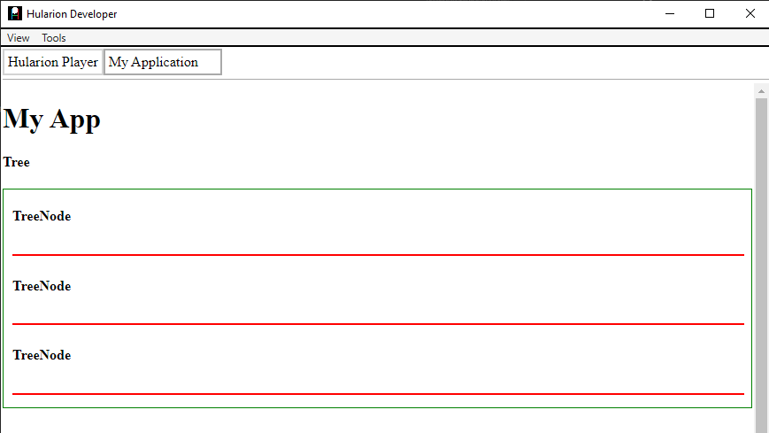
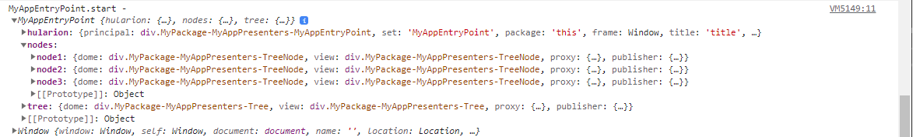
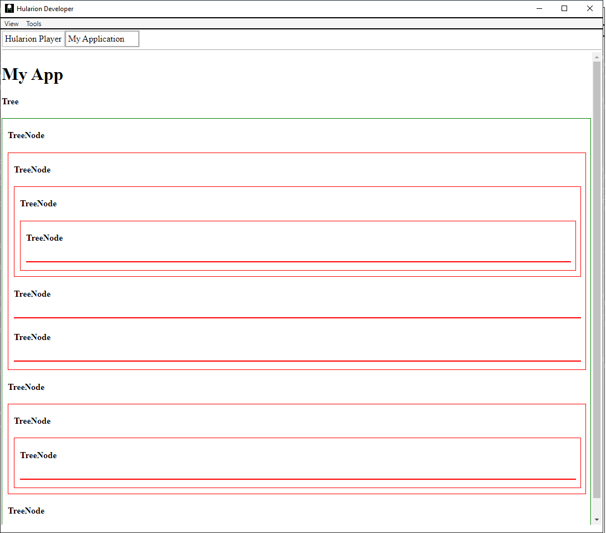
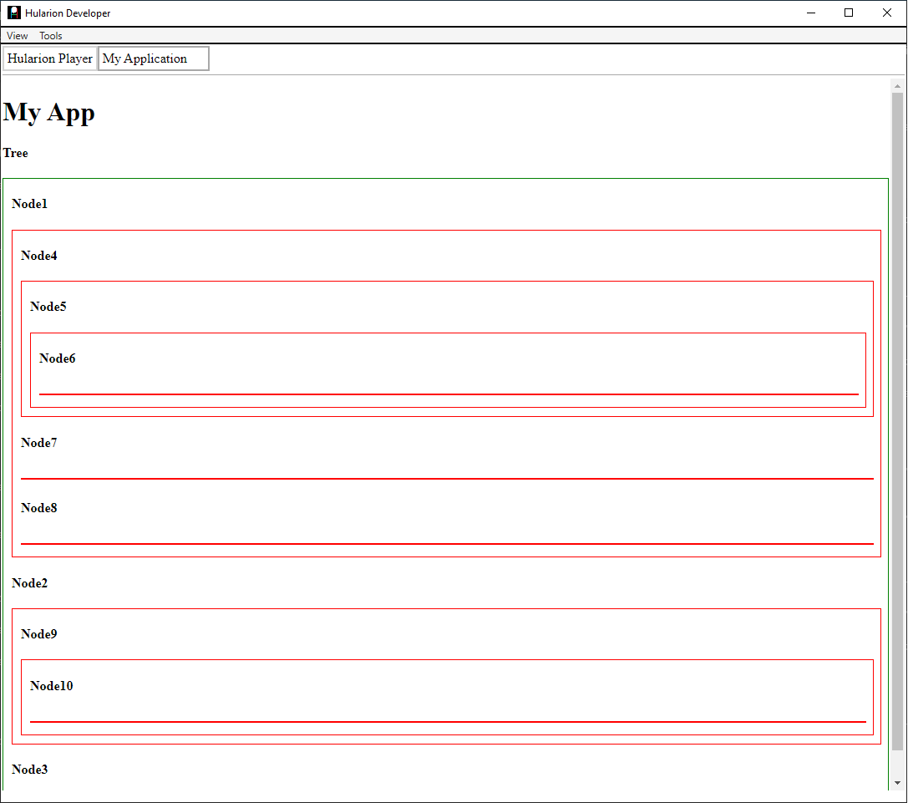
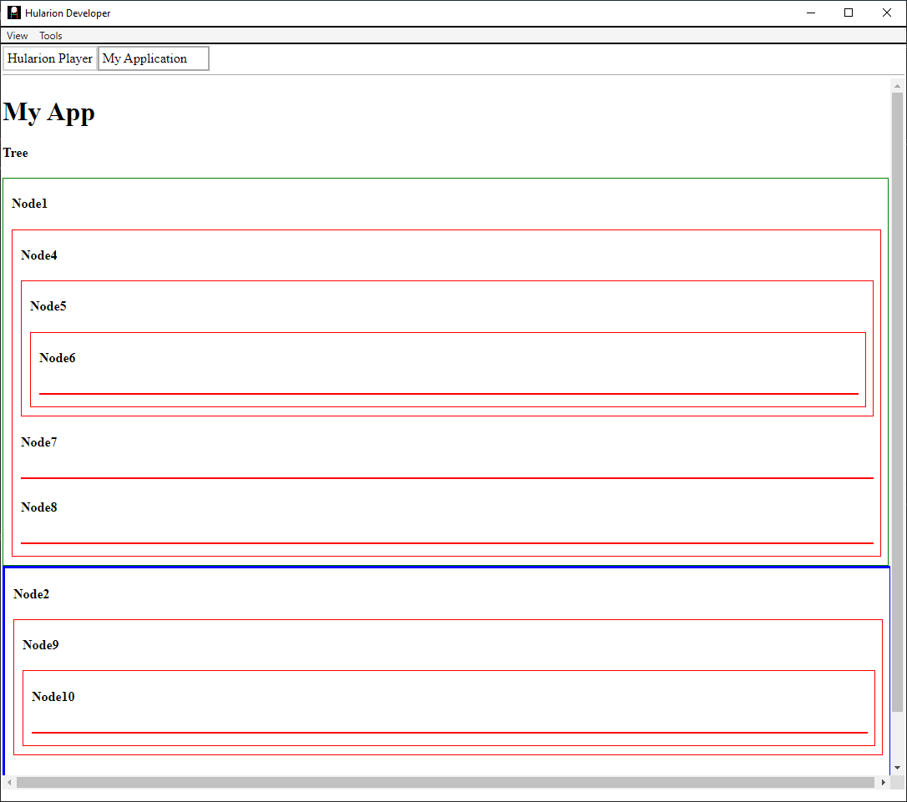

# Hularion - *Software with a Strategy*

##### Hularion TM &nbsp;&nbsp;&nbsp;&nbsp;&nbsp;&nbsp;&nbsp; Software with a Strategy TM

&nbsp;

If you are unfamiliar with Hularion Experience, please take a look at the first two documents, Getting Started and Button. The concepts in those two are necessary for this one. They are available using the following links.

https://github.com/JohnathanADrews/HularionExperience/tree/main/docs/1%20-%20GettingStarted/readme.md

https://github.com/JohnathanADrews/HularionExperience/blob/main/docs/2%20-%20Create%20a%20Button/readme.md

## Hularion Experience - Components

In Hularion Experience, one of the goals was to abstract the process of wiring up different presenters to enable a clean, intuitive, and simple usage. In HX, components are presenters that are related to each other in a hierarchy as declared by a caller. For example, imagine you have a Home presenter with menu system. The menu system contains a Menu presenter, and MenuItem presenters. The Menu presenter contains MenuItems, and MenuItems also contain MenuItems. Furthermore, the organization of the menu is determined by the Home presenter. This is exactly the type of problem that HX components resolve in a clean and clear way.

##
#### For components, it's easiest to just lay out the code so you can add it to your project and see how it works. Let's setup the MyAppEntryPoint and add a Tree presenter and a TreeNode presenter. Menus and MenuItems can get complex, so we will keep it simple by using generic tree structure to illustrate the point.

### MyAppEntryPoint

```
<h1>My App</h1>

<hx h-presenter="Tree" h-handle="tree">
	<hx h-component="TreeNode=>AddTreeNodeHandler" h-handle="nodes.node1"></hx>
	<hx h-component="TreeNode=>AddTreeNodeHandler" h-handle="nodes.node2"></hx>
	<hx h-component="TreeNode=>AddTreeNodeHandler" h-handle="nodes.node3"></hx>
</hx>

<script>

    function MyAppEntryPoint() {
    }

    MyAppEntryPoint.prototype = {

        start: function (parameters) {
            var t = this;
            
            console.log("MyAppEntryPoint.start - ", t, window);
			
        }
    }

</script>
```

### Tree
```
<hx h-component-handler="AddTreeNodeHandler" h-method="addTreeNode" h-encoding="json" />

<h4>Tree</h4>

<div h-handle="nodes" class="nodes"></div>

</div>

<script>

    function Tree() {
    }

    Tree.prototype = {

        start: function (parameters) {     
			var t = this;       		
            console.log("Tree.start - ", t, window);

        },
		
		addTreeNode: function(node, parameters){
			var t = this;			
			t.nodes.append(node.dome);
		}
	}

</script>

<style>

	.nodes{
		display: inline-block;
		border: solid 1px green;
		width: 100%;
	}

</style>
```

### TreeNode
```
<hx h-component-handler="AddTreeNodeHandler" h-method="addTreeNode" h-encoding="json" />

<h4 h-handle="name">TreeNode</h4>

<div h-handle="nodes" class="nodes"></div>

<script>

    function TreeNode() {
    }

    TreeNode.prototype = {

        start: function (parameters) {     
			var t = this;       		
            console.log("TreeNode.start - ", t, window);

        },
		
		addTreeNode: function(node, parameters){
			var t = this;       		
			t.nodes.append(node.dome);
		}
	}

</script>

<style>

	.this{
		margin:10px;
	}
	
	.nodes{
		display: inline-block;
		border: solid 1px red;
		width: 100%;
	}

</style>
```

When you run it, you should see the following image.


First, let's examine the code in MyAppEntryPoint.
```
<hx h-presenter="Tree" h-handle="tree">
	<hx h-component="TreeNode=>AddTreeNodeHandler" h-handle="nodes.node1"></hx>
	<hx h-component="TreeNode=>AddTreeNodeHandler" h-handle="nodes.node2"></hx>
	<hx h-component="TreeNode=>AddTreeNodeHandler" h-handle="nodes.node3"></hx>
</hx>
```
This code is indicating that HX create a Tree presenter with the outer tag. However, unlike regular preenter references, this presenter has some elements within it. The elements within each have an h-component attribute. This attribute has two parts, the name of the presenter to create, and then the name of the component handler, separated by the "=>" symbol. The component handler is what tells HX how to handle the TreeNode presenter as a component of the Tree presenter. 

If you look at the Tree presenter, there the following tag.
```
<hx h-component-handler="AddTreeNodeHandler" h-method="addTreeNode" h-encoding="json" />
```

The h-component-handler attribute tells HX to expect components on that handler. When it receives a component, HX must call the addTreeNode method, passing the presenter instance. That method in turn processes the instance, adding it to a div in this case.

The elements in the MyAppEntryPoint code also have an h-handle, and that handle is assigned to the MyAppEntryPoint instance. This enables MyAppEntryPoint to subscribe to TreeNode events such as a click, or access methods just like any other presenter instance.


## Sub-Components

Just as Tree has components, a TreeNode can also have components. Looking at the TreeNode presenter, it also has a component handler. It has the same name as the h-component-handler on the Tree presenter, but this is not necessary.
```
<hx h-component-handler="AddTreeNodeHandler" h-method="addTreeNode" h-encoding="json" />
```
Let's add a few sub-components in MyAppEntryPoint.
```
<hx h-presenter="Tree" h-handle="tree">
	<hx h-component="TreeNode=>AddTreeNodeHandler" h-handle="nodes.node1">
		<hx h-component="TreeNode=>AddTreeNodeHandler" h-handle="nodes.node4">			
			<hx h-component="TreeNode=>AddTreeNodeHandler" h-handle="nodes.node5">						
				<hx h-component="TreeNode=>AddTreeNodeHandler" h-handle="nodes.node6">
				</hx>
			</hx>
		</hx>
		<hx h-component="TreeNode=>AddTreeNodeHandler" h-handle="nodes.node7">
		</hx>
		<hx h-component="TreeNode=>AddTreeNodeHandler" h-handle="nodes.node8">
		</hx>
	</hx>
	<hx h-component="TreeNode=>AddTreeNodeHandler" h-handle="nodes.node9">				
		<hx h-component="TreeNode=>AddTreeNodeHandler" h-handle="nodes.node10">					
			<hx h-component="TreeNode=>AddTreeNodeHandler" h-handle="nodes.node11">
			</hx>
		</hx>
	</hx>
	<hx h-component="TreeNode=>AddTreeNodeHandler" h-handle="nodes.node3"></hx>
</hx>
```


Here we have a fairly complicated set of TreeNodes, but they interact without any need for scripting code, and the heirarchy is apparent. 


## Parameters

We could modify the TreeNodes in javascript, but we can also pass some parameters to the start method of the component. This is best used for simple functions such as setting a name. 

In the TreeNode start method, let's add a line to update the h1 tag using the name member of the parameters object.
```
start: function (parameters) {     
			var t = this;       		
            console.log("TreeNode.start - ", t, parameters);
			
			t.name.innerHTML = parameters.name;
        },
```

In MyAppEntryPoint, add some json using the h-start-parameter attribute. The value must be a json string.
```
<hx h-presenter="Tree" h-handle="tree">
	<hx h-component="TreeNode=>AddTreeNodeHandler" h-handle="nodes.node1" h-start-parameter='{"name": "Node1"}'>
		<hx h-component="TreeNode=>AddTreeNodeHandler" h-handle="nodes.node4" h-start-parameter='{"name": "Node4"}'>			
			<hx h-component="TreeNode=>AddTreeNodeHandler" h-handle="nodes.node5" h-start-parameter='{"name": "Node5"}'>						
				<hx h-component="TreeNode=>AddTreeNodeHandler" h-handle="nodes.node6" h-start-parameter='{"name": "Node6"}'>
				</hx>
			</hx>
		</hx>
		<hx h-component="TreeNode=>AddTreeNodeHandler" h-handle="nodes.node7" h-start-parameter='{"name": "Node7"}'>
		</hx>
		<hx h-component="TreeNode=>AddTreeNodeHandler" h-handle="nodes.node8" h-start-parameter='{"name": "Node8"}'>
		</hx>
	</hx>
	<hx h-component="TreeNode=>AddTreeNodeHandler" h-handle="nodes.node2" h-start-parameter='{"name": "Node2"}'>				
		<hx h-component="TreeNode=>AddTreeNodeHandler" h-handle="nodes.node9" h-start-parameter='{"name": "Node9"}'>					
			<hx h-component="TreeNode=>AddTreeNodeHandler" h-handle="nodes.node10" h-start-parameter='{"name": "Node10"}'>
			</hx>
		</hx>
	</hx>
	<hx h-component="TreeNode=>AddTreeNodeHandler" h-handle="nodes.node3" h-start-parameter='{"name": "Node3"}'></hx>
</hx>
```




## Alternate Component Handlers
Now we will show that components can be used with different component handlers. Let's modify Tree a bit to add a second handler and another nodes container.
```
<hx h-component-handler="AddTreeNodeHandler" h-method="addTreeNode" h-encoding="json" />
<hx h-component-handler="AddTreeNodeHandler2" h-method="addTreeNode2" h-encoding="json" />

<h4>Tree</h4>

<div h-handle="nodes" class="nodes"></div>
<div h-handle="nodes2" class="nodes2"></div>

</div>

<script>

    function Tree() {
    }

    Tree.prototype = {

        start: function (parameters) {     
			var t = this;       		
            console.log("Tree.start - ", t, window);

        },
		
		addTreeNode: function(node, parameters){
			var t = this;			
            console.log("Tree.addTreeNode - ", t, node, parameters);
			t.nodes.append(node.dome);
		},
		
		addTreeNode2: function(node, parameters){
			var t = this;			
            console.log("Tree.addTreeNode2 - ", t, node, parameters);
			t.nodes2.append(node.dome);
		}
	}

</script>

<style>

	.nodes{
		display: inline-block;
		border: solid 1px green;
		width: 100%;
	}
	.nodes2{
		display: inline-block;
		border: solid 3px blue;
		width: 100%;
	}

</style>
```

In MyAppEntryPoint, set node2 and node3 to use the new AddTreeNodeHandler2. Then, refresh the app.
```
<hx h-presenter="Tree" h-handle="tree">
	<hx h-component="TreeNode=>AddTreeNodeHandler" h-handle="nodes.node1" h-start-parameter='{"name": "Node1"}'>
		<hx h-component="TreeNode=>AddTreeNodeHandler" h-handle="nodes.node4" h-start-parameter='{"name": "Node4"}'>			
			<hx h-component="TreeNode=>AddTreeNodeHandler" h-handle="nodes.node5" h-start-parameter='{"name": "Node5"}'>						
				<hx h-component="TreeNode=>AddTreeNodeHandler" h-handle="nodes.node6" h-start-parameter='{"name": "Node6"}'>
				</hx>
			</hx>
		</hx>
		<hx h-component="TreeNode=>AddTreeNodeHandler" h-handle="nodes.node7" h-start-parameter='{"name": "Node7"}'>
		</hx>
		<hx h-component="TreeNode=>AddTreeNodeHandler" h-handle="nodes.node8" h-start-parameter='{"name": "Node8"}'>
		</hx>
	</hx>
	<hx h-component="TreeNode=>AddTreeNodeHandler2" h-handle="nodes.node2" h-start-parameter='{"name": "Node2"}'>				
		<hx h-component="TreeNode=>AddTreeNodeHandler" h-handle="nodes.node9" h-start-parameter='{"name": "Node9"}'>					
			<hx h-component="TreeNode=>AddTreeNodeHandler" h-handle="nodes.node10" h-start-parameter='{"name": "Node10"}'>
			</hx>
		</hx>
	</hx>
	<hx h-component="TreeNode=>AddTreeNodeHandler2" h-handle="nodes.node3" h-start-parameter='{"name": "Node3"}'></hx>
</hx>
```


As you can see, node1 is in the green box, and node2 and node3 are in the blue box.

## Final Code

### MyAppEntryPoint
```
<h1>My App</h1>

<hx h-presenter="Tree" h-handle="tree">
	<hx h-component="TreeNode=>AddTreeNodeHandler" h-handle="nodes.node1" h-start-parameter='{"name": "Node1"}'>
		<hx h-component="TreeNode=>AddTreeNodeHandler" h-handle="nodes.node4" h-start-parameter='{"name": "Node4"}'>			
			<hx h-component="TreeNode=>AddTreeNodeHandler" h-handle="nodes.node5" h-start-parameter='{"name": "Node5"}'>						
				<hx h-component="TreeNode=>AddTreeNodeHandler" h-handle="nodes.node6" h-start-parameter='{"name": "Node6"}'>
				</hx>
			</hx>
		</hx>
		<hx h-component="TreeNode=>AddTreeNodeHandler" h-handle="nodes.node7" h-start-parameter='{"name": "Node7"}'>
		</hx>
		<hx h-component="TreeNode=>AddTreeNodeHandler" h-handle="nodes.node8" h-start-parameter='{"name": "Node8"}'>
		</hx>
	</hx>
	<hx h-component="TreeNode=>AddTreeNodeHandler2" h-handle="nodes.node2" h-start-parameter='{"name": "Node2"}'>				
		<hx h-component="TreeNode=>AddTreeNodeHandler" h-handle="nodes.node9" h-start-parameter='{"name": "Node9"}'>					
			<hx h-component="TreeNode=>AddTreeNodeHandler" h-handle="nodes.node10" h-start-parameter='{"name": "Node10"}'>
			</hx>
		</hx>
	</hx>
	<hx h-component="TreeNode=>AddTreeNodeHandler2" h-handle="nodes.node3" h-start-parameter='{"name": "Node3"}'></hx>
</hx>

<script>

    function MyAppEntryPoint() {
    }

    MyAppEntryPoint.prototype = {

        start: function (parameters) {
            var t = this;
            
            console.log("MyAppEntryPoint.start - ", t, window);
			
        }
    }

</script>
```

### Tree
```
<hx h-component-handler="AddTreeNodeHandler" h-method="addTreeNode" h-encoding="json" />
<hx h-component-handler="AddTreeNodeHandler2" h-method="addTreeNode2" h-encoding="json" />

<h4>Tree</h4>

<div h-handle="nodes" class="nodes"></div>
<div h-handle="nodes2" class="nodes2"></div>

</div>

<script>

    function Tree() {
    }

    Tree.prototype = {

        start: function (parameters) {     
			var t = this;       		
            console.log("Tree.start - ", t, window);

        },
		
		addTreeNode: function(node, parameters){
			var t = this;			
            console.log("Tree.addTreeNode - ", t, node, parameters);
			t.nodes.append(node.dome);
		},
		
		addTreeNode2: function(node, parameters){
			var t = this;			
            console.log("Tree.addTreeNode2 - ", t, node, parameters);
			t.nodes2.append(node.dome);
		}
	}

</script>

<style>

	.nodes{
		display: inline-block;
		border: solid 1px green;
		width: 100%;
	}
	.nodes2{
		display: inline-block;
		border: solid 3px blue;
		width: 100%;
	}

</style>
```

### TreeNode
```
<hx h-component-handler="AddTreeNodeHandler" h-method="addTreeNode" h-encoding="json" />

<h4 h-handle="name">TreeNode</h4>

<div h-handle="nodes" class="nodes">

<script>

    function TreeNode() {
    }

    TreeNode.prototype = {

        start: function (parameters) {     
			var t = this;       		
            console.log("TreeNode.start - ", t, parameters);
			
			t.name.innerHTML = parameters.name;
        },
		
		addTreeNode: function(node, parameters){
			var t = this;       		
            console.log("TreeNode.addTreeNode - ", t, node, parameters);
			t.nodes.append(node.dome);
		}
	}

</script>

<style>

	.this{
		margin:10px;
	}
	
	.nodes{
		display: inline-block;
		border: solid 1px red;
		width: 100%;
	}

</style>
```

### The End