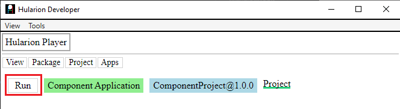
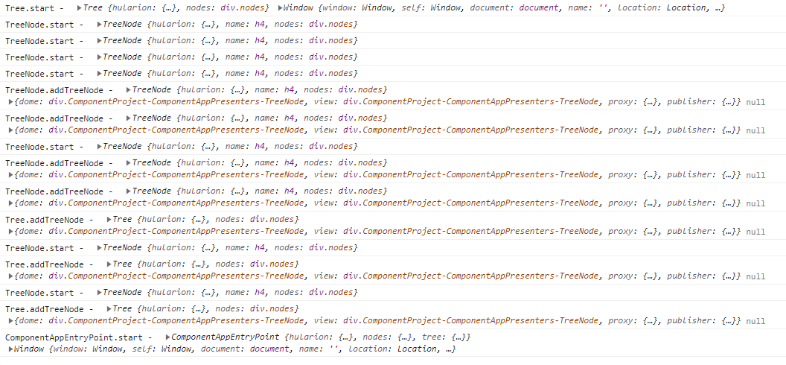

<a id="top"></a> 


#### Hularion - *Software with a Strategy*
#### Hularion Experience (HX) - A modular client application framework for web and desktop using HTML, CSS, and JS.

&nbsp;

# Hularion Experience - Components

&nbsp;

## Prerequisites

If you are unfamiliar with Hularion Experience, please review the following article(s) before continuing. 

#### Article 1 - Getting Started

https://github.com/JohnathanADrews/HularionExperience/tree/main/docs/1%20-%20GettingStarted/readme.md


#### Article 2 - Basics - Create a Button

https://github.com/JohnathanADrews/HularionExperience/blob/main/docs/2%20-%20Create%20a%20Button/readme.md

&nbsp;
<a id="Requirements"></a>
## Requirements

#### Hularion Developer - https://github.com/JohnathanADrews/HularionDeveloper

Please use the latest release. Alternatively, you can run it from your IDE by setting the HularionDeveloper project as the startup project.

&nbsp;

## Contents 

1. [Introduction](#Introduction)
1. [Setup](#Setup)
1. [Setting Up a Tree with Components](#SettingUpComponents)
1. [Adding TreeNode Components](#AddingTreeNodeComponents)
1. [Sub-Components](#SubComponents)
1. [Component Start Parameters](#ComponentStartParameters)
1. [Multiple Component Handlers](#MultipleComponentHandlers)
1. [Final Code](#FinalCode)


&nbsp;
<a id="Introduction"></a>
## Introduction

###### goto &rarr; [(next)](#Setup) - [(top)](#top)

A primary goal of Hularion Experience was to abstract the process of wiring up different presenters to enable a clean, intuitive, and simple usage. In HX, components are presenters that are related to each other in a hierarchy as declared by a caller. For example, imagine you have a Home presenter with menu system. The menu system contains a Menu presenter and a MenuItem presenter. When combined in the Home screen, the Menu presenter reference contains MenuItem  presenter references, and MenuItems also contain MenuItems. Furthermore, the organization of the menu is determined by the Home presenter. This is exactly the type of problem that HX components resolve in a clean and clear way.


&nbsp;
<a id="Setup"></a>
## Setup

###### goto &rarr; [(prev)](#Introduction) - [(next)](#SettingUpComponents) - [(top)](#top)

1. Open the Hularion Developer application as set out in the [(Requirements)](#Requirements).
2. Copy the content of the [Setup](Setup) folder into a local folder. Alternatively, you can create the folder structure and files as follows.

#### Directory Structure and Files


#### ComponentProject.hxproject
```
<hx h-hxpackage="true"
    h-package-name="Component Project"
    h-version="1.0.0"
    h-package-key="ComponentProject">

</hx>
```

#### ComponentApp.html
```
<hx h-application="true"
    h-application-key="ComponentApp"
    h-application-name="Component Application"
    h-presenter-set="ComponentAppPresenters"
    h-application-presenter="ComponentAppEntryPoint"
    h-application-is-default="true">
</hx>
```

#### ComponentAppEntryPoint.html
```
<h1>Component App</h1>

<script>

    function ComponentAppEntryPoint() {
    }

    ComponentAppEntryPoint.prototype = {

        start: function (parameters) {
            var t = this;
            
            console.log("ComponentAppEntryPoint.start - ", t, window);
        }
    }

</script>
```


#### Load the ComponentApp Applcation

In Hularion Developer, select Package->ViewSources. Then, click Add Source.


Enter a Name and a Location, which is the directory in which ComponentProject.hxproject was placed. Then, click Create. The Create button will then be replaced by an Update button and a Delete button.


Go to Package->View Packages. You will see the Component Project package. It has a green tip, which means that it is sourced from a project, as opposed to a compiled package. Click the Add button to add the project. The Add button will be replaced by a Remove button.


Next, go to Apps->My Apps. You should see a line for Component Application. Click Run, which will cause the application to load in another tab.



The running application:


&nbsp;
<a id="SettingUpComponents"></a>
## Setting Up a Tree with Components

###### goto &rarr; [(prev)](#Setup) - [(next)](#AddingTreeNodeComponents) - [(top)](#top)

In this example, we will create a simple tree of nested div tags. This allows us to explore components without any other functional expectations.

First, let's create a couple of presenters in the ComponentAppPresenters folder.

Tree.html
```
<h4>Tree</h4>

<div h-handle="nodes" class="nodes"></div>

<script>

    function Tree() {
    }

    Tree.prototype = {

        start: function (parameters) {     
			var t = this;       		
            console.log("Tree.start - ", t, window);

        }
	}

</script>

<style>

	.nodes{
		display: inline-block;
		border: solid 1px green;
		width: 100%;
	}

</style>
```

TreeNode.html
```
<h4 h-handle="name">TreeNode</h4>

<div h-handle="nodes" class="nodes">

<script>

    function TreeNode() {
    }

    TreeNode.prototype = {

        start: function () {     
			var t = this;       		
            console.log("TreeNode.start - ", t);
			
        }
	}

</script>

<style>

	.this{
		margin:10px;
	}
	
	.nodes{
		display: inline-block;
		border: solid 1px red;
		width: 100%;
	}

</style>
```

As you can see, each presenter has a title, a container for additional nodes, and some styling.

Now, let's add a Tree presenter reference to ComponentAppEntryPoint.html.
```
<hx h-presenter="Tree" h-handle="tree" />
```

Full Code
```
<h1>Component App</h1>

<hx h-presenter="Tree" h-handle="tree" />

<script>

    function ComponentAppEntryPoint() {
    }

    ComponentAppEntryPoint.prototype = {

        start: function (parameters) {
            var t = this;
            
            console.log("ComponentAppEntryPoint.start - ", t, window);
        }
    }

</script>
```

Reloading the application, we get the following.


As you can see, we have our ComponentAppEntryPoint presenter with a Tree presenter reference. Now, we are setup for adding the component declarations.


&nbsp;
<a id="AddingTreeNodeComponents"></a>
## Adding TreeNode Components

###### goto &rarr; [(prev)](#SettingUpComponents) - [(next)](#SubComponents) - [(top)](#top)

The goal is to add TreeNode components to the Tree presenter from the ComponentAppEntryPoint presenter. So, let's start by adding the tags in the Tree presenter reference in ComponentAppEntryPoint. Replace the Tree presenter reference with the following.

```
<hx h-presenter="Tree" h-handle="tree">
	<hx h-component="TreeNode=>AddTreeNodeHandler" h-handle="nodes.node1"></hx>
	<hx h-component="TreeNode=>AddTreeNodeHandler" h-handle="nodes.node2"></hx>
	<hx h-component="TreeNode=>AddTreeNodeHandler" h-handle="nodes.node3"></hx>
</hx>
```

Here the Tree tag is no longer self-closing, rather, it has some tags within it. These are not presenter reference tags, however. These tags have the h-component attribute. This indicates to the framework that they are components of the Tree presenter. 

The "TreeNode=>AddTreeNodeHandler" part indicates two things. The "TreeNode" part indicates that the components are TreeNode presenters. The "AddTreeNodeHandler" indicates which handler on the parent presenter, in this case Tree, will handle the TreeNode presenter instance. "AddTreeNodeHandler" is a declaration by the Tree presenter, and it indicates a method to call on the constructor function that will handle the TreeNode component. So, let's add that declaration to the Tree presenter.

Here is the declaration.
```
<hx h-component-handler="AddTreeNodeHandler" h-method="addTreeNode" />
```

As you can see, it has the attribute h-component-handler="AddTreeNodeHandler", which indicates the handler in ComponentAppEntryPoint. It also has the  h-method="addTreeNode" attribute. This directs any incoming components to that method on the Tree constructor function. So, let's add that method.
```
addTreeNode: function(node, parameters){
	var t = this;			
	console.log("Tree.addTreeNode - ", t, node, parameters);
	t.nodes.append(node.dome);
}
```

#### Full Code

#### ComponentAppEntryPoint.html
```
<h1>Component App</h1>

<hx h-presenter="Tree" h-handle="tree">
	<hx h-component="TreeNode=>AddTreeNodeHandler" h-handle="nodes.node1"></hx>
	<hx h-component="TreeNode=>AddTreeNodeHandler" h-handle="nodes.node2"></hx>
	<hx h-component="TreeNode=>AddTreeNodeHandler" h-handle="nodes.node3"></hx>
</hx>

<script>

    function ComponentAppEntryPoint() {
    }

    ComponentAppEntryPoint.prototype = {

        start: function (parameters) {
            var t = this;
            
            console.log("ComponentAppEntryPoint.start - ", t, window);
        }
    }

</script>
```

#### Tree.html
```
<hx h-component-handler="AddTreeNodeHandler" h-method="addTreeNode" />

<h4>Tree</h4>

<div h-handle="nodes" class="nodes"></div>

<script>

    function Tree() {
    }

    Tree.prototype = {

        start: function (parameters) {     
			var t = this;       		
            console.log("Tree.start - ", t, window);

        },
		
		
		addTreeNode: function(node, parameters){
			var t = this;			
            console.log("Tree.addTreeNode - ", t, node, parameters);
			t.nodes.append(node.dome);
		}
	}

</script>

<style>

	.nodes{
		display: inline-block;
		border: solid 1px green;
		width: 100%;
	}

</style>
```

Reloading the application, we get the following result.


We can also see how the elements were added to the DOM.


Looking at the console log, we can see the the Tree instance is started first, followed by each of the TreeNode instances. After each TreeNode instance, addTreeNode is called on the Tree instance to add the TreeNode. 

Also, we can see that ComponentAppEntryPoint is the instance that receives the handles from h-handle on the components. Whereas the component handler gives the Tree instance an opportunity to add the TreeNode, the h-handle goes to the presenter declaring the tree, ComponentAppEntryPoint. Then, ComponentAppEntryPoint can use those handles to call methods or subscribe to events without the Tree instance being involved.


&nbsp;
<a id="SubComponents"></a>
## Sub-Components

###### goto &rarr; [(prev)](#AddingTreeNodeComponents) - [(next)](#ComponentStartParameters) - [(top)](#top)

We have added TreeNode components to the Tree presenter reference. In order to create a proper heirarchy, we need to add components to the TreeNode components that are  within the Tree presenter reference. So, let's add the following code to ComponentAppEntryPoint.

```
<hx h-presenter="Tree" h-handle="tree">
	<hx h-component="TreeNode=>AddTreeNodeHandler" h-handle="nodes.node1">
		<hx h-component="TreeNode=>AddTreeNodeHandler" h-handle="nodes.node4">			
			<hx h-component="TreeNode=>AddTreeNodeHandler" h-handle="nodes.node5">						
				<hx h-component="TreeNode=>AddTreeNodeHandler" h-handle="nodes.node6">
				</hx>
			</hx>									
			<hx h-component="TreeNode=>AddTreeNodeHandler" h-handle="nodes.node7">
			</hx>
		</hx>
	</hx>
	<hx h-component="TreeNode=>AddTreeNodeHandler" h-handle="nodes.node2"></hx>
	<hx h-component="TreeNode=>AddTreeNodeHandler" h-handle="nodes.node3"></hx>
</hx>
``` 

Our tree is starting to get a bit more complicated, but this form is much simpler than creating many of these nodes in javascript and adding them in just the right place.

We now need to add a component handler for TreeNode. Here we are using the same name as the component handler on Tree, "AddTreeNodeHandler", but they do not need to be the same.

#### TreeNode.html
Add the component handler.
```
<hx h-component-handler="AddTreeNodeHandler" h-method="addTreeNode"/>
```
Add the addTreeNode method.
```
addTreeNode: function(node, parameters){
	var t = this;       		
	console.log("TreeNode.addTreeNode - ", t, node, parameters);
	t.nodes.append(node.dome);
}
```
#### Full Code
```
<hx h-component-handler="AddTreeNodeHandler" h-method="addTreeNode"/>

<h4 h-handle="name">TreeNode</h4>

<div h-handle="nodes" class="nodes">

<script>

    function TreeNode() {
    }

    TreeNode.prototype = {

        start: function () {     
			var t = this;       		
            console.log("TreeNode.start - ", t);
			
        },
		
		addTreeNode: function(node, parameters){
			var t = this;       		
            console.log("TreeNode.addTreeNode - ", t, node, parameters);
			t.nodes.append(node.dome);
		}
	}

</script>

<style>

	.this{
		margin:10px;
	}
	
	.nodes{
		display: inline-block;
		border: solid 1px red;
		width: 100%;
	}

</style>
```

Reloading the application, we get the following result.


We can also see how the elements were added to the DOM.


Looking at the console log, we can see the the Tree instance is started first, followed by each of the TreeNode instances. The first TreeNodes that are created do not have any components, but the later ones do, so addTreeNode is called.




&nbsp;
<a id="ComponentStartParameters"></a>
## Component Start Parameters

###### goto &rarr; [(prev)](#SubComponents) - [(next)](#MultipleComponentHandlers) - [(top)](#top)

Sometimes, we want to add some start parameters for the components. These are typically information data such as Name or Title that you would want to add to the declaration, rather than update using the handle in the javascript. To do this, use the h-start-parameter attribute on the h-component declaration, passing in a json string. Let's add these to ComponentAppEntryPoint, setting a "name" value.

```
<hx h-presenter="Tree" h-handle="tree">
	<hx h-component="TreeNode=>AddTreeNodeHandler" h-handle="nodes.node1" h-start-parameter='{"name": "Node1"}'>
		<hx h-component="TreeNode=>AddTreeNodeHandler" h-handle="nodes.node4" h-start-parameter='{"name": "Node4"}'>			
			<hx h-component="TreeNode=>AddTreeNodeHandler" h-handle="nodes.node5" h-start-parameter='{"name": "Node5"}'>						
				<hx h-component="TreeNode=>AddTreeNodeHandler" h-handle="nodes.node6" h-start-parameter='{"name": "Node6"}'>
				</hx>
			</hx>									
			<hx h-component="TreeNode=>AddTreeNodeHandler" h-handle="nodes.node7" h-start-parameter='{"name": "Node7"}'>
			</hx>
		</hx>
	</hx>
	<hx h-component="TreeNode=>AddTreeNodeHandler" h-handle="nodes.node2" h-start-parameter='{"name": "Node2"}'></hx>
	<hx h-component="TreeNode=>AddTreeNodeHandler" h-handle="nodes.node3" h-start-parameter='{"name": "Node3"}'></hx>
</hx>
```

Next, let's add some code to TreeNode so that it can accept the parameters in in the constructor by adding a "parameters" parameter. Then, let's add some logic to update the h4 tag having the h-handle="name" attribute.

Full Code
```
<hx h-component-handler="AddTreeNodeHandler" h-method="addTreeNode" h-encoding="json" />

<h4 h-handle="name">TreeNode</h4>

<div h-handle="nodes" class="nodes">

<script>

    function TreeNode() {
    }

    TreeNode.prototype = {

        start: function (parameters) {     
			var t = this;       		
            console.log("TreeNode.start - ", t, parameters);
			
			t.name.innerHTML = parameters.name;
        },
		
		addTreeNode: function(node, parameters){
			var t = this;       		
            console.log("TreeNode.addTreeNode - ", t, node, parameters);
			t.nodes.append(node.dome);
		}
	}

</script>

<style>

	.this{
		margin:10px;
	}
	
	.nodes{
		display: inline-block;
		border: solid 1px red;
		width: 100%;
	}

</style>
```

Reloading the application, we get the following result.


Now, the names have changed from TreeNode to the names given in the parameters.

Taking a look in the console log, we can see the new parameters object that is passed to the constructor.


&nbsp;
<a id="MultipleComponentHandlers"></a>
## Multiple Component Handlers

###### goto &rarr; [(prev)](#ComponentStartParameters) - [(next)](#FinalCode) - [(top)](#top)

A presenter can have multiple component handlers. This could be used to separate our different kinds of components, or it could be used to arrange components differently based on which handler is called. In this example, we will create a second component handler for Tree and then set Node2 and Node3 to use the second handler. 

We need to do the following.
1. Add the new component handler declaration in Tree presenter, AddTreeNodeHandlerNew.
1. Add the new method in Tree presenter to handle the components.
1. Create a new div tag to contain the nodes from the second handler.
1. Add some styling to visually differentiate between the two containers.

Full Code Tree.html
```
<hx h-component-handler="AddTreeNodeHandler" h-method="addTreeNode" />
<hx h-component-handler="AddTreeNodeHandlerNew" h-method="addTreeNodeNew" />

<h4>Tree</h4>

<div h-handle="nodes" class="nodes"></div>
<div h-handle="nodesNew" class="nodesNew"></div>

<script>

    function Tree() {
    }

    Tree.prototype = {

        start: function (parameters) {     
			var t = this;       		
            console.log("Tree.start - ", t, window);

        },		
		
		addTreeNode: function(node, parameters){
			var t = this;			
            console.log("Tree.addTreeNode - ", t, node, parameters);
			t.nodes.append(node.dome);
		},		
		
		addTreeNodeNew: function(node, parameters){
			var t = this;			
            console.log("Tree.addTreeNodeNew - ", t, node, parameters);
			t.nodesNew.append(node.dome);
		}
	}

</script>

<style>

	.nodes{
		display: inline-block;
		border: solid 1px green;
		width: 100%;
	}
	.nodesNew{
		display: inline-block;
		border: solid 3px blue;
		width: 100%;
	}

</style>
```

In ComponentAppEntryPoint, we need to set the handler from Node2 and Node3 to the new handler.
```
<hx h-component="TreeNode=>AddTreeNodeHandlerNew" h-handle="nodes.node2" h-start-parameter='{"name": "Node2"}'></hx>
<hx h-component="TreeNode=>AddTreeNodeHandlerNew" h-handle="nodes.node3" h-start-parameter='{"name": "Node3"}'></hx>
```

Full Code ComponentAppEntryPoint.html
```
<h1>Component App</h1>

<hx h-presenter="Tree" h-handle="tree">
	<hx h-component="TreeNode=>AddTreeNodeHandler" h-handle="nodes.node1" h-start-parameter='{"name": "Node1"}'>
		<hx h-component="TreeNode=>AddTreeNodeHandler" h-handle="nodes.node4" h-start-parameter='{"name": "Node4"}'>			
			<hx h-component="TreeNode=>AddTreeNodeHandler" h-handle="nodes.node5" h-start-parameter='{"name": "Node5"}'>						
				<hx h-component="TreeNode=>AddTreeNodeHandler" h-handle="nodes.node6" h-start-parameter='{"name": "Node6"}'>
				</hx>
			</hx>									
			<hx h-component="TreeNode=>AddTreeNodeHandler" h-handle="nodes.node7" h-start-parameter='{"name": "Node7"}'>
			</hx>
		</hx>
	</hx>
	<hx h-component="TreeNode=>AddTreeNodeHandlerNew" h-handle="nodes.node2" h-start-parameter='{"name": "Node2"}'></hx>
	<hx h-component="TreeNode=>AddTreeNodeHandlerNew" h-handle="nodes.node3" h-start-parameter='{"name": "Node3"}'></hx>
</hx>

<script>

    function ComponentAppEntryPoint() {
    }

    ComponentAppEntryPoint.prototype = {

        start: function (parameters) {
            var t = this;
            
            console.log("ComponentAppEntryPoint.start - ", t, window);
        }
    }

</script>
```

Reloading the application, we get the following result.


Notice that Node2 and Node3 are now in the blue div, which corresponds to the second component handler.


&nbsp;
<a id="FinalCode"></a>
## Final Code

###### goto &rarr; [(prev)](#MultipleComponentHandlers) - [(next)](#End) - [(top)](#top)

#### File Structure


#### ComponentProject.hxproject
```
<hx h-hxpackage="true"
    h-package-name="Component Project"
    h-version="1.0.0"
    h-package-key="ComponentProject">

</hx>
```

#### ComponentApp.html
```
<hx h-application="true"
    h-application-key="ComponentApp"
    h-application-name="Component Application"
    h-presenter-set="ComponentAppPresenters"
    h-application-presenter="ComponentAppEntryPoint"
    h-application-is-default="true">
</hx>
```

#### ComponentAppEntryPoint.html
```
<h1>Component App</h1>

<hx h-presenter="Tree" h-handle="tree">
	<hx h-component="TreeNode=>AddTreeNodeHandler" h-handle="nodes.node1" h-start-parameter='{"name": "Node1"}'>
		<hx h-component="TreeNode=>AddTreeNodeHandler" h-handle="nodes.node4" h-start-parameter='{"name": "Node4"}'>			
			<hx h-component="TreeNode=>AddTreeNodeHandler" h-handle="nodes.node5" h-start-parameter='{"name": "Node5"}'>						
				<hx h-component="TreeNode=>AddTreeNodeHandler" h-handle="nodes.node6" h-start-parameter='{"name": "Node6"}'>
				</hx>
			</hx>									
			<hx h-component="TreeNode=>AddTreeNodeHandler" h-handle="nodes.node7" h-start-parameter='{"name": "Node7"}'>
			</hx>
		</hx>
	</hx>
	<hx h-component="TreeNode=>AddTreeNodeHandlerNew" h-handle="nodes.node2" h-start-parameter='{"name": "Node2"}'></hx>
	<hx h-component="TreeNode=>AddTreeNodeHandlerNew" h-handle="nodes.node3" h-start-parameter='{"name": "Node3"}'></hx>
</hx>

<script>

    function ComponentAppEntryPoint() {
    }

    ComponentAppEntryPoint.prototype = {

        start: function (parameters) {
            var t = this;
            
            console.log("ComponentAppEntryPoint.start - ", t, window);
        }
    }

</script>
```

#### Tree.html
```
<hx h-component-handler="AddTreeNodeHandler" h-method="addTreeNode" />
<hx h-component-handler="AddTreeNodeHandlerNew" h-method="addTreeNodeNew" />

<h4>Tree</h4>

<div h-handle="nodes" class="nodes"></div>
<div h-handle="nodesNew" class="nodesNew"></div>

<script>

    function Tree() {
    }

    Tree.prototype = {

        start: function (parameters) {     
			var t = this;       		
            console.log("Tree.start - ", t, window);

        },		
		
		addTreeNode: function(node, parameters){
			var t = this;			
            console.log("Tree.addTreeNode - ", t, node, parameters);
			t.nodes.append(node.dome);
		},		
		
		addTreeNodeNew: function(node, parameters){
			var t = this;			
            console.log("Tree.addTreeNodeNew - ", t, node, parameters);
			t.nodesNew.append(node.dome);
		}
	}

</script>

<style>

	.nodes{
		display: inline-block;
		border: solid 1px green;
		width: 100%;
	}
	.nodesNew{
		display: inline-block;
		border: solid 3px blue;
		width: 100%;
	}

</style>
```

#### TreeNode.html
```
<hx h-component-handler="AddTreeNodeHandler" h-method="addTreeNode" h-encoding="json" />

<h4 h-handle="name">TreeNode</h4>

<div h-handle="nodes" class="nodes">
<div h-handle="nodesNew" class="nodesNew">

<script>

    function TreeNode() {
    }

    TreeNode.prototype = {

        start: function (parameters) {     
			var t = this;       		
            console.log("TreeNode.start - ", t, parameters);
			
			t.name.innerHTML = parameters.name;
        },
		
		addTreeNode: function(node, parameters){
			var t = this;       		
            console.log("TreeNode.addTreeNode - ", t, node, parameters);
			t.nodes.append(node.dome);
		}
	}

</script>

<style>

	.this{
		margin:10px;
	}
	
	.nodesNew{
		display: inline-block;
		border: solid 1px red;
		width: 100%;
	}

</style>
```

&nbsp;
<a id="End"></a>
### The End 
Please take a look a this [Completed](Completed) folder for the final project.
###### goto &rarr; [(prev)](#FinalCode) - [(top)](#top)

