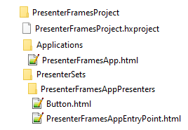
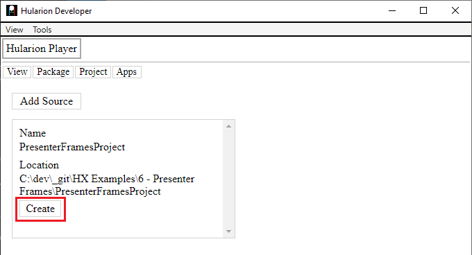
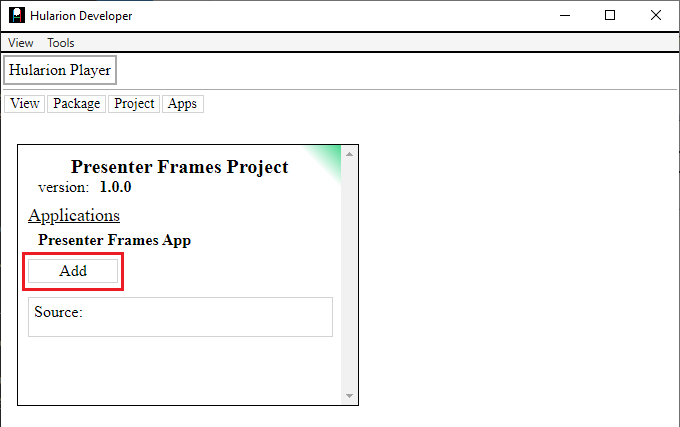
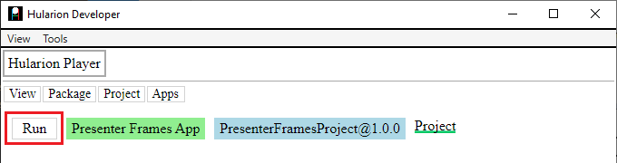
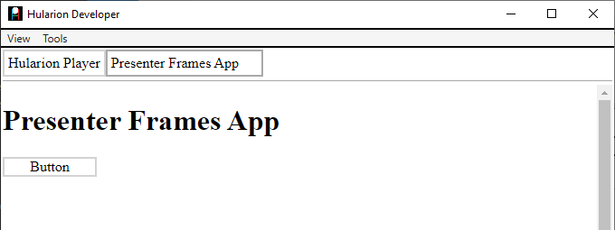
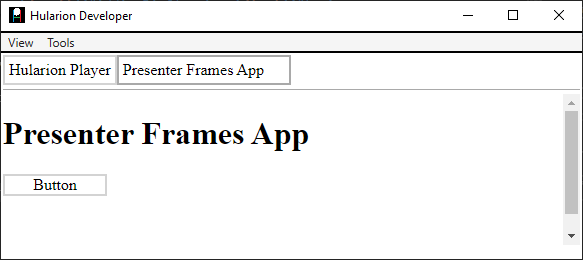
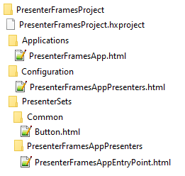

<a id="top"></a> 


#### Hularion - *Software with a Strategy*
#### Hularion Experience (HX) - A modular client application framework for web and desktop using HTML, CSS, and JS.

&nbsp;

# Hularion Experience - Presenter Frames

&nbsp;

## Prerequisites

If you are unfamiliar with Hularion Experience, please review the following article(s) before continuing. 

#### Article 1 - Getting Started

https://github.com/JohnathanADrews/HularionExperience/tree/main/docs/1%20-%20GettingStarted/readme.md


#### Article 2 - Basics - Create a Button

https://github.com/JohnathanADrews/HularionExperience/blob/main/docs/2%20-%20Create%20a%20Button/readme.md

&nbsp;
<a id="Requirements"></a>
## Requirements

#### Hularion Developer - https://github.com/JohnathanADrews/HularionDeveloper

Please use the latest release. Alternatively, you can run it from your IDE by setting the HularionDeveloper project as the startup project.

&nbsp;

## Contents 

1. [Introduction](#Introduction)
1. [Setup](#Setup)
1. [New Presenter Set and Frame Reference](#NewPresenterSetFrameReference)
1. [Attaching a Frame Handle to a Caller Frame](#AttachingFrameHandleCallerFrame)
1. [Attaching a Frame Handle to Presenter Instances](#AttachingFrameHandlePresenterInstances)
1. [Final Code](#FinalCode)


&nbsp;
<a id="Introduction"></a>
## Introduction

###### goto &rarr; [(next)](#Setup) - [(top)](#top)

Consider the second article "2 - Create a Button". In that article, we created a Button presenter in the same presenter set as the MyAppEntryPoint presenter. However, a Button is a general use presenter, while MyAppEntryPoint is specific to the application. If we continue to build the application in this way, we could have many general use presenters such as Menu, ListBox, Grid, and others, along side application specific presenters such as Inventory, Order, and Customer. So, we need a way to separate the general use presenters from the more application specific presenters. This is the problem that "frames" solve.


&nbsp;
<a id="Setup"></a>
## Setup

###### goto &rarr; [(prev)](#Introduction) - [(next)](#NewPresenterSetFrameReference) - [(top)](#top)

1. Open the Hularion Developer application as set out in the [(Requirements)](#Requirements).
2. Copy the content of the [Setup](Setup) folder into a local folder. Alternatively, you can create the folder structure and files as follows.

#### Directory Structure and Files




#### PresenterFramesProject.hxproject
```
<hx h-hxpackage="true"
    h-package-name="Presenter Frames Project"
    h-version="1.0.0"
    h-package-key="PresenterFramesProject">

</hx>
```

#### PresenterFramesApp.html
```
<hx h-application="true"
    h-application-key="PresenterFramesApp"
    h-application-name="Presenter Frames App"
    h-presenter-set="PresenterFramesAppPresenters"
    h-application-presenter="PresenterFramesAppEntryPoint"
    h-application-is-default="true">
</hx>
```

#### PresenterFramesAppEntryPoint.html
```
<h1>Presenter Frames App</h1>

<hx h-presenter="Button" />

<script>

    function PresenterFramesAppEntryPoint() {
    }

    PresenterFramesAppEntryPoint.prototype = {

        start: function (parameters) {
            var t = this;
            
        }
    }

</script>
```

#### Button.html
```
<hx h-publisher="Click" />
<hx h-proxy="setText" />

<label h-handle="title" class="buttonTitle">Button</label>


<script>

    function Button() {
    }

    Button.prototype = {

        start: function (parameters) {            
		
            console.log("Button.start - ", this, window);

			var t = this;
			console.log("Button.start principal - ", t.hularion.principal);
			t.hularion.principal.addEventListener("click", ()=>{
				console.log("Button - button clicked");
				
				t.hularion.publisher.Click.publish();
			});
        },
		
		setText: function(text){
            console.log("Button.setText - ", this, text);
			this.title.innerHTML = text;
		}
    }

</script>

<style>
	
	.this{
		width: 100px;
		border:solid 2px lightgrey;
		text-align:center;
		cursor: pointer;
		user-select: none;
	}
	
	.this *{
		cursor: pointer;
		user-select: none;
	}
	
	.buttonTitle:hover{
		color:darkgrey;
	}

</style>
```

#### Load the PresenterFramesApp Application

In Hularion Developer, select Package->ViewSources. Then, click Add Source.


Enter a Name and a Location, which is the directory in which PresenterFramesProject.hxproject was placed. Then, click Create. The Create button will then be replaced by an Update button and a Delete button.


Go to Package->View Packages. You will see the PresenterFramesProject Project package. It has a green tip, which means that it is sourced from a project, as opposed to a compiled package. Click the Add button to add the project. The Add button will be replaced by a Remove button.



Next, go to Apps->My Apps. You should see a line for PresenterFramesApp Application. Click Run, which will cause the application to load in another tab.



The running application:




&nbsp;
<a id="NewPresenterSetFrameReference"></a>
## New Presenter Set and Frame Reference

###### goto &rarr; [(prev)](#Setup) - [(next)](#AttachingFrameHandleCallerFrame) - [(top)](#top)

To separate the PresenterFramesAppEntryPoint presenter and the Button presenter, we will create a second presenter set called Common by creating a folder named Common inside of the PresenterSets folder. Then we will move the Button.html presenter into the common folder. It should look like the following image.


If you refresh the application, you should get the following error. This is because Button is no longer in the same presenter set as PresenterFramesAppEntryPoint.


Now, we need to create a configuration file for the PresenterFramesAppPresenters presenter set. To do this, we first need to create a folder called Configuration in the top level project folder. Then, we need to create a configuration file called PresenterFramesAppPresenters.html within that folder. The project should look as follows.


In the conguration file, add the following code. 
```
<hx h-presenter-configuration="PresenterFramesProject-PresenterFramesAppPresenters-Config" h-presenter-set="PresenterFramesAppPresenters">

</hx>
```
The h-presenter-configuration attribute identifies it as a configuration file and gives the configuration a unique name. The h-presenter-set="PresenterFramesAppPresenters" lets the compiler know which presenter set the configuration affects.

Now, let's add the frame reference.
```
<hx h-presenter-configuration="PresenterFramesProject-PresenterFramesAppPresenters-Config" h-presenter-set="PresenterFramesAppPresenters">

    <hx h-import-presenter="this" h-import-set="Common" h-frame="Common"></hx>
	
</hx>
```
The h-import-presenter="this" attribute indicates which package alias. "this" always represents the package (or project) containing the presenter set. Sets can be referenced across packages, but that is out of scope here. 

The h-import-set="Common" attribute indicates that the PresenterFramesAppPresenters set references the Common set, which tells the framework to load up the Common set and give a reference to the PresenterFramesAppPresenters set.

The h-frame="Common" attribute gives an alias to the frame so that it can be used by presenters in PresenterFramesAppPresenters.

If you now refresh the app, however, you will still get the failed to create Button error. This is because we need to add the alias in the h-presenter tag in order to scope Button to the Common set. So, the presenter reference will look like this (noice the "Common/" part).
```
<hx h-presenter="Common/Button" />
```

The full PresenterFramesAppEntryPoint code is this.
```
<h1>Presenter Frames App</h1>

<hx h-presenter="Common/Button" />

<script>

    function PresenterFramesAppEntryPoint() {
    }

    PresenterFramesAppEntryPoint.prototype = {

        start: function (parameters) {
            var t = this;
            
        }
    }

</script>
```

If you refresh the app now, it should load with the button.




&nbsp;
<a id="AttachingFrameHandleCallerFrame"></a>
## Attaching a Frame Handle to a Caller Frame

###### goto &rarr; [(prev)](#NewPresenterSetFrameReference) - [(next)](#AttachingFrameHandlePresenterInstances) - [(top)](#top)

Another use for presenter frames is to create a frame handle which can be used to create presenters in javascript. There are two ways frame handles can be accessed, either "frame" (globally in the context of the set iframe) or "inject" (attached like a handle).

To attach a frame handle to the caller frame, use the following code.
```
<hx h-presenter-frame="Common" h-attach="frame" h-handle="sets.common"></hx>
``` 
The h-presenter-frame="Common" uses the frame alias set by the h-frame="Common" attribute in the previous tag.

The h-attach="frame" indicates that the frame reference should be attached to the frame. That is, globally on the PresenterFramesAppPresenters iframe.

The h-handle="sets.common" indicates the path on the iframe window object for the frame reference.

In total, we have
```
<hx h-presenter-configuration="PresenterFramesProject-PresenterFramesAppPresenters-Config" h-presenter-set="PresenterFramesAppPresenters">

    <hx h-import-presenter="this" h-import-set="Common" h-frame="Common"></hx>	
    <hx h-presenter-frame="Common" h-attach="frame" h-handle="sets.common"></hx>	
	
</hx>
```

Now, add a console line to PresenterFramesAppEntryPoint, you can see the content of the frame handle.
```
<h1>Presenter Frames App</h1>

<hx h-presenter="Common/Button" />

<script>

    function PresenterFramesAppEntryPoint() {
    }

    PresenterFramesAppEntryPoint.prototype = {

        start: function (parameters) {
            var t = this;
            
            console.log("PresenterFramesAppEntryPoint.start - ", t, window.sets);
        }
    }

</script>
```

Refresh the application and look in the Dev Tool Console.


We can see that the window.sets object has an object called "common" just as we specified. There are a few objects on common, but the one we are interested in is the "presenters" object, which has a "Button" object. That button object has a create method. So, lets call that method and add another button to the screen.

```
<h1>Presenter Frames App</h1>

<hx h-presenter="Common/Button" />

<script>

    function PresenterFramesAppEntryPoint() {
    }

    PresenterFramesAppEntryPoint.prototype = {

        start: function (parameters) {
            var t = this;
            
            console.log("PresenterFramesAppEntryPoint.start - ", t, window.sets);
			
			
			var frameButton = sets.common.presenters.Button.create();
			frameButton.proxy.setText("Frame Button");
			t.hularion.principal.append(frameButton.dome);
        }
    }

</script>
```
Refreshing the application, we can see the new button.


&nbsp;
<a id="AttachingFrameHandlePresenterInstances"></a>
## Attaching a Frame Handle to Presenter Instances 

###### goto &rarr; [(prev)](#AttachingFrameHandleCallerFrame) - [(next)](#FinalCode) - [(top)](#top)

Now, let's use the other h-attach method. Let's add a frame reference that will appear on each presenter instance. Use the following line.
```
<hx h-presenter-frame="Common" h-attach="inject" h-handle="frames.common"></hx>	
```
The h-presenter-frame="Common" uses the frame alias set by the h-frame="Common", just like the other frame reference.

The h-attach="inject" indicates that the frame reference should be attached to each MyAppPresenters presenter instance.

The h-handle="frames.common" indicates the path on the presenter instances where the frame refernce will live.

Here is the full configuration code.
```
<hx h-presenter-configuration="PresenterFramesProject-PresenterFramesAppPresenters-Config" h-presenter-set="PresenterFramesAppPresenters">

    <hx h-import-presenter="this" h-import-set="Common" h-frame="Common"></hx>
    <hx h-presenter-frame="Common" h-attach="frame" h-handle="sets.common"></hx>	
	<hx h-presenter-frame="Common" h-attach="inject" h-handle="frames.common"></hx>	
</hx>
```

Now, let's create another button using the new frame reference on the presenter instance. We will add the following code.
```
var injectButton = t.frames.common.presenters.Button.create();
injectButton.proxy.setText("Inject Button");
t.hularion.principal.append(injectButton.dome);
```

The complete code is the following.

```
<h1>Presenter Frames App</h1>

<hx h-presenter="Common/Button" />

<script>

    function PresenterFramesAppEntryPoint() {
    }

    PresenterFramesAppEntryPoint.prototype = {

        start: function (parameters) {
            var t = this;
            
            console.log("PresenterFramesAppEntryPoint.start - ", t, window.sets);
			
			
			var frameButton = sets.common.presenters.Button.create();
			frameButton.proxy.setText("Frame Button");
			t.hularion.principal.append(frameButton.dome);
			
			
			var injectButton = t.frames.common.presenters.Button.create();
			injectButton.proxy.setText("Inject Button");
			t.hularion.principal.append(injectButton.dome);
        }
    }

</script>
```

As you can see, we have the new button.


&nbsp;
<a id="FinalCode"></a>
## Final Code

###### goto &rarr; [(prev)](#AttachingFrameHandlePresenterInstances) - [(next)](#End) - [(top)](#top)

#### File Structure



#### PresenterFramesProject.hxproject
```
<hx h-hxpackage="true"
    h-package-name="Presenter Frames Project"
    h-version="1.0.0"
    h-package-key="PresenterFramesProject">

</hx>
```

#### PresenterFramesApp.html
```
<hx h-application="true"
    h-application-key="PresenterFramesApp"
    h-application-name="Presenter Frames App"
    h-presenter-set="PresenterFramesAppPresenters"
    h-application-presenter="PresenterFramesAppEntryPoint"
    h-application-is-default="true">
</hx>
```

#### PresenterFramesAppPresenters.html
```
<hx h-presenter-configuration="PresenterFramesProject-PresenterFramesAppPresenters-Config" h-presenter-set="PresenterFramesAppPresenters">

    <hx h-import-presenter="this" h-import-set="Common" h-frame="Common"></hx>
    <hx h-presenter-frame="Common" h-attach="frame" h-handle="sets.common"></hx>	
	<hx h-presenter-frame="Common" h-attach="inject" h-handle="frames.common"></hx>	
</hx>
```

#### PresenterFramesAppEntryPoint.html
```
<h1>Presenter Frames App</h1>

<hx h-presenter="Common/Button" />

<script>

    function PresenterFramesAppEntryPoint() {
    }

    PresenterFramesAppEntryPoint.prototype = {

        start: function (parameters) {
            var t = this;
            
            console.log("PresenterFramesAppEntryPoint.start - ", t, window.sets);
			
			
			var frameButton = sets.common.presenters.Button.create();
			frameButton.proxy.setText("Frame Button");
			t.hularion.principal.append(frameButton.dome);
			
			
			var injectButton = t.frames.common.presenters.Button.create();
			injectButton.proxy.setText("Inject Button");
			t.hularion.principal.append(injectButton.dome);
        }
    }

</script>
```

#### Button.html
```
<hx h-publisher="Click" />
<hx h-proxy="setText" />

<label h-handle="title" class="buttonTitle">Button</label>


<script>

    function Button() {
    }

    Button.prototype = {

        start: function (parameters) {            
		
            console.log("Button.start - ", this, window);

			var t = this;
			console.log("Button.start principal - ", t.hularion.principal);
			t.hularion.principal.addEventListener("click", ()=>{
				console.log("Button - button clicked");
				
				t.hularion.publisher.Click.publish();
			});
        },
		
		setText: function(text){
            console.log("Button.setText - ", this, text);
			this.title.innerHTML = text;
		}
    }

</script>

<style>
	
	.this{
		width: 100px;
		border:solid 2px lightgrey;
		text-align:center;
		cursor: pointer;
		user-select: none;
	}
	
	.this *{
		cursor: pointer;
		user-select: none;
	}
	
	.buttonTitle:hover{
		color:darkgrey;
	}

</style>
```


&nbsp;
<a id="End"></a>
### The End 
Please take a look a this [Completed](Completed) folder for the final project.
###### goto &rarr; [(prev)](#FinalCode) - [(top)](#top)


### The End