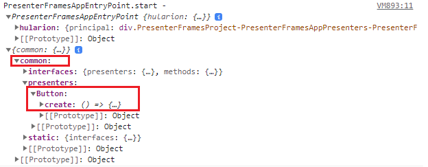

# Hularion - *Software with a Strategy*

##### Hularion TM &nbsp;&nbsp;&nbsp;&nbsp;&nbsp;&nbsp;&nbsp; Software with a Strategy TM

&nbsp;

If you are unfamiliar with Hularion Experience, please take a look at the first two documents, Getting Started and Button. The concepts in those two are necessary for this one. They are available using the following links.

https://github.com/JohnathanADrews/HularionExperience/tree/main/docs/1%20-%20GettingStarted/readme.md

https://github.com/JohnathanADrews/HularionExperience/blob/main/docs/2%20-%20Create%20a%20Button/readme.md

## Hularion Experience - Presenter Frames

Consider the second document "2 - Create a Button". In that example, we created a Button presenter in the same presenter set as the MyAppEntryPoint presenter. However, a Button is a general use presenter, while MyAppEntryPoint is specific to the application. If we continue to build the application in this way, we could have many general use presenters such as Menu, ListBox, Grid, and others, along side application specific presenters such as Inventory, Order, and Customer. So, we need a way to separate the general use presenters from the more application specific presenters. This is the problem that "frames" solve.


## Starting Code

Here is the starting code. Please be sure that the directory structure is setup as it was in the "2 - Create a Button" document and that Hularion Developer has the application running.

MyAppEntryPoint
```
<h1>My App</h1>

<hx h-presenter="Button" />

<script>

    function MyAppEntryPoint() {
    }

    MyAppEntryPoint.prototype = {

        start: function (parameters) {
            var t = this;
            
        }
    }

</script>
```

Button
```
<hx h-publisher="Click" />
<hx h-proxy="setText" />

<label h-handle="title" class="buttonTitle">Button</label>


<script>

    function Button() {
    }

    Button.prototype = {

        start: function (parameters) {            
		
            console.log("Button.start - ", this, window);

			var t = this;
			console.log("Button.start principal - ", t.hularion.principal);
			t.hularion.principal.addEventListener("click", ()=>{
				console.log("Button - button clicked");
				
				t.hularion.publisher.Click.publish();
			});
        },
		
		setText: function(text){
            console.log("Button.setText - ", this, text);
			this.title.innerHTML = text;
		}
    }

</script>

<style>
	
	.this{
		width: 100px;
		border:solid 2px lightgrey;
		text-align:center;
		cursor: pointer;
		user-select: none;
	}
	
	.this *{
		cursor: pointer;
		user-select: none;
	}
	
	.buttonTitle:hover{
		color:darkgrey;
	}

</style>
```

## New Presenter Set and Frame Reference

Let's create a new presenter set called Common by creating a folder named Common inside of the PresenterSets folder. Then move the Button.html presenter into the common folder. It should look like the following image.


If you refresh the application, you should get the following error. This is because Button is no longer in the same presenter set as MyAppEntryPoint.


Now, we need to create a configuration file for the MyAppPresenters presenter set. To do this, we first need to create a folder called Configuration in the top level project folder. Then, we need to create a configuration file called MyAppPresenters.html within that folder. The project should look as follows.


In the conguration file, add the following code. 
```
<hx h-presenter-configuration="MyProject-MyAppPresenters-Config" h-presenter-set="MyAppPresenters">

</hx>
```
The h-presenter-configuration attribute identifies it as a configuration file and gives the configuration a unique name. The h-presenter-set="MyAppPresenters" lets the compiler know which presenter set the configuration affects.

Now, let's add the frame reference.
```
<hx h-presenter-configuration="MyProject-MyAppPresenters-Config" h-presenter-set="MyAppPresenters">

    <hx h-import-presenter="this" h-import-set="Common" h-frame="Common"></hx>
	
</hx>
```
The h-import-presenter="this" attribute indicates which package alias. "this" always represents the package (or project) containing the presenter set. Sets can be referenced across packages, but that is out of scope here. 

The h-import-set="Common" attribute indicates that the MyAppPresenters set references the Common set, which tells the framework to load up the Common set and give a reference to the MyAppPresenters set.

The h-frame="Common" attribute gives an alias to the frame so that it can be used by presenters in MyAppPresenters.

If you now refresh the app, however, you will still get the failed to create Button error. This is because we need to add the alias in the h-presenter tag in order to scope Button to the Common set. So, the presenter reference will look like this (noice the "Common/" part).
```
<hx h-presenter="Common/Button" />
```

The full MyAppEntryPoint code is this.
```
<h1>My App</h1>

<hx h-presenter="Common/Button" />

<script>

    function MyAppEntryPoint() {
    }

    MyAppEntryPoint.prototype = {

        start: function (parameters) {
            var t = this;
            
        }
    }

</script>
```

If you refresh the app now, it should load with the button.


## Presenter Creators Using Frames

Another use for presenter frames is to create a frame handle which can be used to create presenters in javascript. There are two ways frame handles can be accessed, either "frame" (globally in the context of the set iframe) or "inject" (attached like a handle).

To attach a frame handle to the caller frame, use the following code.
```
<hx h-presenter-frame="Common" h-attach="frame" h-handle="sets.common"></hx>
``` 
The h-presenter-frame="Common" uses the frame alias set by the h-frame="Common" attribute in the previous tag.

The h-attach="frame" indicates that the frame reference should be attached to the frame. That is, globally on the MyAppPresenters iframe.

The h-handle="sets.common" indicates the path on the iframe window object for the frame reference.

In total, we have
```
<hx h-presenter-configuration="MyProject-MyAppPresenters-Config" h-presenter-set="MyAppPresenters">

    <hx h-import-presenter="this" h-import-set="Common" h-frame="Common"></hx>	
    <hx h-presenter-frame="Common" h-attach="frame" h-handle="sets.common"></hx>	
	
</hx>
```

Now, add a console line to MyAppEntryPoint, you can see the content of the frame handle.
```
<h1>My App</h1>

<hx h-presenter="Common/Button" />

<script>

    function MyAppEntryPoint() {
    }

    MyAppEntryPoint.prototype = {

        start: function (parameters) {
            var t = this;
            
            console.log("MyAppEntryPoint.start - ", t, window.sets);
        }
    }

</script>
```

Refresh the application and look in the Dev Tool Console.



We can see that the window.sets object has an object called "common" just as we specified. There are a few objects on common, but the one we are interested in is the "presenters" object, which has a "Button" object. That button object has a create method. So, lets call that method and add another button to the screen.

```
<h1>My App</h1>

<hx h-presenter="Common/Button" />

<script>

    function MyAppEntryPoint() {
    }

    MyAppEntryPoint.prototype = {

        start: function (parameters) {
            var t = this;
            
            console.log("MyAppEntryPoint.start - ", t, window.sets);
			
			
			var frameButton = sets.common.presenters.Button.create();
			frameButton.proxy.setText("Frame Button");
			t.hularion.principal.append(frameButton.dome);
        }
    }

</script>
```
Refreshing the application, we can see the new button.


Now, let's use the other method. Let's add a frame reference that will appear on each presenter instance. Use the following line.
```
<hx h-presenter-frame="Common" h-attach="inject" h-handle="frames.common"></hx>	
```
The h-presenter-frame="Common" uses the frame alias set by the h-frame="Common", just like the other frame reference.

The h-attach="inject" indicates that the frame reference should be attached to each MyAppPresenters presenter instance.

The h-handle="frames.common" indicates the path on the presenter instances where the frame refernce will live.

Here is the full configuration code.
```
<hx h-presenter-configuration="MyProject-MyAppPresenters-Config" h-presenter-set="MyAppPresenters">

    <hx h-import-presenter="this" h-import-set="Common" h-frame="Common"></hx>	
    <hx h-presenter-frame="Common" h-attach="frame" h-handle="sets.common"></hx>	
    <hx h-presenter-frame="Common" h-attach="inject" h-handle="frames.common"></hx>	
	
</hx>
```

Now, let's create another button using the new frame reference on the presenter instance. We will add the following code.
```
var injectButton = t.frames.common.presenters.Button.create();
injectButton.proxy.setText("Inject Button");
t.hularion.principal.append(injectButton.dome);
```

The complete code is the following.

```
<h1>My App</h1>

<hx h-presenter="Common/Button" />

<script>

    function MyAppEntryPoint() {
    }

    MyAppEntryPoint.prototype = {

        start: function (parameters) {
            var t = this;
            
            console.log("MyAppEntryPoint.start - ", t, window.sets);
			
			
			var frameButton = sets.common.presenters.Button.create();
			frameButton.proxy.setText("Frame Button");
			t.hularion.principal.append(frameButton.dome);
			
			var injectButton = t.frames.common.presenters.Button.create();
			injectButton.proxy.setText("Inject Button");
			t.hularion.principal.append(injectButton.dome);
        }
    }

</script>
```

As you can see, we have the new button.


### The End