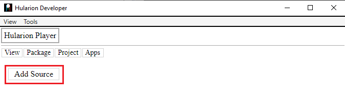
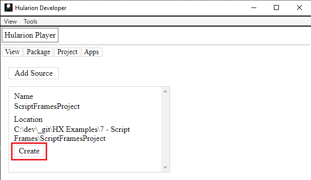
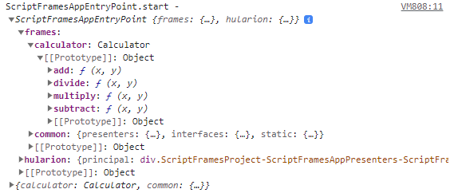

<a id="top"></a> 


#### Hularion - *Software with a Strategy*
#### Hularion Experience (HX) - A modular client application framework for web and desktop using HTML, CSS, and JS.

&nbsp;

# Hularion Experience - Script Frames

&nbsp;

## Prerequisites

If you are unfamiliar with Hularion Experience, please review the following article(s) before continuing. 

#### Article 1 - Getting Started

https://github.com/JohnathanADrews/HularionExperience/tree/main/docs/1%20-%20GettingStarted/readme.md


#### Article 2 - Basics - Create a Button

https://github.com/JohnathanADrews/HularionExperience/blob/main/docs/2%20-%20Create%20a%20Button/readme.md

#### Article 6 - Presenter Frames

https://github.com/JohnathanADrews/HularionExperience/blob/main/docs/6%20-%20Presenter%20Frames/readme.md

&nbsp;
<a id="Requirements"></a>
## Requirements

#### Hularion Developer - https://github.com/JohnathanADrews/HularionDeveloper

Please use the latest release. Alternatively, you can run it from your IDE by setting the HularionDeveloper project as the startup project.

&nbsp;

## Contents 

1. [Introduction](#Introduction)
1. [Setup](#Setup)
1. [Attaching a Script Frame to a Presenter Frame](#AttachingScriptFramePresenterFrame)
1. [Attaching a Script Frame to Presenter Instances](#AttachingScriptFramePresenterInstances)
1. [Script API](#ScriptAPI)
1. [Loading a Presenter Frame into a Script Frame](#LoadingPresenterFramesScriptFrames)
1. [Loading a Script Frame into a Script Frame](#LoadingScriptFramesScriptFrames)
1. [Final Code](#FinalCode)


&nbsp;
<a id="Introduction"></a>
## Introduction

###### goto &rarr; [(next)](#Setup) - [(top)](#top)


Until this point, most of the discussion has been about presenters and how to develop them. However, sometimes we may want to use javascript utilities outside the context of a presenter.  In the Presenter Frames document, we discussed the need for different frames to manage presenter code from different presenter sets. In this document, we will discuss how to create a script set, a script frame, and then use those frames to share functionality across frames. In this example, we will use a similar setup to what we had at the end of "Document 6 - Presenter Frames" 


&nbsp;
<a id="Setup"></a>
## Setup

###### goto &rarr; [(prev)](#Introduction) - [(next)](#AttachingScriptFramePresenterFrame) - [(top)](#top)

1. Open the Hularion Developer application as set out in the [(Requirements)](#Requirements).
2. Copy the content of the [Setup](Setup) folder into a local folder. Alternatively, you can create the folder structure and files as follows.

#### Directory Structure and Files


#### ScriptFramesProject.hxproject
```
<hx h-hxpackage="true"
    h-package-name="Script Frames Project"
    h-version="1.0.0"
    h-package-key="ScriptFramesProject">

</hx>
```

#### ScriptFramesApp.html
```
<hx h-application="true"
    h-application-key="ScriptFramesApp"
    h-application-name="Script Frames App"
    h-presenter-set="ScriptFramesAppPresenters"
    h-application-presenter="ScriptFramesAppEntryPoint"
    h-application-is-default="true">
</hx>
```

#### ScriptFramesAppPresenters.html
```
<hx h-presenter-configuration="ScriptFramesProject-ScriptFramesAppPresenters-Config" h-presenter-set="ScriptFramesAppPresenters">

    <hx h-import-presenter="this" h-import-set="Common" h-frame="Common"></hx>
    <hx h-presenter-frame="Common" h-attach="frame" h-handle="sets.common"></hx>	
	<hx h-presenter-frame="Common" h-attach="inject" h-handle="frames.common"></hx>	
</hx>
```

#### ScriptFramesAppEntryPoint.html
```
<h1>Script Frames App</h1>

<hx h-presenter="Common/Button" />

<script>

    function ScriptFramesAppEntryPoint() {
    }

    ScriptFramesAppEntryPoint.prototype = {

        start: function (parameters) {
            var t = this;
            
            console.log("ScriptFramesAppEntryPoint.start - ", t, window.sets);
			
			
        }
    }

</script>
```

#### Button.html
```
<hx h-publisher="Click" />
<hx h-proxy="setText" />

<label h-handle="title" class="buttonTitle">Button</label>


<script>

    function Button() {
    }

    Button.prototype = {

        start: function (parameters) {            
		
            console.log("Button.start - ", this, window);

			var t = this;
			console.log("Button.start principal - ", t.hularion.principal);
			t.hularion.principal.addEventListener("click", ()=>{
				console.log("Button - button clicked");
				
				t.hularion.publisher.Click.publish();
			});
        },
		
		setText: function(text){
            console.log("Button.setText - ", this, text);
			this.title.innerHTML = text;
		}
    }

</script>

<style>
	
	.this{
		width: 100px;
		border:solid 2px lightgrey;
		text-align:center;
		cursor: pointer;
		user-select: none;
	}
	
	.this *{
		cursor: pointer;
		user-select: none;
	}
	
	.buttonTitle:hover{
		color:darkgrey;
	}

</style>
```


#### Load the ScriptFramesApp Application

In Hularion Developer, select Package->ViewSources. Then, click Add Source.



Enter a Name and a Location, which is the directory in which ScriptFramesProject.hxproject was placed. Then, click Create. The Create button will then be replaced by an Update button and a Delete button.


Go to Package->View Packages. You will see the Script Frames Project package. It has a green tip, which means that it is sourced from a project, as opposed to a compiled package. Click the Add button to add the project. The Add button will be replaced by a Remove button.


Next, go to Apps->My Apps. You should see a line for Script Frames Application. Click Run, which will cause the application to load in another tab.


The running application:


&nbsp;
<a id="AttachingScriptFramePresenterFrame"></a>
## Attaching a Script Frame to a Presenter Frame

###### goto &rarr; [(prev)](#Setup) - [(next)](#AttachingScriptFramePresenterInstances) - [(top)](#top)


In order to create a script frame, we first need a script set, so let's create one. First, create the project-level folder ScriptSets. Then, create a folder inside that one - we will call it MyScripts. Then, in the MyScripts folder, create a file called calcualtor.js. The setup should look like the following.


In calculator.js, add the following code.
```
function Calculator(){	
}
Calculator.prototype ={
	add: function(x, y){
		return x + y;
	},
	subtract: function(x, y){
		return x - y;
	},
	multiply: function(x, y){
		return x * y;
	},
	divide: function(x, y){
		return x / y;
	}
}
```

Now, suppose we want to use the calculator in our application. We need to access the calculator from the MyScripts script set. To  do this, we add a reference in the ScriptFramesAppPresenters configuration. We will use the following lines.
```
<hx h-import-script="this" h-import-set="MyScripts" h-frame="sfMyScripts"></hx>
<hx h-script-frame="sfMyScripts" h-attach="frame" h-handle="sets.calculator" h-assign="new Calculator();"></hx>
```

#### Examine the first line.

The h-import-script="this" attribute refers to the package alias (or project) in which the set resides. "this" indicates that the package is the package to which the configuration belongs (i.e. the current package).

The h-import-set="MyScripts" attribute indicates that we are referencing the MyScripts script set.

The h-frame="sfMyScripts" attribute assigns an alias to the frame that is created so it can be referenced elsewhere.


#### Examine the second line.

The h-script-frame="sfMyScripts" attribute indicates that we are using the frame assigned in the first line.

The h-attach="frame" indicates that the script handle will be attached to the iframe's window.

The h-handle="sets.calculator" attribute names the handle that will be used.

The h-assign="new Calculator();" attribute determines what will be assigned to the handle. In this case, an instance of the Calculator contructor function.

The full configuration is as follows, which includes the presenter frame references to Common from the previous article.

```
<hx h-presenter-configuration="ScriptFramesProject-ScriptFramesAppPresenters-Config" h-presenter-set="ScriptFramesAppPresenters">

    <hx h-import-presenter="this" h-import-set="Common" h-frame="Common"></hx>
    <hx h-presenter-frame="Common" h-attach="frame" h-handle="sets.common"></hx>	
	<hx h-presenter-frame="Common" h-attach="inject" h-handle="frames.common"></hx>	
	
	<hx h-import-script="this" h-import-set="MyScripts" h-frame="sfMyScripts"></hx>
	<hx h-script-frame="sfMyScripts" h-attach="frame" h-handle="sets.calculator" h-assign="new Calculator();"></hx>

</hx>
```


When we save this and run it, we can look at the Console in the Dev Tools to see what happened. The console.log is
```
console.log("ScriptFramesAppEntryPoint.start - ", t, window.sets);
```


As we can see, the window.sets object has a "calculator" member, and that object has the methods on the prototype we added to it. Now, let's use some of the functionality.

```
<h1>Script Frames App</h1>

<hx h-presenter="Common/Button" />

<script>

    function ScriptFramesAppEntryPoint() {
    }

    ScriptFramesAppEntryPoint.prototype = {

        start: function (parameters) {
            var t = this;
            
            console.log("ScriptFramesAppEntryPoint.start - ", t, window.sets);
			
			
			console.log("ScriptFramesAppEntryPoint.start - add(2,5) - ", window.sets.calculator.add(2, 5));
			console.log("ScriptFramesAppEntryPoint.start - subtract(3,6) - ", window.sets.calculator.subtract(3,6));
			console.log("ScriptFramesAppEntryPoint.start - multiply(4,7) - ", window.sets.calculator.multiply(4,7));
			console.log("ScriptFramesAppEntryPoint.start - divide(5,8) - ", window.sets.calculator.divide(5, 8));
        }
    }

</script>
```

If we refresh the application, we get the following console.log.


&nbsp;
<a id="AttachingScriptFramePresenterInstances"></a>
## Attaching a Script Frame to Presenter Instances

###### goto &rarr; [(prev)](#AttachingScriptFramePresenterFrame) - [(next)](#ScriptAPI) - [(top)](#top)


Just as we used "inject" to add a presenter frame handle to presenter instances, we can use the same approach to add script handles to presenter instances. We just change the h-attach attribute to "inject". The "new Calculator();" will be placed on the frames.calculator handle of each presenter.
```
<hx h-script-frame="sfMyScripts" h-attach="inject" h-handle="frames.calculator" h-assign="new Calculator();"></hx>
```
The full configuration is
```
<hx h-presenter-configuration="ScriptFramesProject-ScriptFramesAppPresenters-Config" h-presenter-set="ScriptFramesAppPresenters">

    <hx h-import-presenter="this" h-import-set="Common" h-frame="Common"></hx>
    <hx h-presenter-frame="Common" h-attach="frame" h-handle="sets.common"></hx>	
	<hx h-presenter-frame="Common" h-attach="inject" h-handle="frames.common"></hx>	
	
	<hx h-import-script="this" h-import-set="MyScripts" h-frame="sfMyScripts"></hx>
	<hx h-script-frame="sfMyScripts" h-attach="frame" h-handle="sets.calculator" h-assign="new Calculator();"></hx>
	<hx h-script-frame="sfMyScripts" h-attach="inject" h-handle="frames.calculator" h-assign="new Calculator();"></hx>
</hx>
```

When we refesh the application, we get the following result on the MyAppEntryPoint presenter.




&nbsp;
<a id="ScriptAPI"></a>
## Script API

###### goto &rarr; [(prev)](#AttachingScriptFramePresenterInstances) - [(next)](#LoadingPresenterFramesScriptFrames) - [(top)](#top)

In this section, we will discuss a stylistic choice for handling many script references. We may have a number of objects that we want to be able to access from another frame. In addition to Calculator, I might have DateTime, TreeTraverser, CustomerApplicationValidator, ValueEstimator, and so on. We can make references to all of these in configuration file, or we can create an "API" javascript object that would contain the necessary references.

So, let's start by adding another javascript file called worker.js. We will add the following code.
```
function Worker(){
	
}
Worker.prototype ={
	DoWork1: function(){
		console.log("Worker.DoWork1");
	},
	DoWork2: function(){
		console.log("Worker.DoWork1");
	}
}
```

Finally, let's add api.js with the following code.
```
function API(){
	this.Calculator = Calculator;
	this.Worker = Worker;
}
API.prototype ={
}
```

Next, we will add a reference in the configuration.
```
<hx h-script-frame="sfMyScripts" h-attach="frame" h-handle="sets.msScripts.api" h-assign="new API();"></hx>	
```
Here is the full configuration.
```
<hx h-presenter-configuration="ScriptFramesProject-ScriptFramesAppPresenters-Config" h-presenter-set="ScriptFramesAppPresenters">

    <hx h-import-presenter="this" h-import-set="Common" h-frame="Common"></hx>
    <hx h-presenter-frame="Common" h-attach="frame" h-handle="sets.common"></hx>	
	<hx h-presenter-frame="Common" h-attach="inject" h-handle="frames.common"></hx>	
	
	<hx h-import-script="this" h-import-set="MyScripts" h-frame="sfMyScripts"></hx>
	<hx h-script-frame="sfMyScripts" h-attach="frame" h-handle="sets.calculator" h-assign="new Calculator();"></hx>
	<hx h-script-frame="sfMyScripts" h-attach="inject" h-handle="frames.calculator" h-assign="new Calculator();"></hx>
	
    <hx h-script-frame="sfMyScripts" h-attach="frame" h-handle="sets.msScripts.api" h-assign="new API();"></hx>	
</hx>
```

Finally, we will use this frame hande in ScriptFramesAppEntryPoint to create new instances of Calculator and Worker.
```
console.log("ScriptFramesAppEntryPoint.start - new Calulator - ", new window.sets.msScripts.api.Calculator());
console.log("ScriptFramesAppEntryPoint.start - new Worker - ", new window.sets.msScripts.api.Worker());
```
Full Code
```
<h1>Script Frames App</h1>

<hx h-presenter="Common/Button" />

<script>

    function ScriptFramesAppEntryPoint() {
    }

    ScriptFramesAppEntryPoint.prototype = {

        start: function (parameters) {
            var t = this;
            
            console.log("ScriptFramesAppEntryPoint.start - ", t, window.sets);
			
			
			console.log("ScriptFramesAppEntryPoint.start - add(2,5) - ", window.sets.calculator.add(2, 5));
			console.log("ScriptFramesAppEntryPoint.start - subtract(3,6) - ", window.sets.calculator.subtract(3,6));
			console.log("ScriptFramesAppEntryPoint.start - multiply(4,7) - ", window.sets.calculator.multiply(4,7));
			console.log("ScriptFramesAppEntryPoint.start - divide(5,8) - ", window.sets.calculator.divide(5, 8));
			
			
			console.log("ScriptFramesAppEntryPoint.start - new Calulator - ", new window.sets.msScripts.api.Calculator());
			console.log("ScriptFramesAppEntryPoint.start - new Worker - ", new window.sets.msScripts.api.Worker());
        }
    }

</script>
```

When we refresh the application, we get the following console log.


By encapsulating the javascript functionality into a single API constructor function, access to many aspects of the script can be handled with a single frame reference. This also makes it clear to the script library which functionality is being used.

&nbsp;
<a id="LoadingPresenterFramesScriptFrames"></a>
## Loading a Presenter Frame into a Script Frame

###### goto &rarr; [(prev)](#ScriptAPI) - [(next)](#LoadingScriptFramesScriptFrames) - [(top)](#top)

So far, we have discussed how to load script frame handles into presenter frames. Now, we will look at ways to load presenter frame handles into script frames. First, we need to create a configuration file for the MyScripts script set.

In the configuration folder, create MyScripts.html. Add the following code.
```
<hx h-script-configuration="ScriptFramesProject-MyScripts-Config" h-script-set="MyScripts">

</hx>
```
As you can see, there is just a configuration line. 

The h-script-configuration="ScriptFramesProject-MyScripts-Config" attribute indicates that the configuration is for a script set and it also assigns a unique key.

The h-script-set="MyScripts" attribute indicates which script set the configuration affects.

Now, let's add in a couple of lines to setup the frame and then attach the handle to the frame.

Full Code
```
<hx h-script-configuration="ScriptFramesProject-MyScripts-Config" h-script-set="MyScripts">

    <hx h-import-presenter="this" h-import-set="Common" h-frame="Common"></hx>	
    <hx h-presenter-frame="Common" h-attach="frame" h-handle="sets.common"></hx>	

</hx>
```
Just as it did in the presenter configuration, these lines make a reference to create a frame for the Common presenter set and give it an alias. Then, that alias is used to create a frame handle.

Next, Let's add the "getCommonPresenters" method to API so we can get the frame handle.
```
function API(){
	this.Calculator = Calculator;
	this.Worker = Worker;
	
}
API.prototype ={
	getCommonPresenters: function(){
		return sets.common;
	}
}
```
Then, we will add get the frame handle in ScriptFramesAppEntryPoint a log it. We will also create a button and log it. 
```
<h1>Script Frames App</h1>

<hx h-presenter="Common/Button" />

<script>

    function ScriptFramesAppEntryPoint() {
    }

    ScriptFramesAppEntryPoint.prototype = {

        start: function (parameters) {
            var t = this;
            
            console.log("ScriptFramesAppEntryPoint.start - ", t, window.sets);
			
			
			console.log("ScriptFramesAppEntryPoint.start - add(2,5) - ", window.sets.calculator.add(2, 5));
			console.log("ScriptFramesAppEntryPoint.start - subtract(3,6) - ", window.sets.calculator.subtract(3,6));
			console.log("ScriptFramesAppEntryPoint.start - multiply(4,7) - ", window.sets.calculator.multiply(4,7));
			console.log("ScriptFramesAppEntryPoint.start - divide(5,8) - ", window.sets.calculator.divide(5, 8));
			
			
			console.log("ScriptFramesAppEntryPoint.start - new Calulator - ", new window.sets.msScripts.api.Calculator());
			console.log("ScriptFramesAppEntryPoint.start - new Worker - ", new window.sets.msScripts.api.Worker());
			
			
			var common = window.sets.msScripts.api.getCommonPresenters();
			console.log("ScriptFramesAppEntryPoint.start - getCommonPresenters - ", common);
			console.log("ScriptFramesAppEntryPoint.start - getCommonPresenters - Button - ", common.presenters.Button.create());
        }
    }

</script>
```

Here is the result. The first part is the "common" variable which contains the returned frame reference. Then, there are a couple of lines for the Button, since a new instance is created. Finally, we have the logged Button instance.


&nbsp;
<a id="LoadingScriptFramesScriptFrames"></a>
## Loading a Script Frame into a Script Frame

###### goto &rarr; [(prev)](#LoadingPresenterFramesScriptFrames) - [(next)](#FinalCode) - [(top)](#top)


In this section, we will load script frame handles into other script frames. This could be useful if you want to segregate functionality into different script set.

Let's make another script set called Jobs by creating the Jobs folder in the ScriptSets folder. In the Jobs folder, create jobs.js. 
```
function Jobs(){
}
Jobs.prototype = {
	addJob: function(){
		console.log("Jobs.addJob");
	},
	removeJob: function(){
		console.log("Jobs.removeJob");
	}
}
```

In the MyScripts configuration, let's add the necessary lines to create a handle.
```
<hx h-import-script="this" h-import-set="Jobs" h-frame="sfJobs"></hx>
<hx h-script-frame="sfJobs" h-attach="frame" h-handle="sets.jobs" h-assign="new Jobs();"></hx>
```
The total file is
```
<hx h-script-configuration="ScriptFramesProject-MyScripts-Config" h-script-set="MyScripts">

    <hx h-import-presenter="this" h-import-set="Common" h-frame="Common"></hx>	
    <hx h-presenter-frame="Common" h-attach="frame" h-handle="sets.common"></hx>	


    <hx h-import-script="this" h-import-set="Jobs" h-frame="sfJobs"></hx>
    <hx h-script-frame="sfJobs" h-attach="frame" h-handle="sets.jobs" h-assign="new Jobs();"></hx>
</hx>
```

To see the new Jobs handle, we need to add it to API. We will add a getJobs method.
```
function API(){
	this.Calculator = Calculator;
	this.Worker = Worker;
	
}
API.prototype ={
	getCommonPresenters: function(){
		return sets.common;
	},
	getJobs: function(){
		return sets.jobs;
	}
}
```
Finally, we will add a couple line to see it in ScriptFramesAppEntryPoint.
```
var jobs = window.sets.msScripts.api.getJobs();
console.log("ScriptFramesAppEntryPoint.start - getJobs - ", jobs);
jobs.addJob();
jobs.removeJob();
```
Full Code
```
<h1>Script Frames App</h1>

<hx h-presenter="Common/Button" />

<script>

    function ScriptFramesAppEntryPoint() {
    }

    ScriptFramesAppEntryPoint.prototype = {

        start: function (parameters) {
            var t = this;
            
            console.log("ScriptFramesAppEntryPoint.start - ", t, window.sets);
			
			
			console.log("ScriptFramesAppEntryPoint.start - add(2,5) - ", window.sets.calculator.add(2, 5));
			console.log("ScriptFramesAppEntryPoint.start - subtract(3,6) - ", window.sets.calculator.subtract(3,6));
			console.log("ScriptFramesAppEntryPoint.start - multiply(4,7) - ", window.sets.calculator.multiply(4,7));
			console.log("ScriptFramesAppEntryPoint.start - divide(5,8) - ", window.sets.calculator.divide(5, 8));
			
			
			console.log("ScriptFramesAppEntryPoint.start - new Calulator - ", new window.sets.msScripts.api.Calculator());
			console.log("ScriptFramesAppEntryPoint.start - new Worker - ", new window.sets.msScripts.api.Worker());
			
			
			var common = window.sets.msScripts.api.getCommonPresenters();
			console.log("ScriptFramesAppEntryPoint.start - getCommonPresenters - ", common);
			console.log("ScriptFramesAppEntryPoint.start - getCommonPresenters - Button - ", common.presenters.Button.create());
						
			var jobs = window.sets.msScripts.api.getJobs();
			console.log("ScriptFramesAppEntryPoint.start - getJobs - ", jobs);
			jobs.addJob();
			jobs.removeJob();
			
        }
    }

</script>
```

When we refresh the app, we get the following output. As you can see, we have a 


&nbsp;
<a id="FinalCode"></a>
## Final Code

###### goto &rarr; [(prev)](#LoadingScriptFramesScriptFrames) - [(next)](#End) - [(top)](#top)

#### File Structure


#### ScriptFramesProject.hxproject
```
<hx h-hxpackage="true"
    h-package-name="Script Frames Project"
    h-version="1.0.0"
    h-package-key="ScriptFramesProject">

</hx>
```

#### ScriptFramesApp.html
```
<hx h-application="true"
    h-application-key="ScriptFramesApp"
    h-application-name="Script Frames App"
    h-presenter-set="ScriptFramesAppPresenters"
    h-application-presenter="ScriptFramesAppEntryPoint"
    h-application-is-default="true">
</hx>
```

#### MyScripts.html
```
<hx h-script-configuration="ScriptFramesProject-MyScripts-Config" h-script-set="MyScripts">

    <hx h-import-presenter="this" h-import-set="Common" h-frame="Common"></hx>	
    <hx h-presenter-frame="Common" h-attach="frame" h-handle="sets.common"></hx>	


    <hx h-import-script="this" h-import-set="Jobs" h-frame="sfJobs"></hx>
    <hx h-script-frame="sfJobs" h-attach="frame" h-handle="sets.jobs" h-assign="new Jobs();"></hx>
</hx>
```

#### ScriptFramesAppPresenters.html
```
<hx h-presenter-configuration="ScriptFramesProject-ScriptFramesAppPresenters-Config" h-presenter-set="ScriptFramesAppPresenters">

    <hx h-import-presenter="this" h-import-set="Common" h-frame="Common"></hx>
    <hx h-presenter-frame="Common" h-attach="frame" h-handle="sets.common"></hx>	
	<hx h-presenter-frame="Common" h-attach="inject" h-handle="frames.common"></hx>	
	
	<hx h-import-script="this" h-import-set="MyScripts" h-frame="sfMyScripts"></hx>
	<hx h-script-frame="sfMyScripts" h-attach="frame" h-handle="sets.calculator" h-assign="new Calculator();"></hx>
	<hx h-script-frame="sfMyScripts" h-attach="inject" h-handle="frames.calculator" h-assign="new Calculator();"></hx>
	
    <hx h-script-frame="sfMyScripts" h-attach="frame" h-handle="sets.msScripts.api" h-assign="new API();"></hx>	
</hx>
```

#### Button.html
```
<hx h-publisher="Click" />
<hx h-proxy="setText" />

<label h-handle="title" class="buttonTitle">Button</label>


<script>

    function Button() {
    }

    Button.prototype = {

        start: function (parameters) {            
		
            console.log("Button.start - ", this, window);

			var t = this;
			console.log("Button.start principal - ", t.hularion.principal);
			t.hularion.principal.addEventListener("click", ()=>{
				console.log("Button - button clicked");
				
				t.hularion.publisher.Click.publish();
			});
        },
		
		setText: function(text){
            console.log("Button.setText - ", this, text);
			this.title.innerHTML = text;
		}
    }

</script>

<style>
	
	.this{
		width: 100px;
		border:solid 2px lightgrey;
		text-align:center;
		cursor: pointer;
		user-select: none;
	}
	
	.this *{
		cursor: pointer;
		user-select: none;
	}
	
	.buttonTitle:hover{
		color:darkgrey;
	}

</style>
```

#### ScriptFramesAppEntryPoint.html
```
<h1>Script Frames App</h1>

<hx h-presenter="Common/Button" />

<script>

    function ScriptFramesAppEntryPoint() {
    }

    ScriptFramesAppEntryPoint.prototype = {

        start: function (parameters) {
            var t = this;
            
            console.log("ScriptFramesAppEntryPoint.start - ", t, window.sets);
			
			
			console.log("ScriptFramesAppEntryPoint.start - add(2,5) - ", window.sets.calculator.add(2, 5));
			console.log("ScriptFramesAppEntryPoint.start - subtract(3,6) - ", window.sets.calculator.subtract(3,6));
			console.log("ScriptFramesAppEntryPoint.start - multiply(4,7) - ", window.sets.calculator.multiply(4,7));
			console.log("ScriptFramesAppEntryPoint.start - divide(5,8) - ", window.sets.calculator.divide(5, 8));
			
			
			console.log("ScriptFramesAppEntryPoint.start - new Calulator - ", new window.sets.msScripts.api.Calculator());
			console.log("ScriptFramesAppEntryPoint.start - new Worker - ", new window.sets.msScripts.api.Worker());
			
			
			var common = window.sets.msScripts.api.getCommonPresenters();
			console.log("ScriptFramesAppEntryPoint.start - getCommonPresenters - ", common);
			console.log("ScriptFramesAppEntryPoint.start - getCommonPresenters - Button - ", common.presenters.Button.create());
						
			var jobs = window.sets.msScripts.api.getJobs();
			console.log("ScriptFramesAppEntryPoint.start - getJobs - ", jobs);
			jobs.addJob();
			jobs.removeJob();
			
        }
    }

</script>
```

#### jobs.js
```
function Jobs(){
}
Jobs.prototype = {
	addJob: function(){
		console.log("Jobs.addJob");
	},
	removeJob: function(){
		console.log("Jobs.removeJob");
	}
}
```

#### api.js
```
function API(){
	this.Calculator = Calculator;
	this.Worker = Worker;
	
}
API.prototype ={	
	getCommonPresenters: function(){
		return sets.common;
	},
	getJobs: function(){
		return sets.jobs;
	}
}
```

#### calculator.js
```
function Calculator(){	
}
Calculator.prototype ={
	add: function(x, y){
		return x + y;
	},
	subtract: function(x, y){
		return x - y;
	},
	multiply: function(x, y){
		return x * y;
	},
	divide: function(x, y){
		return x / y;
	}
}
```

#### worker.js
```
function Worker(){
	
}
Worker.prototype ={
	DoWork1: function(){
		console.log("Worker.DoWork1");
	},
	DoWork2: function(){
		console.log("Worker.DoWork1");
	}
}
```


&nbsp;
<a id="End"></a>
### The End 
Please take a look a this [Completed](Completed) folder for the final project.
###### goto &rarr; [(prev)](#FinalCode) - [(top)](#top)


### The End