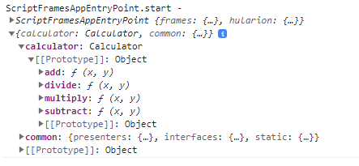
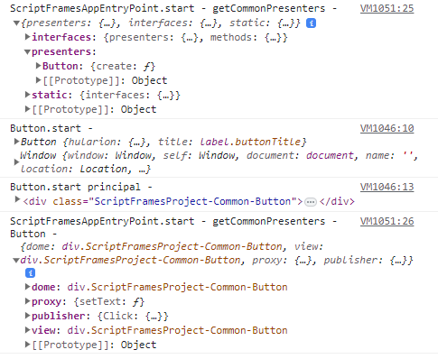

# Hularion - *Software with a Strategy*

##### Hularion TM &nbsp;&nbsp;&nbsp;&nbsp;&nbsp;&nbsp;&nbsp; Software with a Strategy TM

&nbsp;

## Prerequisites

If you are unfamiliar with Hularion Experience, please take a look at the following documents. In addition to documents 1 and 2, document 6 conveys information that this document will assume the reader understands.

Document 1 - Getting Started

https://github.com/JohnathanADrews/HularionExperience/tree/main/docs/1%20-%20GettingStarted/readme.md

Document 2 - Basics - Create a Button

https://github.com/JohnathanADrews/HularionExperience/blob/main/docs/2%20-%20Create%20a%20Button/readme.md

Document 6 - Presenter Frames

https://github.com/JohnathanADrews/HularionExperience/blob/main/docs/6%20-%20Presenter%20Frames/readme.md


## Hularion Experience - Script Frames

Until this point, most of the discussion has been about presenters and how to develop them. However, sometimes we may want to use javascript utilities outside the context of a presenter.  In the Presenter Frames document, we discussed the need for different frames to manage presenter code from different presenter sets. In this document, we will discuss how to create a script set, a script frame, and then use those frames to share functionality across frames. In this example, we will use a similar setup to what we had at the end of "Document 6 - Presenter Frames" 

## Starting Setup

The folder structure should look like this.


MyProject.hxproject project file
```
<hx h-hxpackage="true"
    h-package-name="MyPackage"
    h-version="1.0.0"
    h-package-key="MyPackage">

</hx>
```

MyAppPresenters.html configuration file
```
<hx h-presenter-configuration="MyProject-MyAppPresenters-Config" h-presenter-set="MyAppPresenters">

    <hx h-import-presenter="this" h-import-set="Common" h-frame="Common"></hx>	
    <hx h-presenter-frame="Common" h-attach="frame" h-handle="sets.common"></hx>	
    <hx h-presenter-frame="Common" h-attach="inject" h-handle="frames.common"></hx>	
	
</hx>
```

MyAppEntryPoint.html presenter file
```
<h1>My App</h1>

<hx h-presenter="Common/Button" />

<script>

    function MyAppEntryPoint() {
    }

    MyAppEntryPoint.prototype = {

        start: function (parameters) {
            var t = this;
            
            console.log("MyAppEntryPoint.start - ", t, window.sets);
					
			
        }
    }

</script>
```

Button.html presenter file
```
<label h-handle="title" class="buttonTitle">Button</label>

<script>

    function Button() {
    }

    Button.prototype = {

        start: function (parameters) {            
		
            console.log("Button.start - ", this, window);

			var t = this;
			console.log("Button.start principal - ", t.hularion.principal);
			t.hularion.principal.addEventListener("click", ()=>{
				console.log("Button - button clicked");
				
				t.hularion.publisher.Click.publish();
			});
        },
		
		setText: function(text){
            console.log("Button.setText - ", this, text);
			this.title.innerHTML = text;
		}
    }

</script>

<style>
	
	.this{
		width: 100px;
		border:solid 2px lightgrey;
		text-align:center;
		cursor: pointer;
		user-select: none;
	}
	
	.this *{
		cursor: pointer;
		user-select: none;
	}
	
	.buttonTitle:hover{
		color:darkgrey;
	}

</style>
```

## Adding a script set and a script file.

Lets's a script set. To do this, create the project-level folder ScriptSets. Then, create a folder inside that one - we will call it MyScripts. Then, in the MyScripts folder, create a file called calcualtor.js. The setup should look like the following.


In calculator.js, add the following code.
```
function Calculator(){	
}
Calculator.prototype ={
	add: function(x, y){
		return x + y;
	},
	subtract: function(x, y){
		return x - y;
	},
	multiply: function(x, y){
		return x * y;
	},
	divide: function(x, y){
		return x / y;
	}
}
```

Now, suppose we want to use the calculator in our application. We need to access the calculator from the MyScripts script set. To  do this, we add a reference in the MyAppPresenters configuration. We will use the following lines.
```
<hx h-import-script="this" h-import-set="MyScripts" h-frame="sfMyScripts"></hx>
<hx h-script-frame="sfMyScripts" h-attach="frame" h-handle="sets.calculator" h-assign="new Calculator();"></hx>
```
The full configuration is
```
<hx h-presenter-configuration="MyProject-MyAppPresenters-Config" h-presenter-set="MyAppPresenters">

    <hx h-import-presenter="this" h-import-set="Common" h-frame="Common"></hx>	
    <hx h-presenter-frame="Common" h-attach="frame" h-handle="sets.common"></hx>	
    <hx h-presenter-frame="Common" h-attach="inject" h-handle="frames.common"></hx>		
	
    <hx h-import-script="this" h-import-set="MyScripts" h-frame="sfMyScripts"></hx>
    <hx h-script-frame="sfMyScripts" h-attach="frame" h-handle="sets.calculator" h-assign="new Calculator();"></hx>	
	
</hx>
```

#### Examine the first line.

The h-import-script="this" attribute refers to the package alias (or project) in which the set resides. "this" indicates that the package is the package to which the configuration belongs.

The h-import-set="MyScripts" attribute indicates that we are referencing the MyScripts script set.

The h-frame="sfMyScripts" attribute assigns an alias to the frame that is created so it can be referenced elsewhere.


#### Examine the second line.

The h-script-frame="sfMyScripts" attribute indicates that we are using the frame assigned in the first line.

The h-attach="frame" indicates that the script handle will be attached to the iframe's window.

The h-handle="sets.calculator" attribute names the handle that will be used.

The h-assign="new Calculator();" attribute determines what will be assigned to the handle. In this case, an instance of the Calculator contructor function.

When we save this and run it, we can look at the Console in the Dev Tools to see what happened. The console.log is
```
console.log("MyAppEntryPoint.start - ", t, window.sets);
```



As we can see, the window.sets object has a "calculator" member, and that object has the methods on the prototype we added to it. Now, let's use some of the functionality.

```
<h1>My App</h1>

<hx h-presenter="Common/Button" />

<script>

    function MyAppEntryPoint() {
    }

    MyAppEntryPoint.prototype = {

        start: function (parameters) {
            var t = this;
            
            console.log("MyAppEntryPoint.start - ", t, window.sets);
			
			console.log("MyAppEntryPoint.start - add(2,5) - ", window.sets.calculator.add(2, 5));
			console.log("MyAppEntryPoint.start - subtract(3,6) - ", window.sets.calculator.subtract(3,6));
			console.log("MyAppEntryPoint.start - multiply(4,7) - ", window.sets.calculator.multiply(4,7));
			console.log("MyAppEntryPoint.start - divide(5,8) - ", window.sets.calculator.divide(5, 8));
			
        }
    }

</script>
```

If we refresh the application, we get the following console.log.


## Using the "inject" Approach

Just as we used "inject" to add a presenter frame handle to presenter instances, we can use the same approach to add script handles to presenter instances. We just change the h-attach attribute to "inject".
```
<hx h-script-frame="sfMyScripts" h-attach="inject" h-handle="frames.calculator" h-assign="new Calculator();"></hx>
```
The full configuration is
```
<hx h-presenter-configuration="MyProject-MyAppPresenters-Config" h-presenter-set="MyAppPresenters">

    <hx h-import-presenter="this" h-import-set="Common" h-frame="Common"></hx>	
    <hx h-presenter-frame="Common" h-attach="frame" h-handle="sets.common"></hx>	
    <hx h-presenter-frame="Common" h-attach="inject" h-handle="frames.common"></hx>		
	
    <hx h-import-script="this" h-import-set="MyScripts" h-frame="sfMyScripts"></hx>
    <hx h-script-frame="sfMyScripts" h-attach="frame" h-handle="sets.calculator" h-assign="new Calculator();"></hx>	
    <hx h-script-frame="sfMyScripts" h-attach="inject" h-handle="frames.calculator" h-assign="new Calculator();"></hx>	
	
</hx>
```

When we refesh the application, we get the following result on the MyAppEntryPoint presenter.


## Script API

In this section, we will discuss a stylistic choice for handling many script references. I may have a number of objects that I want to be able to access from another frame. In addition to Calculator, I might have DateTime, TreeTraverser, CustomerApplicationValidator, ValueEstimator, and so on. We can make references to all of these in configuration file, or we can create an "API" javascript object (or it could be called SDK or Handle. Not sure what a "best" name is) that would contain the necessary references.

So, let's start by adding another javascript file called worker.js. We will add the following code.
```
function Worker(){
	
}
Worker.prototype ={
	DoWork1: function(){
		console.log("Worker.DoWork1");
	},
	DoWork2: function(){
		console.log("Worker.DoWork1");
	}
}
```

Finally, let's add api.js with the following code.
```
function API(){
	this.Calculator = Calculator;
	this.Worker = Worker;
}
API.prototype ={
}
```

Next, we will add a reference in the configuration.
```
<hx h-script-frame="sfMyScripts" h-attach="frame" h-handle="sets.msScripts.api" h-assign="new API();"></hx>	
```
Here is the full configuration.
```
<hx h-presenter-configuration="MyProject-MyAppPresenters-Config" h-presenter-set="MyAppPresenters">

    <hx h-import-presenter="this" h-import-set="Common" h-frame="Common"></hx>	
    <hx h-presenter-frame="Common" h-attach="frame" h-handle="sets.common"></hx>	
    <hx h-presenter-frame="Common" h-attach="inject" h-handle="frames.common"></hx>		
	
    <hx h-import-script="this" h-import-set="MyScripts" h-frame="sfMyScripts"></hx>
    <hx h-script-frame="sfMyScripts" h-attach="frame" h-handle="sets.calculator" h-assign="new Calculator();"></hx>	
    <hx h-script-frame="sfMyScripts" h-attach="inject" h-handle="frames.calculator" h-assign="new Calculator();"></hx>

    <hx h-script-frame="sfMyScripts" h-attach="frame" h-handle="sets.msScripts.api" h-assign="new API();"></hx>		
	
</hx>
```

Finally, we will use this frame hande in MyAppEntryPoint to create new instances of Calculator and Worker.
```
console.log("MyAppEntryPoint.start - new Calulator - ", new window.sets.msScripts.api.Calculator());
console.log("MyAppEntryPoint.start - new Worker - ", new window.sets.msScripts.api.Worker());
```
Here is the full code.
```
<h1>My App</h1>

<hx h-presenter="Common/Button" />

<script>

    function MyAppEntryPoint() {
    }

    MyAppEntryPoint.prototype = {

        start: function (parameters) {
            var t = this;
            
            console.log("MyAppEntryPoint.start - ", t, window.sets);
			
			console.log("MyAppEntryPoint.start - add(2,5) - ", window.sets.calculator.add(2, 5));
			console.log("MyAppEntryPoint.start - subtract(3,6) - ", window.sets.calculator.subtract(3,6));
			console.log("MyAppEntryPoint.start - multiply(4,7) - ", window.sets.calculator.multiply(4,7));
			console.log("MyAppEntryPoint.start - divide(5,8) - ", window.sets.calculator.divide(5, 8));
			
			
			console.log("MyAppEntryPoint.start - new Calulator - ", new window.sets.msScripts.api.Calculator());
			console.log("MyAppEntryPoint.start - new Worker - ", new window.sets.msScripts.api.Worker());
			
        }
    }

</script>
```

When we refresh the application, we get the following console log.


By encapsulating the javascript functionality into a single API constructor function, access to many aspects of the script can be handled with a single frame reference. This also makes it clear to the script library which functionality is being used.

## Loading Presenter Frames into Script Frames

So far, we have discussed how to load script handles into presenter frames. Now, we will look at ways to load presenter frame handles into sript frames. First, we need to create a configuration file for the MyScripts script set.

In the configuration folder, create MyScripts.html. Add the following code.
```
<hx h-script-configuration="MyProject-MyScripts-Config" h-script-set="MyScripts">

</hx>
```
As you can see, there is just a configuration line. 

The h-script-configuration="MyProject-MyScripts-Config" attribute indicates that the configuration is for a script set and it also assigns a unique key.

The h-script-set="MyScripts" attribute indicates which script set the configuration affects.

Now, we will copy in a couple of lines from the presenter configuration.
```
<hx h-script-configuration="MyProject-MyScripts-Config" h-script-set="MyScripts">

    <hx h-import-presenter="this" h-import-set="Common" h-frame="Common"></hx>	
    <hx h-presenter-frame="Common" h-attach="frame" h-handle="sets.common"></hx>	

</hx>
```
Just as it did in the presenter configuration, these lines make a reference create a frame for the Common presenter set and give it an alias. Then, that alias is used to create a frame handle.

Next, Let's add some code to API so we can get the frame handle.
```
function API(){
	this.Calculator = Calculator;
	this.Worker = Worker;
	
}
API.prototype ={
	getCommonPresenters: function(){
		return sets.common;
	}
}
```
Then, we will add get the frame handle in MyAppEntryPoint a log it. We will also create a button and log it. 
```
<h1>My App</h1>

<hx h-presenter="Common/Button" />

<script>

    function MyAppEntryPoint() {
    }

    MyAppEntryPoint.prototype = {

        start: function (parameters) {
            var t = this;
            
            console.log("MyAppEntryPoint.start - ", t, window.sets);
			
			console.log("MyAppEntryPoint.start - add(2,5) - ", window.sets.calculator.add(2, 5));
			console.log("MyAppEntryPoint.start - subtract(3,6) - ", window.sets.calculator.subtract(3,6));
			console.log("MyAppEntryPoint.start - multiply(4,7) - ", window.sets.calculator.multiply(4,7));
			console.log("MyAppEntryPoint.start - divide(5,8) - ", window.sets.calculator.divide(5, 8));
			
			
			console.log("MyAppEntryPoint.start - new Calulator - ", new window.sets.msScripts.api.Calculator());
			console.log("MyAppEntryPoint.start - new Worker - ", new window.sets.msScripts.api.Worker());
			
			var common = window.sets.msScripts.api.getCommonPresenters();
			console.log("MyAppEntryPoint.start - getCommonPresenters - ", common);
			console.log("MyAppEntryPoint.start - getCommonPresenters - Button - ", common.presenters.Button.create());
			
        }
    }

</script>
```

Here is the result.




## Loading Script Frames into Script Frames

In this section, we will load script frame handles into other script frame handles. An example of when this could be useful is if you have a general purpose library that you want to use by a business logic library.

Let's make another script set called Jobs by creating the Jobs folder in the ScriptSets folder. In the Jobs folder, create jobs.js. 
```
function Jobs(){
}
Jobs.prototype = {
	addJob: function(){
		console.log("Jobs.addJob");
	},
	removeJob: function(){
		console.log("Jobs.removeJob");
	}
}
```

In the MyScripts configuration, let's add the necessary lines to create a handle.
```
<hx h-import-script="this" h-import-set="Jobs" h-frame="sfJobs"></hx>
<hx h-script-frame="sfJobs" h-attach="frame" h-handle="sets.jobs" h-assign="new Jobs();"></hx>
```
The total file is
```
<hx h-script-configuration="MyProject-MyScripts-Config" h-script-set="MyScripts">

    <hx h-import-presenter="this" h-import-set="Common" h-frame="Common"></hx>	
    <hx h-presenter-frame="Common" h-attach="frame" h-handle="sets.common"></hx>	


    <hx h-import-script="this" h-import-set="Jobs" h-frame="sfJobs"></hx>
    <hx h-script-frame="sfJobs" h-attach="frame" h-handle="sets.jobs" h-assign="new Jobs();"></hx>	
</hx>
```

To see the new Jobs handle, we need to add it to API. We will add a getJobs method.
```function API(){
	this.Calculator = Calculator;
	this.Worker = Worker;
	
}
API.prototype ={
	getCommonPresenters: function(){
		return sets.common;
	},
	getJobs: function(){
		return sets.jobs;
	}
}
```
Finally, we will add a couple line to see it in MyAppEntryPoint.
```
var jobs = window.sets.msScripts.api.getJobs();
console.log("MyAppEntryPoint.start - getJobs - ", jobs);
```
Full code -
```
<hx h-presenter="Common/Button" />

<script>

    function MyAppEntryPoint() {
    }

    MyAppEntryPoint.prototype = {

        start: function (parameters) {
            var t = this;
            
            console.log("MyAppEntryPoint.start - ", t, window.sets);
			
			console.log("MyAppEntryPoint.start - add(2,5) - ", window.sets.calculator.add(2, 5));
			console.log("MyAppEntryPoint.start - subtract(3,6) - ", window.sets.calculator.subtract(3,6));
			console.log("MyAppEntryPoint.start - multiply(4,7) - ", window.sets.calculator.multiply(4,7));
			console.log("MyAppEntryPoint.start - divide(5,8) - ", window.sets.calculator.divide(5, 8));
			
			
			console.log("MyAppEntryPoint.start - new Calulator - ", new window.sets.msScripts.api.Calculator());
			console.log("MyAppEntryPoint.start - new Worker - ", new window.sets.msScripts.api.Worker());
			
			var common = window.sets.msScripts.api.getCommonPresenters();
			console.log("MyAppEntryPoint.start - getCommonPresenters - ", common);
			console.log("MyAppEntryPoint.start - getCommonPresenters - Button - ", common.presenters.Button.create());
			
			
			var jobs = window.sets.msScripts.api.getJobs();
			console.log("MyAppEntryPoint.start - getJobs - ", jobs);
			
        }
    }
</script>
```

When we refresh the app, we get the following output.


### The End