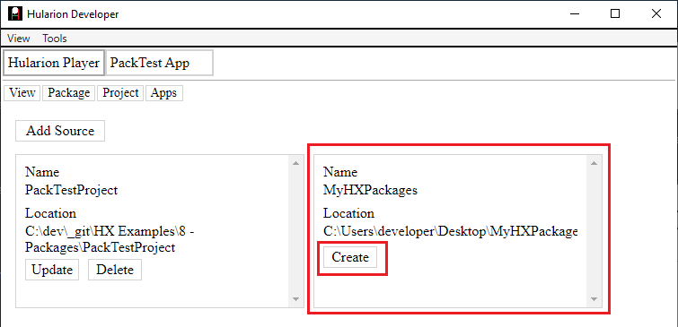
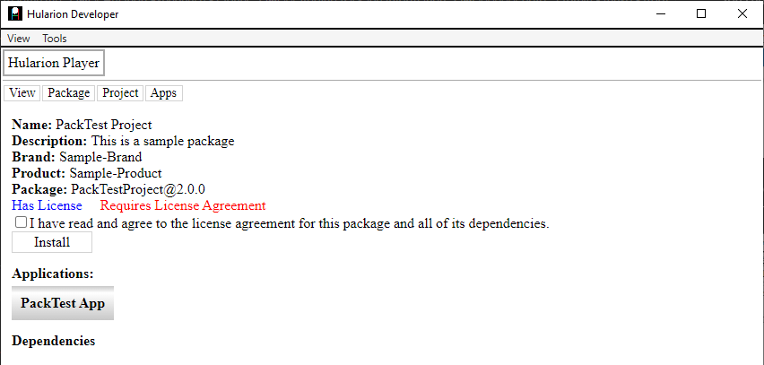
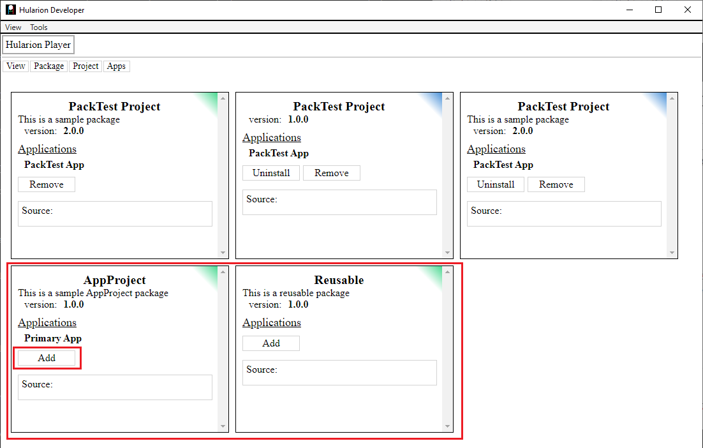
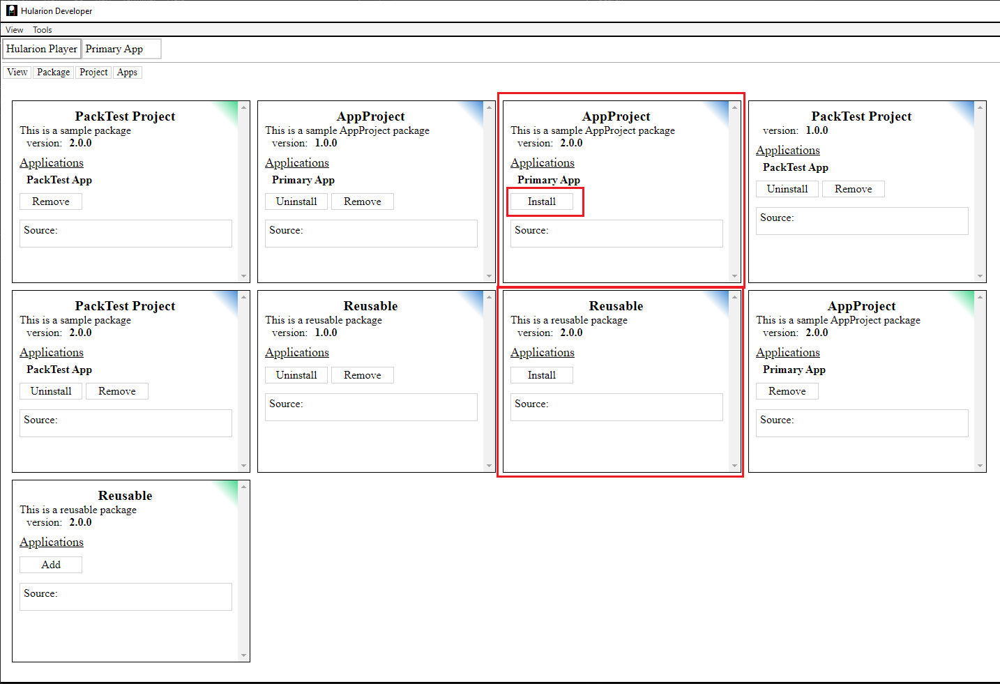

<a id="top"></a> 


#### Hularion - *Software with a Strategy*
#### Hularion Experience (HX) - A modular client application framework for web and desktop using HTML, CSS, and JS.

&nbsp;

# Hularion Experience - Packages

&nbsp;

## Prerequisites

If you are unfamiliar with Hularion Experience, please review the following article(s) before continuing. 

#### Article 1 - Getting Started

https://github.com/JohnathanADrews/HularionExperience/tree/main/docs/1%20-%20GettingStarted/readme.md


#### Article 2 - Basics - Create a Button

https://github.com/JohnathanADrews/HularionExperience/blob/main/docs/2%20-%20Create%20a%20Button/readme.md

Document 6 - Presenter Frames

https://github.com/JohnathanADrews/HularionExperience/blob/main/docs/6%20-%20Presenter%20Frames/readme.md

Document 7 - Script Frames

https://github.com/JohnathanADrews/HularionExperience/blob/main/docs/7%20-%20Script%20Frames/readme.md

&nbsp;
<a id="Requirements"></a>
## Requirements

#### Hularion Developer - https://github.com/JohnathanADrews/HularionDeveloper

Please use the latest release. Alternatively, you can run it from your IDE by setting the HularionDeveloper project as the startup project.

&nbsp;

## Contents 

1. [Introduction](#Introduction)
1. [Setup](#Setup)
1. [Building a Package](#BuildingAPackage)
1. [Installing a Package](#InstallingAPackage)
1. [Adding Package Information](#AddingPackageInformation)
1. [Package Systems](#PackageSystems)
1. [Referencing a Built Packages](#ReferencingBuiltPackages)
1. [Installing an Application Package](#InstallingApplicationPackage)


&nbsp;
<a id="Introduction"></a>
## Introduction

###### goto &rarr; [(next)](#Setup) - [(top)](#top)

One of the key goals of Hularion Experience it to provide high modularization of applications. So far, we have covered presenters, presenter sets, and script sets. In this article, we will focus on the compilation of projects into packages, and then how to reference one package from another.


&nbsp;
<a id="Setup"></a>
## Setup

###### goto &rarr; [(prev)](#Introduction) - [(next)](#BuildingAPackage) - [(top)](#top)

1. Open the Hularion Developer application as set out in the [(Requirements)](#Requirements).
2. Copy the content of the [Setup](Setup) folder into a local folder. Alternatively, you can create the folder structure and files as follows.

#### Directory Structure and Files


#### PackTestProject.hxproject
```
<hx h-hxpackage="true"
    h-package-name="PackTest Project"
    h-version="1.0.0"
    h-package-key="PackTestProject">

</hx>
```

#### PackTestApp.html
```
<hx h-application="true"
    h-application-key="PackTestApp"
    h-application-name="PackTest App"
    h-presenter-set="PackTestAppPresenters"
    h-application-presenter="PackTestAppEntryPoint"
    h-application-is-default="true">
</hx>
```

#### PackTestEntryPoint.html
```
<h1>PackTest App</h1>

<hx h-presenter="Button" />

<script>

    function PackTestAppEntryPoint() {
    }

    PackTestAppEntryPoint.prototype = {

        start: function (parameters) {
            var t = this;
            
            console.log("PackTestAppEntryPoint.start - ", t);
			
			
        }
    }

</script>
```


#### Button.html
```
<hx h-publisher="Click" />
<hx h-proxy="setText" />

<label h-handle="title" class="buttonTitle">Button</label>


<script>

    function Button() {
    }

    Button.prototype = {

        start: function (parameters) {            
		
            console.log("Button.start - ", this, window);

			var t = this;
			console.log("Button.start principal - ", t.hularion.principal);
			t.hularion.principal.addEventListener("click", ()=>{
				console.log("Button - button clicked");
				
				t.hularion.publisher.Click.publish();
			});
        },
		
		setText: function(text){
            console.log("Button.setText - ", this, text);
			this.title.innerHTML = text;
		}
    }

</script>

<style>
	
	.this{
		width: 100px;
		border:solid 2px lightgrey;
		text-align:center;
		cursor: pointer;
		user-select: none;
	}
	
	.this *{
		cursor: pointer;
		user-select: none;
	}
	
	.buttonTitle:hover{
		color:darkgrey;
	}

</style>
```

#### Load the PackTestProjectApp Application

In Hularion Developer, select Package->ViewSources. Then, click Add Source.


Enter a Name and a Location, which is the directory in which PackTestProject.hxproject was placed. Then, click Create. The Create button will then be replaced by an Update button and a Delete button.


Go to Package->View Packages. You will see the PackTestProject Project package. It has a green tip, which means that it is sourced from a project, as opposed to a compiled package. Click the Add button to add the project. The Add button will be replaced by a Remove button.


Next, go to Apps->My Apps. You should see a line for PackTest App. Click Run, which will cause the application to load in another tab.


The running application:


&nbsp;
<a id="BuildingAPackage"></a>
## Building a Package 

###### goto &rarr; [(prev)](#Setup) - [(next)](#InstallingAPackage) - [(top)](#top)

The first task is to build the starting package. In Hularion Developer, let's take the following steps.

1. Create a new folder called MyHXPackages. It can have any name, but I will refer to it as the MyHXPackages folder from here.

1. Go to the Build Package menu.


2. In that menu, set the source directory to the directory that the PackTest project is in. Set the destination to the path of the MyHXPackages folder. You can use the Select Directory buttons to navigate to the directory or just enter the full path into the textbox by first clicking on it.


3. Click the Build Package button. Once you do that, you should see the package appear in the destination folder. There may not be a notification, so check the folder to verify that the package is there.


&nbsp;
<a id="InstallingAPackage"></a>
## Installing a Package 

###### goto &rarr; [(prev)](#BuildingAPackage) - [(next)](#AddingPackageInformation) - [(top)](#top)

Now that we have a package, let's add it as a source to Hularion Developer.


As you can see, we already have a source for the PackTestProject folder. Now, lets add the MyHXPackages directory, which contains our new package. Click the Add Source button.


Enter the MyHXPackages directory as a source. Don't forget to click the Create button.



Next, let's look at the packages. Go to Package->View Packages.


As you can see, we now have two PackTestApp entries. The one with the green tip is the project, and the one with the blue tip is the package. Next, click the Install button. This will give us access to the applications within the package.


In the installation screen, you will see information about the package. In our test package, we have kept it simple, so there is no license and much of the information is blank. 

Click the license checkbox and then click Install (There is no success/failure notification at time of writing. If you do not see one, it is fine to go to the next step).


Now, go to Apps->My Apps. You will see a second application. which is connected to the installed package. Whereas the Project sourced application is underlined in green, the Package sourced application is underlined in blue. When you click Run on the second line, the application will pop up in a new tab, just as it did for the other application.


So, that is how to create and deploy an application using Hularion Developer. In later articles, we will discuss how to deploy packages as standalone desktop applications or web applications.


&nbsp;
<a id="AddingPackageInformation"></a>
## Adding Package Information 

###### goto &rarr; [(prev)](#InstallingAPackage) - [(next)](#PackageSystems) - [(top)](#top)

If you look at the installation screen that appeared when we installed the package, you will see that much of the metadata is missing from the package. In this section, we will add those data.


These data are contained within the PackTestProject.hxproject project file.

```
<hx h-hxpackage="true"
    h-package-name="PackTest Project"
    h-version="1.0.0"
    h-package-key="PackTestProject">

</hx>
```

First, let's set a new package version. We will set it to 2.0.0 for clarity. This will prevent a conflict with the package we just created.

```
<hx h-hxpackage="true"
    h-package-name="PackTest Project"
    h-version="2.0.0"
    h-package-key="PackTestProject">

</hx>
```

Now, let's add a few more details, many of which are attributes of the root element.

```
<hx h-hxpackage="true"
    h-package-name="PackTest Project"
    h-version="2.0.0"
    h-package-key="PackTestProject"

    h-brand-name="Sample-Brand"
    h-product-key="Sample-Product"	
	h-description="This is a sample package">
	
	<hx h-license="true" h-license-must-agree="true">
		This is the license for this package.
	</hx>
</hx>
```

Next, go through the build process again to create the new package.  [( Build Process )](#BuildingAPackage) 

You should now see a second package in the MyHXPackages folder.


Going to the Package->ViewPackages screen, you will see a new package with the new version number. Click Install to go to the installation screen.


Our installation screen now contains the information we added to the package. Notice that it also indicates "Has a License". So, let's install this version and then head back to Package->View Packages. (There is no installation notification at this writing.)



Finally, let's go to Apps->My Apps and take a look. There is another application for the new version of the package.


&nbsp;
<a id="PackageSystems"></a>
## Package Systems 

###### goto &rarr; [(prev)](#AddingPackageInformation) - [(next)](#ReferencingBuiltPackages) - [(top)](#top)


We have discussed in previous articles how to use presenter sets and script sets to increase modularity among parts of an application. However, we may also want to use functionality from outside our current project or package. In this section, We will begin discussing how to accomplish this.

In this section we will dicuss how to create systems of packages. We will create a new project for our common presenters and we will move Button to that project. Then, we will reference the the new project from the PackTestProject project.

First, let's create a new folder called PackageSystem and then add the directory structure as follows.


#### Add the  AppProject project

1. Create an AppProject folder in the PackageSystem folder.
1. Create the AppProject.hxproject project file in the AppProject folder.
1. Create an Applications folder in the AppProject folder.
1. Create a PrimaryApp.html file in the PackageSystem\AppProject\Applications folder.
1. Create a PresenterSets folder in the PackageSystem\AppProject folder.
1. Create a AppPresenters folder in the PackageSystem\AppProject\PresenterSets folder.
1. Create the PrimaryAppEntryPoint.html file in the PackageSystem\AppProject\PresenterSets\AppPresenters folder.

#### Add the  Reusable project

1. Create a Reusable folder in the PackageSystem folder.
1. Create the Reusable.hxproject project file in the Reusable folder.
1. Create a PresenterSets folder in the PackageSystem\Reusable folder.
1. Create a Common folder in the PackageSystem\Reusable\PresenterSets folder.
1. Create a Button.html file in the PackageSystem\Reusable\PresenterSets\Common folder.

The result should look like the following image.


Here are the file contents.

AppProject.hxproject
```
<hx h-hxpackage="true"
    h-package-name="AppProject"
    h-version="1.0.1"
    h-package-key="AppProject"
	
    h-brand-name="AppProject-Brand"
    h-product-key="AppProject-Product"	
	h-description="This is a sample AppProject package"
	>
	
	<hx h-license="true" h-license-must-agree="true">
		This is the license for this AppProject package.
	</hx>

</hx>
```

PrimaryApp.html
```
<hx h-application="true"
    h-application-key="PrimaryApp"
    h-application-name="Primary App"
    h-presenter-set="AppPresenters"
    h-application-presenter="PrimaryAppEntryPoint"
    h-application-is-default="true">
</hx>
```

PrimaryAppEntryPoint.html
```
<h1>Primary App</h1>

<script>

    function PrimaryAppEntryPoint() {
    }

    PrimaryAppEntryPoint.prototype = {

        start: function (parameters) {
            var t = this;
            
            console.log("PrimaryAppEntryPoint.start - ", t, window);

        }
    }

</script>
```


Reusable.hxproject
```
<hx h-hxpackage="true"
    h-package-name="Reusable"
    h-version="1.0.0"
    h-package-key="Reusable"
	
    h-brand-name="Reusable-Brand"
    h-product-key="Reusable-Product"	
	h-description="This is a reusable package"
	>
	
	<hx h-license="true" h-license-must-agree="true">
		This is the license for this Reusable package.
	</hx>

</hx>
```

Button.html
```
<hx h-publisher="Click" />
<hx h-proxy="setText" />

<label h-handle="title" class="buttonTitle">Button</label>


<script>

    function Button() {
    }

    Button.prototype = {

        start: function (parameters) {            
		
            console.log("Button.start - ", this, window);

			var t = this;
			console.log("Button.start principal - ", t.hularion.principal);
			t.hularion.principal.addEventListener("click", ()=>{
				console.log("Button - button clicked");
				
				t.hularion.publisher.Click.publish();
			});
        },
		
		setText: function(text){
            console.log("Button.setText - ", this, text);
			this.title.innerHTML = text;
		}
    }

</script>

<style>
	
	.this{
		width: 100px;
		border:solid 2px lightgrey;
		text-align:center;
		cursor: pointer;
		user-select: none;
	}
	
	.this *{
		cursor: pointer;
		user-select: none;
	}
	
	.buttonTitle:hover{
		color:darkgrey;
	}

</style>
```

Let's also add the package source (Package->View Sources), but this time we will point it to the package system folder instead of an individual package folder. (Don't be like me and forget to click Create)


Now, let's take a look at our packages (Package->View Packages).




As you can see, we now have two additional projects, an AppProject project and a Reusable project. Let's add the AppProject project and then go to Apps->My Apps. 


In My Apps, we now hove our PackTest application and also the Primary App application.

If you click Run, you will see the application in a new tab. However, it is missing the Button.


Next, we will add the button presenter tag to the PrimaryAppEntryPoint presenter.

```
<hx h-presenter="Button" h-handle="buttons.myButton" />
```
Full code
```
<h1>Primary App</h1>

<hx h-presenter="Button" h-handle="buttons.myButton" />

<script>

    function PrimaryAppEntryPoint() {
    }

    PrimaryAppEntryPoint.prototype = {

        start: function (parameters) {
            var t = this;
            
            console.log("PrimaryAppEntryPoint.start - ", t, window);

        }
    }

</script>
```

When we reload the application, we get the following error in the console. This is because Button does not exist in the AppPresenters presenter set. 


Before, we solved this problem by adding Button to another presenter set. This time, we need to use a presenter set from another project. To do this, we first need to setup a package reference within the AppProject.hxproject file.

Here is the package reference line in AppProject.hxproject.
```
 <hx h-package-import="Reusable@1.0.0=>Reusable" h-project="..\Reusable" />
```
Full code
```
<hx h-hxpackage="true"
    h-package-name="AppProject"
    h-version="1.0.0"
    h-package-key="AppProject"
	
    h-brand-name="AppProject-Brand"
    h-product-key="AppProject-Product"	
	h-description="This is a sample AppProject package">
	
	<hx h-license="true" h-license-must-agree="true">
		This is the license for this AppProject package.
	</hx>
	
	
    <hx h-package-import="Reusable@1.0.0=>Reusable" h-project="..\Reusable" />

</hx>
```

The h-package-import="Reusable@1.0.0=>Reusable" attribute indicates that the reference is to the Reusable package, version 1.0.0, and it puts this reference into the Reusable alias. The alias can then be used by configuration files. This prevents the configurations from needing to update version numbers.

The h-project="..\Reusable" indicated that the package is part of the package system, and that HX should build it when loaded with AppProject each time. It also causes the version number to be ignored.

The next step is to use the package alias to create a presenter frame in the AppPresenters configuration. In the PackageSystem\AppProject folder, create a Configuration folder. Then, create the AppPresenters.html file.

Add the following text to the file.
```
<hx h-presenter-configuration="AppProject-AppPresenters-Config" h-presenter-set="AppPresenters">

    <hx h-import-presenter="Reusable" h-import-set="Common" h-frame="Common"></hx>	
		
	
</hx>
```

As you can see, this is just like the other presenter frame examples, except we are using the Reusable alias instead of the "this" alias.

Since the frame name is Common, we just need to add that to the reference in PrimaryAppEntryPoint.
```
<hx h-presenter="Common/Button" h-handle="buttons.myButton" />
```
Full code
```
<hx h-publisher="Click" />
<hx h-proxy="setText" />

<label h-handle="title" class="buttonTitle">Button</label>


<script>

    function Button() {
    }

    Button.prototype = {

        start: function (parameters) {            
		
            console.log("Button.start - ", this, window);

			var t = this;
			console.log("Button.start principal - ", t.hularion.principal);
			t.hularion.principal.addEventListener("click", ()=>{
				console.log("Button - button clicked");
				
				t.hularion.publisher.Click.publish();
			});
        },
		
		setText: function(text){
            console.log("Button.setText - ", this, text);
			this.title.innerHTML = text;
		}
    }

</script>

<style>
	
	.this{
		width: 100px;
		border:solid 2px lightgrey;
		text-align:center;
		cursor: pointer;
		user-select: none;
	}
	
	.this *{
		cursor: pointer;
		user-select: none;
	}
	
	.buttonTitle:hover{
		color:darkgrey;
	}

</style>
```

If you reload the application now, you will see the button.


&nbsp;
<a id="ReferencingBuiltPackages"></a>
## Referencing a Built Packages 

###### goto &rarr; [(prev)](#PackageSystems) - [(next)](#InstallingApplicationPackage) - [(top)](#top)


In addition to referencing other projects, we need to be able to reference other packages. In this section, we will discuss how to make a package reference. 

First, let's buld the PackageSystem packages. Click Package->Build Package to go to the package screen, and then enter the source directory and destination directory. We will use the PackageSystem directory as the Source Directory, and we will continue to use the MyHXPackages directory as the Destination Directory. 


After clicking Build Package, we can see that both packages in the package system were built.


Now, let's go to the AppProject.hxproject file and change the package reference, removing the h-project attribute.
```
<hx h-hxpackage="true"
    h-package-name="AppProject"
    h-version="1.0.0"
    h-package-key="AppProject"
	
    h-brand-name="AppProject-Brand"
    h-product-key="AppProject-Product"	
	h-description="This is a sample AppProject package">
	
	<hx h-license="true" h-license-must-agree="true">
		This is the license for this AppProject package.
	</hx>
	
	
    <hx h-package-import="Reusable@1.0.0=>Reusable" />

</hx>
``` 

If we reload the application, the button still appears on the application. This is because the framework will automatically attach a project with the same key if the desired package is not found.


So, let's also move the Reusable outside of the PackageSystem folder. Now, if you reload the application, the same Button not found error will appear. 


Let's Install the Reusable package.


Let's take a quick look at our application. The default name of the button is "Button"


&nbsp;
<a id="InstallingApplicationPackage"></a>
## Installing an Application Package

###### goto &rarr; [(prev)](#ReferencingBuiltPackages) - [(next)](#AddingLabelClone) - [(top)](#top)

In this last section, we discussed installing a dependency, Reusable, and referencing it from our AppProject project. We will install the AppProject package and run the application. Then, we will update both packages, install them, and then run the new application version.

First, let's install AppProject.


Here is the installtion screen. Notice that we now have a dependency.


In Apps->My Apps, we now have a new application corresponding to the AppProject package.


If we run the application, we get the same application screen.


Let's make a couple of simple but noticable changes, and then rebuild the packages.

PrimaryAppEntryPoint - Change the h1 to read "Primary App 2.0.0".
```
<h1>Primary App 2.0.0</h1>
```

Button - Change the default Button text to read "2.0.0"
```
<label h-handle="title" class="buttonTitle">2.0.0</label>
```

Change AppProject.hxproject to version 2.0.0 and change the Reusable import line to version 2.0.0.
```
<hx h-hxpackage="true"
    h-package-name="AppProject"
    h-version="2.0.0"
    h-package-key="AppProject"
	
    h-brand-name="AppProject-Brand"
    h-product-key="AppProject-Product"	
	h-description="This is a sample AppProject package"
	>
	
	<hx h-license="true" h-license-must-agree="true">
		This is the license for this AppProject package.
	</hx>
	
	<hx h-package-import="Reusable@2.0.0=>Reusable" />

</hx>
```

Change Reusable.hxproject to version 2.0.0
```
<hx h-hxpackage="true"
    h-package-name="Reusable"
    h-version="2.0.0"
    h-package-key="Reusable"
	
    h-brand-name="Reusable-Brand"
    h-product-key="Reusable-Product"	
	h-description="This is a reusable package"
	>
	
	<hx h-license="true" h-license-must-agree="true">
		This is the license for this Reusable package.
	</hx>

</hx>
```

Save all the files, and then build the new version.


Take a look to verify the packages were made.


In the View Packages screen, we now have two new package-sourced packages for version 2.0.0. This time, we will only install version AppProject 2.0.0. Reusable version 2.0.0 will be automatically installed with AppProject, since it is a dependency.



In the installation screen, we can see the updated version for each package.


Going back to View Packages, we can see that the Reusable package was automatically installed.


In My Apps, we can see the new version 2.0.0 application.


Finally, we have the result of the version 2.0.0 application.


&nbsp;
<a id="End"></a>
## The End 
###### goto &rarr; [(prev)](#InstallingApplicationPackage) - [(top)](#top)
