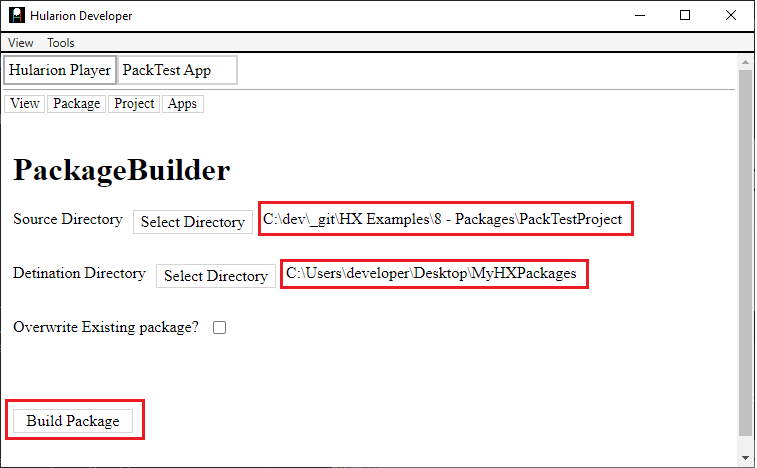
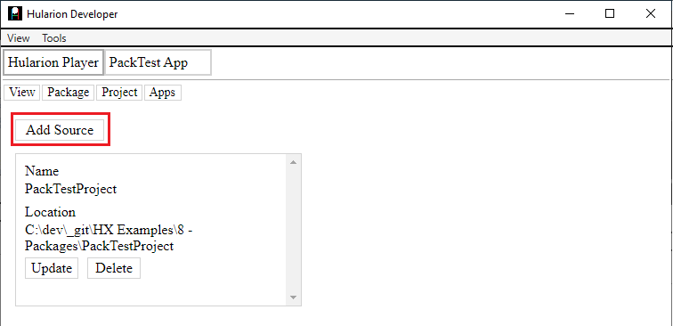
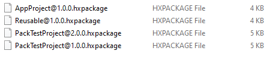

<a id="Top"></a> 

 

# Hularion - *Software with a Strategy*

##### Hularion TM &nbsp;&nbsp;&nbsp;&nbsp;&nbsp;&nbsp;&nbsp; Software with a Strategy TM

# Hularion Experience - Packages


## Prerequisites

If you are unfamiliar with Hularion Experience, please take a look at the following documents. 

Document 1 - Getting Started

https://github.com/JohnathanADrews/HularionExperience/tree/main/docs/1%20-%20GettingStarted/readme.md

Document 2 - Basics - Create a Button

https://github.com/JohnathanADrews/HularionExperience/blob/main/docs/2%20-%20Create%20a%20Button/readme.md

Document 6 - Presenter Frames

https://github.com/JohnathanADrews/HularionExperience/blob/main/docs/6%20-%20Presenter%20Frames/readme.md

Document 7 - Script Frames

https://github.com/JohnathanADrews/HularionExperience/blob/main/docs/7%20-%20Script%20Frames/readme.md


## Contents 

1. [Introduction](#Introduction)
1. [Starting Code](#StartingCode)
1. [Building a Package](#BuildingAPackage)
1. [Installing a Package](#InstallingAPackage)
1. [Adding Package Information](#AddingPackageInformation)
1. [Package Systems](#PackageSystems)
1. [Referencing Built Packages](#ReferencingBuiltPackages)

## Introduction <a id="Introduction"></a>

One of the key goals of Hularion Experience it to provide a high modularization of applications. So far, we have covered presenters, presenter sets, and script sets. In this article, we will focus on the compilation of projects into packages, and then how to reference one package from another.

Let's start with a setup similar to that in the "2 - Create a Button" article. https://github.com/JohnathanADrews/HularionExperience/blob/main/docs/2%20-%20Create%20a%20Button/readme.md

The project directory should look like this.


###### [( To Top of Article )](#Top)

## Starting Code <a id="StartingCode"></a>

Here is the starting code. Please be sure that the directory structure is setup as it was in the "2 - Create a Button" document and that Hularion Developer has the application running.

MyProject.hxproject
```
<hx h-hxpackage="true"
    h-package-name="MyPackage"
    h-version="1.0.0"
    h-package-key="MyPackage">

</hx>
```

MyApp.html
```
<hx h-application="true"
    h-application-key="MyApp"
    h-application-name="My Application"
    h-presenter-set="MyAppPresenters"
    h-application-presenter="MyAppEntryPoint"
    h-application-is-default="true">
</hx>
```


MyAppEntryPoint.html
```
<h1>My App</h1>

<hx h-presenter="Button" h-handle="buttons.myButton" />

<script>

    function MyAppEntryPoint() {
    }

    MyAppEntryPoint.prototype = {

        start: function (parameters) {
            var t = this;
            
            console.log("MyAppEntryPoint.start - ", t, window);

        }
    }

</script>
```

Button.html
```
<hx h-publisher="Click" />
<hx h-proxy="setText" />

<label h-handle="title" class="buttonTitle">Button</label>


<script>

    function Button() {
    }

    Button.prototype = {

        start: function (parameters) {            
		
            console.log("Button.start - ", this, window);

			var t = this;
			console.log("Button.start principal - ", t.hularion.principal);
			t.hularion.principal.addEventListener("click", ()=>{
				console.log("Button - button clicked");
				
				t.hularion.publisher.Click.publish();
			});
        },
		
		setText: function(text){
            console.log("Button.setText - ", this, text);
			this.title.innerHTML = text;
		}
    }

</script>

<style>
	
	.this{
		width: 100px;
		border:solid 2px lightgrey;
		text-align:center;
		cursor: pointer;
		user-select: none;
	}
	
	.this *{
		cursor: pointer;
		user-select: none;
	}
	
	.buttonTitle:hover{
		color:darkgrey;
	}

</style>
```

###### [( To Top of Article )](#Top)

## Building a Package <a id="BuildingAPackage"></a>

Using this project, we will build a package. To do this, we will use Hularion Develeoper.

1. Create a new folder called MyHXPackages. It can have any name, but I will refer to it as the MyHXPackages folder from here.

1. Go to the Build Package menu.


2. In that menu, set the source directory to the directory that the project is in. Set the destination to the path of the MyHXPackages folder. You can use the Select Directory buttons to navigate to the directory or just enter the full path into the textbox by first clicking on it.




3. Click the Build Package button. Once you do that, you should see the package appear in the destination folder.


###### [( To Top of Article )](#Top)

## Installing a Package <a id="InstallingAPackage"></a>

Now that we have a package, let's add it as a source to Hularion Developer.


As you can see, we already have a source for the MyProject folder. Now, lets add the MyHXPackages directory, which contains our new package. Click the Add Source button.



Enter the MyHXPackages directory as a source. Don't forget to click the Create button.


Next, let's look at the packages. Go to Package->View Packages.


As you can see, we now have two MyPackage entries. The one with the green tip is the project, and the one with the blue tip is the package. Next, click the Install button. This will give us access to the applications within the package.


In the installation screen, you will see information about the package. In our test package, we have kept it simple, so there is no license and much of the information is blank. 

Click the license checkbox and then click Install (There is no success/failure notification at time of writing. If you do not see one, it is fine to go to the next step).


Now, go to Apps->My Apps. You will see a second application. which is connected to the installed package. Whereas the Project sourced application is underlined in green, the Package sourced application is underlined in blue. When you click Run on the second line, the application will pop up in a new tab, just as it did for the other application.


So, that is how to create and deploy an application using Hularion Developer. In later articles, we will discuss how to deploy packages as standalone desktop applications or web applications.


###### [( To Top of Article )](#Top)

## Adding Package Information <a id="AddingPackageInformation"></a>

Our next focus will be on versioning and adding additional details to a package. These details are kept in the project file. So far, our MyProject.hxproject file contains the following.

```
<hx h-hxpackage="true"
    h-package-name="MyPackage"
    h-version="1.0.0"
    h-package-key="MyPackage">

</hx>
```

First, let's set a new package version. This will prevent a conflict with the package we just created.

```
<hx h-hxpackage="true"
    h-package-name="MyPackage"
    h-version="1.1.0"
    h-package-key="MyPackage">

</hx>
```

Now, let's add a few more details.

```
<hx h-hxpackage="true"
    h-package-name="MyPackage"
    h-version="1.0.1"
    h-package-key="MyPackage"
	
    h-brand-name="Sample-Brand"
    h-product-key="Sample-Product"	
	h-description="This is a sample package">
	
	<hx h-license="true" h-license-must-agree="true">
		This is the license for this package.
	</hx>

</hx>
```

Next, go through the build process again to create the new package.  [( Build Process )](#BuildingAPackage) 

You should now see a second package in the MyHXPackages folder.


Going to the Package->ViewPackages screen, you will see a new package with the new version number. Click Install to go to the installation screen.


Our installation screen now contains the information we added to the package. Notice that it also indicates "Has a License".


###### [( To Top of Article )](#Top)

## Package Systems <a id="PackageSystems"></a>

We have discussed in previous articles how to use presenter sets and script sets to increase modularity among parts of an application. However, we may also want to use functionality from outside our current project/package. We will discuss this in this section and the next one.

In this section we will dicuss how to create systems of packages. We will create a new project for our common presenters and we will move Button to that project. Then, we will reference the the new project from the MyProject project.

First, let's create a new folder called PackageSystem and then add the directory structure as follows.


#### Add the  AppProject project

1. Create an AppProject folder in the PackageSystem folder.
1. Create the AppProject.hxproject project file in the AppProject folder.
1. Create an Applications folder in the AppProject folder.
1. Create a PrimaryApp.html file in the PackageSystem\AppProject\Applications folder.
1. Create a PresenterSets folder in the PackageSystem\AppProject folder.
1. Create a AppPresenters folder in the PackageSystem\AppProject\PresenterSets folder.
1. Create the PrimaryAppEntryPoint.html file in the PackageSystem\AppProject\PresenterSets\AppPresenters folder.

#### Add the  Reusable project

1. Create a Reusable folder in the PackageSystem folder.
1. Create the Reusable.hxproject project file in the Reusable folder.
1. Create a PresenterSets folder in the PackageSystem\Reusable folder.
1. Create a Common folder in the PackageSystem\Reusable\PresenterSets folder.
1. Create a Button.html file in the PackageSystem\Reusable\PresenterSets\Common folder.

The result should look like the following image.


Here are the file contents.

AppProject.hxproject
```
<hx h-hxpackage="true"
    h-package-name="AppProject"
    h-version="1.0.1"
    h-package-key="AppProject"
	
    h-brand-name="AppProject-Brand"
    h-product-key="AppProject-Product"	
	h-description="This is a sample AppProject package"
	>
	
	<hx h-license="true" h-license-must-agree="true">
		This is the license for this AppProject package.
	</hx>

</hx>
```

PrimaryApp.html
```
<hx h-application="true"
    h-application-key="PrimaryApp"
    h-application-name="Primary App"
    h-presenter-set="AppPresenters"
    h-application-presenter="PrimaryAppEntryPoint"
    h-application-is-default="true">
</hx>
```

PrimaryAppEntryPoint.html
```
<h1>Primary App</h1>

<script>

    function PrimaryAppEntryPoint() {
    }

    PrimaryAppEntryPoint.prototype = {

        start: function (parameters) {
            var t = this;
            
            console.log("PrimaryAppEntryPoint.start - ", t, window);

        }
    }

</script>
```


Reusable.hxproject
```
<hx h-hxpackage="true"
    h-package-name="Reusable"
    h-version="1.0.0"
    h-package-key="Reusable"
	
    h-brand-name="Reusable-Brand"
    h-product-key="Reusable-Product"	
	h-description="This is a reusable package"
	>
	
	<hx h-license="true" h-license-must-agree="true">
		This is the license for this Reusable package.
	</hx>

</hx>
```

Button.html
```
<hx h-publisher="Click" />
<hx h-proxy="setText" />

<label h-handle="title" class="buttonTitle">Button</label>


<script>

    function Button() {
    }

    Button.prototype = {

        start: function (parameters) {            
		
            console.log("Button.start - ", this, window);

			var t = this;
			console.log("Button.start principal - ", t.hularion.principal);
			t.hularion.principal.addEventListener("click", ()=>{
				console.log("Button - button clicked");
				
				t.hularion.publisher.Click.publish();
			});
        },
		
		setText: function(text){
            console.log("Button.setText - ", this, text);
			this.title.innerHTML = text;
		}
    }

</script>

<style>
	
	.this{
		width: 100px;
		border:solid 2px lightgrey;
		text-align:center;
		cursor: pointer;
		user-select: none;
	}
	
	.this *{
		cursor: pointer;
		user-select: none;
	}
	
	.buttonTitle:hover{
		color:darkgrey;
	}

</style>
```

Let's also add the package source (Package->View Sources), but this time we will point it to the package system folder instead of an individual package folder. (Don't be like me and forget to click Create)


Now, let's take a look at our packages (Package->View Packages).


As you can see, we now have two additional projects, an AppProject project and a Reusable project. Let's add the AppProject project and then go to Apps->My Apps. 


If you click Run, you will see the application in a new tab. However, it is missing the Button.


Next, we will add the button presenter tag to the PrimaryAppEntryPoint presenter.

```
<hx h-presenter="Button" h-handle="buttons.myButton" />
```
Full code
```
<h1>Primary App</h1>

<hx h-presenter="Button" h-handle="buttons.myButton" />

<script>

    function PrimaryAppEntryPoint() {
    }

    PrimaryAppEntryPoint.prototype = {

        start: function (parameters) {
            var t = this;
            
            console.log("PrimaryAppEntryPoint.start - ", t, window);

        }
    }

</script>
```

When we reload the application, we get the following error in the console. This is because Button does not exist in the AppPresenters presenter set. 


Before, we solved this problem by adding Button to another presenter set. This time, we need to use a presenter set from another project. To do this, we first need to setup a package reference within the AppProject.hxproject file.

Here is the package reference line in AppProject.hxproject.
```
 <hx h-package-import="Reusable@1.0.0=>Reusable" h-project="..\Reusable" />
```
Full code
```
<hx h-hxpackage="true"
    h-package-name="AppProject"
    h-version="1.0.0"
    h-package-key="AppProject"
	
    h-brand-name="AppProject-Brand"
    h-product-key="AppProject-Product"	
	h-description="This is a sample AppProject package">
	
	<hx h-license="true" h-license-must-agree="true">
		This is the license for this AppProject package.
	</hx>
	
	
    <hx h-package-import="Reusable@1.0.0=>Reusable" h-project="..\Reusable" />

</hx>
```

The h-package-import="Reusable@1.0.0=>Reusable" attribute indicates that the reference is to the Reusable package, version 1.0.0, and it puts this reference into the Reusable alias. The alias can then be used by configuration files. This prevents the configurations from needing to update version numbers.

The h-project="..\Reusable" indicated that the package is part of the package system, and that HX should build it when loaded with AppProject each time. It also causes the version number to be ignored.

The next step is to use the package alias to create a presenter frame in the AppPresenters configuration. In the PackageSystem\AppProject folder, create a Configuration folder. Then, create the AppPresenters.html file.

Add the following text to the file.
```
<hx h-presenter-configuration="AppProject-AppPresenters-Config" h-presenter-set="AppPresenters">

    <hx h-import-presenter="Reusable" h-import-set="Common" h-frame="Common"></hx>	
		
	
</hx>
```

As you can see, this is just like the other presenter frame examples, except we are using the Reusable alias instead of the "this" alias.

Since the frame name is Common, we just need to add that to the reference in PrimaryAppEntryPoint.
```
<hx h-presenter="Common/Button" h-handle="buttons.myButton" />
```
Full code
```
<hx h-publisher="Click" />
<hx h-proxy="setText" />

<label h-handle="title" class="buttonTitle">Button</label>


<script>

    function Button() {
    }

    Button.prototype = {

        start: function (parameters) {            
		
            console.log("Button.start - ", this, window);

			var t = this;
			console.log("Button.start principal - ", t.hularion.principal);
			t.hularion.principal.addEventListener("click", ()=>{
				console.log("Button - button clicked");
				
				t.hularion.publisher.Click.publish();
			});
        },
		
		setText: function(text){
            console.log("Button.setText - ", this, text);
			this.title.innerHTML = text;
		}
    }

</script>

<style>
	
	.this{
		width: 100px;
		border:solid 2px lightgrey;
		text-align:center;
		cursor: pointer;
		user-select: none;
	}
	
	.this *{
		cursor: pointer;
		user-select: none;
	}
	
	.buttonTitle:hover{
		color:darkgrey;
	}

</style>
```

If you reload the application now, you will see the button.


###### [( To Top of Article )](#Top)

## Referencing Build Packages <a id="ReferencingBuiltPackages"></a>

[Incomplete]

In addition to referencing other projects, we need to be able to reference other packages. In this section, we will discuss how to make a package reference. 

First, let's buld the PackageSystem packages. Click Package->Build Package to go to the package screen, and then enter the source directory and destination directory. We will use the PackageSystem directory as the Source Directory, and we will continue to use the MyHXPackages directory as the Destination Directory. 


After clicking Build Package, we can see that both packages in the package system were built.




Noe, let's go to the AppProject.hxproject file and change the package reference, removing the h-project attribute.
```
<hx h-hxpackage="true"
    h-package-name="AppProject"
    h-version="1.0.0"
    h-package-key="AppProject"
	
    h-brand-name="AppProject-Brand"
    h-product-key="AppProject-Product"	
	h-description="This is a sample AppProject package">
	
	<hx h-license="true" h-license-must-agree="true">
		This is the license for this AppProject package.
	</hx>
	
	
    <hx h-package-import="Reusable@1.0.0=>Reusable" />

</hx>
``` 

If we reload the application, the button still appears on the application. This is because the framework will automatically attach a project with the same key if the desired package is not found.


So, let's also move the Reusable outside of the PackageSystem folder. Now, if you reload the application, the same Button not found error will appear. 


In Hularion Developer, let's add the Reusable package.


Let's take a quick look at our application. The default name of the button is "Button"


###### [( To Top of Article )](#Top)

### The End