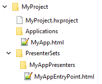
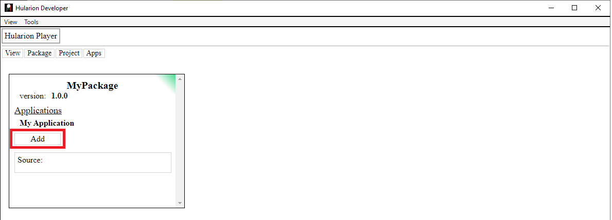
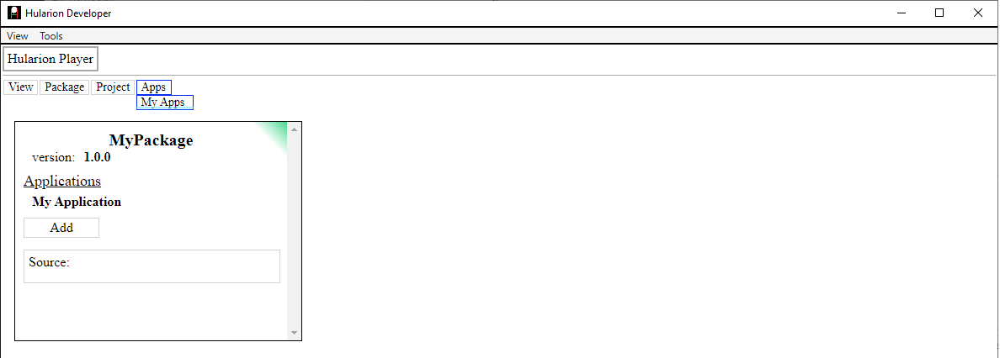

# Hularion - *Software with a Strategy*

##### Hularion TM &nbsp;&nbsp;&nbsp;&nbsp;&nbsp;&nbsp;&nbsp; Software with a Strategy TM

&nbsp;

## Hularion Experience - Creating a New Project

### Create the directories and files

1. Create a new folder. In this example we are using the MyProject folder.
2. In the new folder, create a file called MyProject.hxproject. This is the main project configuration file.
3. Create a sub-folder called Applications. This is the folder that will contain all of the configurations for applications declared within the project.
4. In the Applications folder, create a file called MyApp.html. This contains the configuration details for an application. A project may have zero or more applications.
5. Create a sub-folder called PresenterSets. This folder contains sub-folders, each having its own set of presenters, which are the UI unit.
6. In the PresenterSets folder, create a folder called MyProjectPresenters. This is a name we choose. This name is important and will be used by configuration files.
7. In the MyProjectPresenters folder, create a file called MyAppEntryPoint.html. This will be used as the entry point for the MyApp application.

It should end up looking like this  

 

### Edit the project file, MyProject.hxproject.

Open MyProject.hxproject in a text editor. The project file, like most configuration files in HX, is an HTML fragment. When HX builds a package from a project, it uses HTML attributes to decide the build for both configuration files and presenters. Using HTML also enables seamless integration of CSS and javascript into the configuration. In the MyProject.hxproject file, add the following code.

```
<hx h-hxpackage="true"
    h-package-name="MyPackage"
    h-version="1.0.0"
    h-package-key="MyPackage">

</hx>
```

### Edit the application file, MyApp.html.

Open MyApp.html in a text editor. Like the project file, it is also an HTML fragment. Add the following code.

```
<hx h-application="true"
    h-application-key="MyApp"
    h-application-name="My Application"
    h-presenter-set="MyAppPresenters"
    h-application-presenter="MyAppEntryPoint"
    h-application-is-default="true">
</hx>
```
This file lets HX know that there is an application, MyApp, and where to find the entry point. Note that both the presenter set MyAppPresenters, and the presenter MyAppEntryPoint are required.


### Edit the presenter file, MyAppEntryPoint.html.

Open MyAppEntryPoint.html in a text editor. Like the project file, it is also an HTML fragment. Rather than configuration information, this file contains the preseter's functionality.

```
<h1>My App</h1>

<script>

    function MyAppEntryPoint() {
    }

    MyAppEntryPoint.prototype = {

        start: function (parameters) {            
            console.log("MyAppEntryPoint.start - ", this, window);
        }
    }

</script>
```
Here wer have a presenter that displays "My App" in an h1 tag. Notice the script tag and the javascript constructor function. The function must have the same name as the presenter, and it is required for the presenter to run. Also, there is a "start" method on the constructor function. This method is automatically called once the HX framework creates an instance of the presenter and performs the initialization.


### Run the project.

1. HularionDeveloper repository and download the latest release. https://github.com/JohnathanADrews/HularionDeveloper.
2. Extract the files and run HularionDeveloper.exe. Creating a shortcut may be helpful.
3. When you run it, two windows will pop up. One is the application window, and the other is the web development tools. The first time you run it, you will need to create a context name (like a username) and agree to the disclaimer. This is only necessary the first time. If you look in the HularionDeveloper.exe folder, a .hx folder will appear. There is a database file that stored some basic information such as your context name, which packages are installed, and which applications you have selected. This is also where any HX packages you install are kept.
4. In the menu, go to Package->View Sources. This will show you the package sources you have added, and it will also allow you to add new sources.

5. Click the Add Source button.

6. Enter the name of the source, which can be anything. The location is the directory of the project. The, click the Create button.

7. Go to Package->View Packages

8. Add the package by clicking Add within the MyPackage box. Note that projects have an association with the color green, while projects have an association with the color blue.

9. View your applications by clicking Apps->My Apps.

10. In the applications view, there is now a line item for the application. Click the run button to play the application in a new tab.

11. Look at the application in the new tab.


### The End